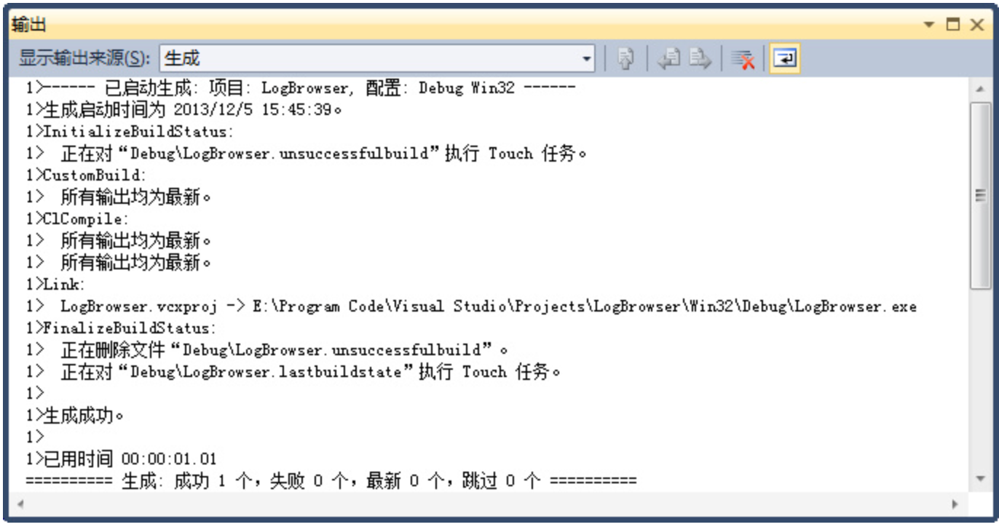
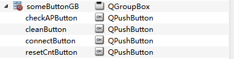

# 前言

优秀笔记汇总

Qt快速入门系列教程 [链接](http://shouce.jb51.net/qt-beginning/50.html)

一去二三里 [链接](https://blog.csdn.net/liang19890820/article/details/50277095)

feiyangqingyun [链接1](https://qtchina.blog.csdn.net/?type=blog) [链接2](https://github.com/feiyangqingyun)

#  1. Qt字符串截取常用函数

- 字符串以XX开头，返回true，第二个参数可以设置大小写敏感

```c++
bool QString::startsWith　　// 字符串以XX开头，返回true，第二个参数可以设置大小写敏感

QString str = "Bananas";

str.startsWith("Ban");   // returns true

str.startsWith("Car");   // returns false
```

- 字符串以XX结尾，返回false，第二个参数可以设置大小写敏感

```C++
bool QString::endsWith　　// 字符串以XX结尾，返回false，第二个参数可以设置大小写敏感

QString str = "Bananas";

str.endsWith("anas");     // returns true

str.endsWith("pple");     // returns false
```

- 返回前后没有空格的字符串

```c++
QString QString::trimmed()　　// 返回前后没有空格的字符串

QString str = " lots\t of\nwhitespace\r\n ";

str = str.trimmed();

// str == "lots\t of\nwhitespace"
```

- 指定位置开始删除n个字符，返回该字符引用

```C++
// 指定位置开始删除n个字符，返回该字符引用
QString &QString::remove(int position, int n)

QString s = "Montreal";

s.remove(1, 4);             // s == "Meal"
```

- 返回从指定位置开始第一次出现的索引位置，未找到返回-1。第二个参数可以设置大小写敏感

```C ++
// 返回从指定位置开始第一次出现的索引位置，未找到返回-1。第二个参数可以设置大小写敏感
int QString::indexOf()

QString x = "sticky question";

QString y = "sti";

x.indexOf(y);        // returns 0

x.indexOf(y, 1);      // returns 10

x.indexOf(y, 10);      // returns 10

x.indexOf(y, 11);      // returns -1
```

- int `QString::lastIndexOf()`返回此字符串中字符串str的最后一次出现的索引位置，从索引位置向后搜索

```C++
int QString::lastIndexOf()　
// 返回此字符串中字符串str的最后一次出现的索引位置，从索引位置向后搜索。如果from是-1(默认值)，搜索从最后一个字符开始;如果from是-2，则在倒数第二个字符处，依此类推。如果没有找到str，则返回-1。第二个参数可以设置大小写敏感
QString x = "crazy azimuths";

QString y = "az";

x.lastIndexOf(y);      // returns 6

x.lastIndexOf(y, 6);    // returns 6

x.lastIndexOf(y, 5);    // returns 2

x.lastIndexOf(y, 1);    // returns -1
```

- 返回包含该字符串的最右n个字符的子字符串。

 ```C++
 QString QString::right(int n) const　　// 返回包含该字符串的最右n个字符的子字符串。
 
 QString x = "Pineapple";
 
 QString y = x.right(5);   // y == "apple"
 ```

- 返回包含该字符串的最左n个字符的子字符串。

 ```C++
 QString QString::left(int n) const　　// 返回包含该字符串的最左n个字符的子字符串。
 
 QString x = "Pineapple";
 
 QString y = x.left(4);   // y == "Pine"
 ```

- 返回一个包含该字符串的n个字符的字符串，从指定的位置索引开始。

```C++
QString QString::mid(int position, int n = -1) const　　// 返回一个包含该字符串的n个字符的字符串，从指定的位置索引开始。

QString x = "Nine pineapples";

QString y = x.mid(5, 4);      // y == "pine"

QString z = x.mid(5);        // z == "pineapples"
```


```C++
QStringList QString::split(const QString &sep, Qt::SplitBehavior behavior = Qt::KeepEmptyParts, Qt::CaseSensitivity cs = Qt::CaseSensitive) const　　// 在sep出现的地方将字符串分割成子字符串，并返回这些字符串的列表。可以设置大小写敏感

QString str = QStringLiteral("a,,b,c");

QStringList list1 = str.split(QLatin1Char(','));

// list1: [ "a", "", "b", "c" ]

QStringList list2 = str.split(QLatin1Char(','), Qt::SkipEmptyParts);

// list2: [ "a", "b", "c" ]
```

# 2. 滚动字幕

简述：滚动字幕简单地理解就是：每隔一段时间（一般几百毫秒效果较佳）显示的文字进行变化（即滚动效果）实现

利用定时器`QTimer`，在固定的时间（这里为200毫秒）截取文本，来实现滚动效果！

首先，定义显示的**滚动字幕**：

```C++
const QString strScrollCation = QString::fromLocal8Bit("一去丶二三里 - 青春不老，奋斗不止！");
```

定义`QLabel`进行文本的显示，利用`QTimer`定时更新。

```C++
m_pLabel = new QLabel(this);
QTimer *pTimer = new QTimer(this);
connect(pTimer,  SIGNAL(timeout()),  this,  SLOT(scrollCaption()));

// 定时200毫秒
pTimer->start(200);
实现槽函数，进行滚动更新：
void MainWindow::scrollCaption()
{
    static int nPos = 0;

    // 当截取的位置比字符串长时，从头开始
    if (nPos > strScrollCation.length())
        nPos = 0;

    m_pLabel->setText(strScrollCation.mid(nPos));
    nPos++;
}
```


# 3. Qt打印功能

使用`Qt`自定义的类和函数实现打印文件的功能

| className              | function                                                     |
| ---------------------- | ------------------------------------------------------------ |
| `QAbstractPrintDialog` | base implementation for print dialogs used to configure printers |
| `QPageSetupDialog`     | configuration dialog for the printer's configuration         |
| `QPrintDialog`         | dialog for specifying the printer's configuration            |
| `QPrintEngine`         | defines an interface for how QPrinter interacts with a given printing subsystem |
| `QPrintPreviewDialog`  | dialog for previewing and configuring page layouts for printer output |
| `QPrintPreviewWidget`  | widget for previewing page layouts for printer output        |
| `QPrinter`             | paint device that paints on a printer                        |
| `QPrinterInfo`         | gives sccess to information about existing printers          |

QT中和打印文件相关的类如下所示，它们分别是：

* 抽象文档打印对话框类，提供配置打印机的打印对话框基本实现；

* 页面设置对话框类，和打印页面相关参数的配置对话框；

* 打印对话框类，指定打印机配置的对话框；

* 打印引擎类，定义了`QPrinter`类如何与打印子系统交互的接口；

* 打印预览对话框类，用来预览和配置页面布局的对话框；

* 打印预览控件类，预览页面布局的控件；

* 打印机类，指示打印机如何工作。

QT中实现打印的方法

首先，我们需要构造一个打印机类（`QPrinter`）对象， 其次，使用此对象构造一个打印对话框类（`QprinterDialog`）对象。如下所示：

```c++
QPrinter printer;
QprinterDialog *dialog = new QprintDialog(&printer, this);
dialog->setWindowtitle(tr(“Print Document”));

if(editor->textCursor().hasSelection())
	dialog->addEnabledOption(QabstractPrintDialog::PrintSelection);
if (dialog->exec() != QDialog::Accepted)
	return;
```

最后附上在项目中，我们如何利用QT自身类，来实现这个跨平台的打印功能。

首先，在头文件中指定槽函数：

```c++
private slots:
    void doPrint();
    void doPrintPreview();
    void printPreview(QPrinter *printer);
    void createPdf();
	void setUpPage();
```

具体实现如下：

```C++
void MainWindow::doPrint(){
    // 创建打印机对象
    QPrinter printer;
    // 创建打印对话框
    QString printerName = printer.printerName();
    if( printerName.size() == 0)
        return;
    QPrintDialog dlg(&printer, this);
    //如果编辑器中有选中区域，则打印选中区域
    if (ui->textEdit->textCursor().hasSelection())
        dlg.addEnabledOption(QAbstractPrintDialog::PrintSelection);
    // 如果在对话框中按下了打印按钮，则执行打印操作
    if (dlg.exec() == QDialog::Accepted){
       ui->textEdit->print(&printer);
       // print the existing document by absoult path
       //  printFile("D:/myRSM.doc");
    }
}
// 打印预览
void MainWindow::doPrintPreview(){
    QPrinter printer;
    // 创建打印预览对话框
    QPrintPreviewDialog preview(&printer, this);
    // 当要生成预览页面时，发射paintRequested()信号
    connect(&preview, SIGNAL(paintRequested(QPrinter*)),
                  this,SLOT(printPreview(QPrinter*)));
    preview.exec();
}

void MainWindow::printPreview(QPrinter *printer){
    ui->textEdit->print(printer);
}
// 生成PDF文件
void MainWindow::createPdf(){
    QString fileName = QFileDialog::getSaveFileName(this, tr("导出PDF文件"), QString(), "*.pdf");
    
    if (!fileName.isEmpty()) {
        // 如果文件后缀为空，则默认使用.pdf
        if (QFileInfo(fileName).suffix().isEmpty())
            fileName.append(".pdf");
        QPrinter printer;
        // 指定输出格式为pdf
        printer.setOutputFormat(QPrinter::PdfFormat);
        printer.setOutputFileName(fileName);
        ui->textEdit->print(&printer);
    }
}
// 页面设置
void MainWindow::setUpPage(){
    QPrinter printer;
    QPageSetupDialog pageSetUpdlg(&printer, this);
    if (pageSetUpdlg.exec() == QDialog::Accepted) {
        printer.setOrientation(QPrinter::Landscape);
    }else{
        printer.setOrientation(QPrinter::Portrait);
    }
}
```

## 3.1 打印设置

`QPrinter`类是一个在打印机上绘图的设备。该设备表示打印输出的一系列页面，提供了一组附加功能来管理特定于设备的特性，比如方向和分辨率，以及在生成文档时逐步遍历其中的页面。

注：在更改任何参数之前，可以使用`QPrinter::isValid()`来验证这一点。

### 3.1.1 打印机设置

**①代码设置**

获取打印机设备列表

```c++
QStringList strlist = QPrinterInfo::availablePrinterNames();
```

打印设备     

```c++
QPrinter Printer；（该文档以下所有Printer都为类QPrinter 定义）
```

获取默认打印机    

```c++
Printer.printerName();
```

设置打印机打印份数

```c++
Printer.setNumCopies(2);
```

设置打印顺序 

```c++
Printer.setPageOrder(QPrinter::PageOrder);
```

（PageOrder此处为枚举值）

从第一页开始：FirstPageFirst  从最后一页开始：LastPageFirst

**②界面设置**

```c++
QPrintDialog *pPrintDialog = new QPrintDialog(&Printer);
pPrintDialog->exec();
```


### 3.1.2 页设置

**①代码设置**

设置页边距 

```c++
Printer.setPageMargins(6,6,6,6,QPrinter::Millimeter);
```

页面方向设置 

```c++
Printer.setOrientation(QPrinter::Orientation);（QPrinter::Landscape常用）（Orientation（纵向：Portrait 横向：Landscape））
```

纸张来源

```C++
Printer.etPaperSource(QPrinter::PaperSource);
```

（PaperSource类型为枚举值）此处枚举值过多不一一列举

设置纸张大小

```C++
Printer.setPageSize(QPrinter::PageSize);（QPrinter::A4常用）
```

（PageSize类型为枚举值）此处枚举值过多不一一列举

**②界面设置**

```C++
QPageSetupDialog *PageSetupDialog = new QPageSetupDialog (&Printer);
PageSetupDialog->exec();
```

修改后点击应用，即可修改打印机设备参数


## 3.3 打印流程

- 打印设置：通过对QPrinter Printer;设置，设置详见（1打印设置）

- 文档打印：QTextDocument *pDoc = new QTextDocument;

 

- 设置内容

pDoc ->setHtml(strHtml);

此处strHtml为html格式的文档

 

注：当打印doc/docx格式文档时需要先转换为html(因为有格式问题)，如果其他的，但是需要调用

pDoc->setPlainText(const QString &text)

pDoc->print(&Printer);

将文档打印到给定的打印机。必须先设置`QPageablePaintDevice`（即`QPrinter`），然后才能使用此功能

 

- 图片打印

加载图片资源

```c++
QPixmap pixmap;

pixmap.load(strFile);（strFile为图片资源路径）

QPainter painterPixmap;
```

将打印机设备和`QPainter` 绑定开始打印

```C++
painterPixmap.begin(&Printer);

QRect rect = painterPixmap.viewport();

int x = rect.width() / pixmap.width();

int y = rect.height() / pixmap.height();

painterPixmap.scale(x, y);

painterPixmap.drawPixmap(0, 0 , pixmap);

painterPixmap.end();
```

`QPainter`调用end则打印结束

 ```javascript
 ```


注：`QPainter`画的内容都可以用此方法打印，QPainter调用begin开始（需要以QPrinter作为传入参数），调用end结束。


如果要画多页需要在begin和end之间调用QPrinter::newPage();

## 3.4 打印预览

打印预览

```C++
QPrintPreviewDialog *pPreviewDialog = new QPrintPreviewDialog(&Printer);    
connect(pPreviewDialog , QPrintPreviewDialog::paintRequested,this,QtPrint::slotPintPreview);//关联打印预览的内容
pPreviewDialog ->resize(1000,900);
pPreviewDialog ->exec();
delete pPreviewDialog ;
pPreviewDialog = nullptr;
```

槽函数slotPintPreview：

打印以及预览内容需要在槽函数里面设置

```C++
Void slotPintPreview(QPrinter *printer){
    设置打印内容
    详见2打印流程->（2）文档打印/（3）图片打印

}
```

预览界面


## 3.5 实例

```C++
#ifndef QTPRINT_H
#define QTPRINT_H

#include <QObject>

class QPrinter;
class QTextDocument;
class QPrintDialog;
class QPrintPreviewDialog;
class QPageSetupDialog;

class QtPrint : public QObject
{
    Q_OBJECT
public:
    explicit QtPrint(QObject *parent = nullptr);
    ~QtPrint();

    enum ShowDialogType
    {
        NODialog = 0,
        DialogPrint,
        DialogPageSetup,
    };

Q_SIGNALS:

public Q_SLOTS:
    void slotPintPreview(QPrinter *);

public:
    void setFilePath(QString strfile);

    bool print(ShowDialogType type = DialogPrint);

    bool showPreviewDialog();

    void printImage();
private:
    QString wordToHtml();
    void inPrint();

private:
    QString m_strFile = "";
    QString m_strHtml = "";
    bool m_bIsdoc = true;
    QPrinter *m_pPrinter;
    QTextDocument *m_pDoc;
    QPrintDialog *m_pPrintDlg;
    QPrintPreviewDialog *m_pPreviewDialog;
    QPageSetupDialog *m_pPageSetupDialog;
};

#endif // QTPRINT_H
```


```C++
#include "QtPrint.h"
#include <QPrintDialog>
#include <QPrintPreviewDialog>
#include <QTextEdit>
#include <QTextDocument>
#include <QPrintPreviewWidget>
#include <QPageSetupDialog>
#include <QPrintDialog>
#include <QFile>
#include <QDir>
#include <QAxWidget>
#include <QTextStream>
#include <QPainter>

QtPrint::QtPrint(QObject *parent) : QObject(parent)
  ,m_pPrinter(nullptr)
  ,m_pDoc(nullptr)
  ,m_pPrintDlg(nullptr)
  ,m_pPreviewDialog(nullptr)
  ,m_pPageSetupDialog(nullptr)
{
    m_pDoc = new QTextDocument;
    m_pPrinter=new QPrinter();
    m_pPrinter->setOutputFormat(QPrinter::NativeFormat);
    //获取打印机设备列表
//    QStringList strlist = QPrinterInfo::availablePrinterNames();

//    //手动设置打印机默认显示
//    m_pPrinter->setPrinterName(printer.printerName());//设置打印机设备名称
//    m_pPrinter->setPageSize(QPrinter::A4);//设置纸张大小
//    m_pPrinter->setNumCopies(2);//设置打印机打印份数
//    m_pPrinter->setPageMargins(6,6,6,6,QPrinter::Millimeter);//设置页边距
//    m_pPrinter->setOrientation(QPrinter::Landscape);//纵向：Portrait 横向：Landscape
//    m_pPrinter->setPageOrder(QPrinter::FirstPageFirst);//从第一页开始：FirstPageFirst  从最后一页开始：LastPageFirst
//    m_pPrinter->setPaperSource(QPrinter::OnlyOne);//纸张来源
//    m_pPrinter->setOrientation(QPrinter::Landscape);//纵向：Portrait 横向：Landscape
//    m_pPrinter->setPageSize(QPrinter::A4);//设置纸张大小

    //打印設置QPrinter
    m_pPrintDlg=new QPrintDialog(m_pPrinter);//打印界面

    //打印页设置
    m_pPageSetupDialog = new QPageSetupDialog(m_pPrinter);//页设置界面
}

QtPrint::~QtPrint(){
    if(m_pPrinter){
        delete m_pPrinter;
    }
    if(m_pDoc) {
        delete m_pDoc;
    }
    if(m_pPrintDlg){
        delete m_pPrintDlg;
    }
    if(m_pPreviewDialog){
        delete m_pPreviewDialog;
    }
    if(m_pPageSetupDialog){
        delete m_pPageSetupDialog;
    }
}

void QtPrint::slotPintPreview(QPrinter *p){
    inPrint();
}

void QtPrint::setFilePath(QString strfile){
    if(strfile.isEmpty())
        return;

    m_strFile = strfile;

    //如果是图片
    QStringList docList;
    docList<<"doc"<<"docx";
    QString strSuffix = m_strFile.split(".").last();
    if(!docList.contains(strSuffix)){
        m_bIsdoc = false;
    }else{
        m_strHtml = wordToHtml();
        m_bIsdoc = true;
    }
}

bool QtPrint::showPreviewDialog(){
    //打印预览窗口
    m_pPreviewDialog = new QPrintPreviewDialog(m_pPrinter);//打印预览界面
    connect(m_pPreviewDialog, QPrintPreviewDialog::paintRequested,this,QtPrint::slotPintPreview);//关联打印预览的内容
    m_pPreviewDialog->resize(1000,900);
    m_pPreviewDialog->exec();
    delete m_pPreviewDialog;
    m_pPreviewDialog = nullptr;
}

bool QtPrint::print(ShowDialogType type){
    bool bSuccess = false;
    if(type == NODialog){
        bSuccess = true;
        inPrint();
    }
    else if(type == DialogPrint){
        if(m_pPrintDlg->exec() == QDialog::Accepted){
            bSuccess = true;
            inPrint();
        }
    }else if(type == DialogPageSetup){
        if(m_pPageSetupDialog->exec() == QDialog::Accepted){
            bSuccess = true;
        }
    }

    return bSuccess;
}

QString QtPrint::wordToHtml(){
    QString fileName=m_strFile;//输入一个doc或docx格式文件的路径
    QAxWidget *a = new QAxWidget("Word.Application");//打开Word  Class ID
    a->setControl(fileName);//打开此Word文档
    a->setProperty("Visible",false);//设置程序不显示
    QVariant newFileName;
    if(fileName.endsWith(".docx")){
        newFileName.setValue(fileName.left(fileName.size()-5).append(".html"));
    }else if(fileName.endsWith(".doc")){
        newFileName.setValue(fileName.left(fileName.size()-4).append(".html"));
    }

    QVariant fileFormat(10); //文件保存格式 HTML文件 这个值有几个枚举类型具体参考:WdSaveFormat枚举            //下面参数几个默认即可
    QVariant LockComments(false);   //注释
    QVariant Password("");          //设置打开密码
    QVariant recent(false);         //最近打开的文件
    QVariant writePassword("");     //写入密码
    QVariant ReadOnlyRecommended(false);   //只读
    a->dynamicCall("SaveAs(const QVariant&, const QVariant&,const QVariant&, const QVariant&, const QVariant&, const QVariant&,const QVariant&)",
                   newFileName,fileFormat,LockComments,Password,recent,writePassword,ReadOnlyRecommended);
    //读取保存后的html文件---编辑结束后即可删除临时生成的html文件
    QString newFileName2 = newFileName.toString();
    QFile NewFile(newFileName2);
    NewFile.open(QIODevice::ReadOnly);
    QTextStream stream(&NewFile);
    QString strhtml = stream.readAll();

    //刪除生成html文件
    NewFile.remove();
    delete a;
    a = nullptr;

    return strhtml;
}

void QtPrint::printImage(){
    QPixmap pixmap;
    pixmap.load(m_strFile);
    if(pixmap.isNull()){
        //报错
        return ;
    }

    QPainter painterPixmap;
    painterPixmap.begin(m_pPrinter);

    QRect rect = painterPixmap.viewport();
    int x = rect.width() / pixmap.width();
    int y = rect.height() / pixmap.height();
    painterPixmap.scale(x, y);
    painterPixmap.drawPixmap(0, 0 , pixmap);//设置图像在A4中的开始坐标是什么
    painterPixmap.end();
}

void QtPrint::inPrint(){
    if(m_bIsdoc){
        m_pDoc->setHtml(m_strHtml);
        m_pDoc->print(m_pPrinter);
    }else{
        printImage();
    }
}
```

# 4. 日志输出

## 4.1 日志输出文件

​		在Qt开发过程当中经常使用qDebug等一些输出来调试程序，但是到了正式发布的时候，都会被注释或者删除，采用日志输出来代替。

​		做过项目的童鞋可能都使用过日志功能，以便有异常错误能够快速跟踪、定位，Qt也提供的类似的机制。之前用Qt4做项目时使用的是Qt::qInstallMsgHandler()，到了Qt5，使用了新的Qt::qInstallMessageHandler()来替代，详情请查看Qt助手（C++ API changes）。

描述

​		助手中在C++ API changes中提到：Qt::qDebug()、Qt::qWarning()、Qt::qCritical()、Qt::qFatal()被改变为宏来跟踪源代码的消息来源。被打印的信息可以被配置（用于缺省消息处理程序），通过设置该新的环境变量QT_MESSAGE_PATTERN。Qt::qInstallMsgHandler()已过时，因此建议使用Qt::qInstallMessageHandler()来代替。

级别：qDebug：调试信息、qWarning：警告信息、qCritical：严重错误、qFatal：致命错误

官方示例

```C++
#include <qapplication.h>
#include <stdio.h>
#include <stdlib.h>

void myMessageOutput(QtMsgType type, const QMessageLogContext &context, const QString &msg){
    QByteArray localMsg = msg.toLocal8Bit();
    switch(type){
        case QtDebugMsg:
            fprintf(stderr, "Debug:%s(%s:%u, %s)\n",loaclMsg.constData(), context.file, context.line, context.function);
            break
        case QtWarningMsg:
            fprintf(stderr, "Warning:%s(%s:%u, %s)\n",loaclMsg.constData(), context.file, context.line, context.function);
            break
        case QtCriticalMsg:
            fprintf(stderr, "Critical:%s(%s:%u, %s)\n",loaclMsg.constData(), context.file, context.line, context.function);
            break
        case QtFatalMsg:
            fprintf(stderr, "Fatal:%s(%s:%u, %s)\n",loaclMsg.constData(), context.file, context.line, context.function);
            abort();
    }
}

int main(int argc, char **argv){
    qInstallMessageHandler(myMessageOutput);
    QApplication app(argc, argv);
    
    return app.exec();
}
```

​		需求（目的）：生成log.txt日志文件，记录详细日志信息（包括等级、所在文件、所在行号、描述信息、产生时间等）,以便于快速跟踪、定位。

```C++
void outputMessage(QtMsgType type, const QMessageLogContext &context, const QString &msg)
{
    static QMutex mutex;
    mutex.lock();

    QString text;
    switch(type){
    case QtDebugMsg:
       text = QString("Debug:");
       break;

    case QtWarningMsg:
       text = QString("Warning:");
       break;

    case QtCriticalMsg:
       text = QString("Critical:");
       break;

    case QtFatalMsg:
       text = QString("Fatal:");
    }

    QString context_info = QString("File:(%1) Line:(%2)").arg(QString(context.file)).arg(context.line);
    QString current_date_time = QDateTime::currentDateTime().toString("yyyy-MM-dd hh:mm:ss ddd");
    QString current_date = QString("(%1)").arg(current_date_time);
    QString message = QString("%1 %2 %3 %4").arg(text).arg(context_info).arg(msg).arg(current_date);

    QFile file("log.txt");
    file.open(QIODevice::WriteOnly | QIODevice::Append);
    QTextStream text_stream(&file);
    text_stream << message << "\r\n";
    file.flush();
    file.close();

    mutex.unlock();
}

int main(int argc, char *argv[])
{
    QApplication app(argc, argv);

    //注册MessageHandler
   	qInstallMessageHandler(outputMessage);

    //打印日志到文件中   这是测试代码，正式代码中需要注释掉
    qDebug("This is a debug message");
    qWarning("This is a warning message");
    qCritical("This is a critical message");
    qFatal("This is a fatal message");

    return app.exec();
}
```

## 4.2 日志输出窗口

​		继上节所讲，Qt可以很容易的将一些日志信息保存到文件中，那么日志信息如何输出到窗口呢？

​		用过VS或者其他IDE的童鞋对日志输出到窗口应该都很熟悉，开发者可以打开一个输出窗口很清晰的查看一些日志信息。

​		例如VS，如下：



代码如下：

log_browser.h

```C++
#include "log_browser.h"

LogBrowser::LogBrowser(QWidget *parent) : QWidget(parent)
{
    this->resize(400, 300);
    is_finished = false;

    browser = new QTextBrowser();
    start_button = new QPushButton();
    clear_button = new QPushButton();

    start_button->setText("start");
    clear_button->setText("clear");

    QHBoxLayout *button_layout = new QHBoxLayout();
    button_layout->addStretch();
    button_layout->addWidget(start_button);
    button_layout->addWidget(clear_button);
    button_layout->setSpacing(10);
    button_layout->setContentsMargins(0, 0, 10, 10);

    QVBoxLayout *main_layout = new QVBoxLayout();
    main_layout->addWidget(browser);
    main_layout->addLayout(button_layout);
    main_layout->setSpacing(10);
    main_layout->setContentsMargins(0, 0, 0, 0);

    this->setLayout(main_layout);
    connect(start_button, &QPushButton::clicked, this, &LogBrowser::start);
    connect(clear_button, &QPushButton::clicked, browser, &QTextBrowser::clear);
}

LogBrowser::~LogBrowser()
{
}

void LogBrowser::outputMessage(QtMsgType type, const QMessageLogContext &context, const QString &msg)
{
    QString message;
    switch(type){ 
    	case QtDebugMsg:
            message = QString("Debug:");
            break;

        case QtWarningMsg:
            message = QString("Warning:");
            break;

        case QtCriticalMsg:
            message = QString("Critical:");
            break;

        case QtFatalMsg:
        	message = QString("Fatal:");
    }

    browser->append(message.append(msg));
}

void LogBrowser::start(){
    if(!is_finished){
        for(int i=0; i<1000000; i++){
            QCoreApplication::processEvents(); 
            qDebug()<<QString("This is a Qt log browser").append(QString::number(i, 10));
        }
    	is_finished = true;
    }
}

void LogBrowser::closeEvent(QCloseEvent *event)
{
    QMessageBox::StandardButton answer = QMessageBox::question(this, tr("Close Log Browser?"), tr("Do you really want to close the log browser?"), QMessageBox::Yes | QMessageBox::No);
    
    if (answer == QMessageBox::Yes)
        event->accept();
    else
        event->ignore();
}

void LogBrowser::keyPressEvent(QKeyEvent *event)
{
	event->ignore();
}

```

main.cpp

```C++
#include "log_browser.h"
#include
#include

QPointer log_broswer;

void outputMessage(QtMsgType type, const QMessageLogContext &context, const QString &msg)
{
    if(log_broswer)
        log_broswer->outputMessage(type, context, msg);
}

int main(int argc, char *argv[])
{
    QApplication a(argc, argv);
    log_broswer = new LogBrowser();
    log_broswer->show();
    qInstallMessageHandler(outputMessage);

    return a.exec();
}

```


## 4.3 日志输出的其他

​		介绍：用`qInstallMessageHandler()`这个全局函数就可以把qDebug(), qWarning()输出重定向的日志文件中，这个函数需要传个参数，实际就是一个回调函数，格式如下`void myMessageOutput(QtMsgType type, const QMessageLogContext &context, const QString &msg)`，type：消息等级， context包括：文件，行号，函数名等， msg：qDebug()时传递的参数。

实现：在myMessageOutput()函数中的步骤如下：

1. 在当前路径下创建日志目录

2. 根据日期创建日志文件

3. 保留七天的日志文件

4. 拼接消息内容：msg+函数名+文件路径+行号

5. 文本流输入到日志文件

```C++
#include <QApplication>
#include <stdio.h>
#include <stdlib.h>
#include <QDebug>
#include <QFile>
#include <QFileInfo>
#define LOG_FILE_KEEP_NUM 7

void myMessageOutput(QtMsgType type, const QMessageLogContext &context, const QString &msg)
{
    //#1 create directory that name is log
    QDir dir("log");
    if (!dir.exists()){
         QDir dir;
         dir.mkdir("log");
    }

    //#2 create log file by current date ==> eg:log20170418.txt
    QString currentDate = QDateTime::currentDateTime().toString("yyyyMMdd");
    QString logName = "log" + currentDate + ".txt";
    QString logFileName = "log/" + logName;

    //#3 Keep a journal for the last one week.
    if (!QFile::exists(logFileName)){
        QFileInfoList fileList = dir.entryInfoList(QStringList() << "*.txt", QDir::NoFilter, QDir::Time);
        if (fileList.size() >= LOG_FILE_KEEP_NUM){
            int i = 1;
            foreach(QFileInfo fileInfo , fileList){
                if (i >= LOG_FILE_KEEP_NUM){
                    QString fileName = fileInfo.absoluteFilePath();
                    QFile::remove(fileName);
                }
                i++;
            }
        }
    }

    QFile file(logFileName);
    if (!file.open(QIODevice::WriteOnly | QIODevice::Append)){
        file.close();
        return ;
    }

    //#4 joint string
    QString currentDateTime = QDateTime::currentDateTime().toString("yyyy-MM-dd hh:mm:ss");
    QString logMsg;

    switch (type){
    case QtDebugMsg:
        logMsg = QString("%1: [Debug]: %2  Function: %3  File: %4  Line: %5\n").arg(currentDateTime).arg(msg).arg(context.function).arg(context.file).arg(context.line);
        break;
    case QtInfoMsg:
        logMsg = QString("%1: [Info]: %2  Function: %3  File: %4  Line: %5\n").arg(currentDateTime).arg(msg).arg(context.function).arg(context.file).arg(context.line);
        break;
    case QtWarningMsg:
        logMsg = QString("%1: [Warning]: %2 Function: %3 Line: %4 File: %5\n").arg(currentDateTime).arg(msg).arg(context.function).arg(context.file).arg(context.line);
        break;
    case QtCriticalMsg:
        logMsg = QString("%1: [Critical]: %2 Function: %3 Line: %4 File: %5\n").arg(currentDateTime).arg(msg).arg(context.function).arg(context.file).arg(context.line);
        break;
    case QtFatalMsg:
        logMsg = QString("%1: [Fatal]: %2 Function: %3 Line: %4 File: %5\n").arg(currentDateTime).arg(msg).arg(context.function).arg(context.file).arg(context.line);
        abort();
        break;
    default:
        break;
    }

    //#5 log message out to file
    QTextStream ts(&file);
    ts << logMsg;

    file.close();
}

int main(int argc, char *argv[]){
    qInstallMessageHandler(myMessageOutput);
    QApplication a(argc, argv);

    qDebug()   << "this is Debug";
    qInfo()    << "this is info";
    qWarning() << "this is warning";
    qCritical()<< "this is critical";
    qFatal("this is fatal");

    return a.exec();
}
```

# 5. Qt数据库及其使用

## 5.1 数据库操作

QT提供QtSql模块实现对数据库的访问，同时提供调用接口。

```C++
QTextCodec::setCodecForLocale(QTextCodec::codecForLocale());// 设置显示中文
QSqlDatabase db =QSqlDatabase::addDatabase("QSQLITE");      // 访问QSQLITE驱动
db.setHostName("easybook-3313b0");                          // 设置数据库主机名
db.setDatabaseName("qtDB.db");                              // 设置数据库名
db.setUserName("zhouhejun");                                // 设置数据库用户名
db.setPassword("123456");                                   // 设置数据库密码
db.open();                             		            // 打开连接
//创建数据库表
QSqlQuery query;
bool success=query.exec("create table automobil(id int primary key,attribute varchar,type varchar,kind varchar,nation int,carnumber int,elevaltor int,distance int,oil int,temperature int)");
if(success)
    qDebug()<<QObject::tr("数据库表创建成功！\n");
else
    qDebug()<<QObject::tr("数据库表创建失败！\n");

//查询
query.exec("select * from automobil");
QSqlRecord rec = query.record();
qDebug() << QObject::tr("automobil表字段数：" )<< rec.count();

//插入记录
QTime t;
t.start();
query.prepare("insert into automobil values(?,?,?,?,?,?,?,?,?,?)");

long records=100;
for(int i=0;i<records;i++){
    query.bindValue(0, i);
    query.bindValue(1, "四轮");
    query.bindValue(2, "轿车");
    query.bindValue(3, "富康");
    query.bindValue(4, rand()%100);
    query.bindValue(5, rand()%10000);
    query.bindValue(6, rand()%300);
    query.bindValue(7, rand()%200000);
    query.bindValue(8, rand()%52);
    query.bindValue(9, rand()%100);

    success = query.exec();
    if(!success){
        QSqlError lastError=query.lastError();
        qDebug()<<lastError.driverText()<<QString(QObject::tr("插入失败"));
    }
}
qDebug()<<QObject::tr("插入 %1 条记录，耗时：%2 ms").arg(records).arg(t.elapsed());

//排序
t.restart();
success=query.exec("select * from automobil order by id desc");
if(success)
    qDebug()<<QObject::tr("排序 %1 条记录，耗时：%2 ms").arg(records).arg(t.elapsed());
else
    qDebug()<<QObject::tr("排序失败！");

//更新记录
t.restart();
for(int i=0;i<records;i++){
   query.clear();
   query.prepare(QString("update automobil set attribute=?,type=?,"
                         "kind=?,nation=?,"
                         "carnumber=?,elevaltor=?,"
                         "distance=?,oil=?,"
                         "temperature=? where id=%1").arg(i));

   query.bindValue(0,"四轮");
   query.bindValue(1,"轿车");
   query.bindValue(2,"富康");
   query.bindValue(3,rand()%100);
   query.bindValue(4,rand()%10000);
   query.bindValue(5,rand()%300);
   query.bindValue(6,rand()%200000);
   query.bindValue(7,rand()%52);
   query.bindValue(8,rand()%100);

   success=query.exec();
   if(!success){
       QSqlError lastError=query.lastError();
       qDebug()<<lastError.driverText()<<QString(QObject::tr("更新失败"));
   }
}
qDebug()<<QObject::tr("更新 %1 条记录，耗时：%2 ms").arg(records).arg(t.elapsed());

//删除
t.restart();
query.exec("delete from automobil where id=15");
qDebug()<<QObject::tr("删除一条记录，耗时：%1 ms").arg(t.elapsed());
```

## 5.2 查询语句SELECT

（1）查询Student数据库。

​		查询students表中各个同学的姓名和总学分。

```C++
USE Student SELECT name, totalscore FROM students
```

（2）查询表中所有记录。

​		查询students表中各个同学的所有信息。

 ```C++
 SELECT * FROM students
 ```

（3）条件查询。

​		查询students表中总学分大于等于120的同学的情况。

```C++
SELECT * FROM students WHERE totalscore >= 120
```

（4）多重条件查询。

​		查询students表中所在系为“计算机”且总学分大于等于120的同学的情况。

```C++
SELECT * FROM students WHERE department='计算机' AND totalscore >= 120
```

（5）使用LIKE谓词进行模式匹配。

​		查询students表中姓“王”且单名的学生情况。

```C++
SELECT * FROM students WHERE name LIKE '王_'
```

（6）用BETWEEN…AND指定查询范围。

​		查询students表中不在1999年出生的学生情况。

```C++
SELECT * FROM students WHERE birthday NOT BETWEEN '1999-1-1' and '1999-12-31'
```

（7）空值比较。

​		查询总学分尚不确定的学生情况。

```C++
SELECT * FROM students WHERE totalscore IS NULL
```

（8）自然连接查询。

​		查找计算机系学生姓名及其“C程序设计”课程的考试分数情况。

```C++
SLELCT name,grade FROM students, courses,grades,
WHERE department = '计算机' AND coursename= ' C程序设计' AND students.studentid = grades.studentid AND courses.courseid = grades.coursesid
```

（9）IN子查询。

​		查找选修了课程号为101的学生情况。

```C++
SELECT * FROM students
WHERE studentid IN ( SELECT studentid FROM courses WHERE courseid = '101' )
```

​		在执行包含子查询的SELECT语句时，系统首先执行子查询，产生一个结果表，再执行外查询。本例中，首先执行子查询：

```C++
SELECT studentid FROM courses, students,grades WHERE courseid = '101' AND students.studentid = grades.studentid AND courses.courseid = grades.coursesid
```

​		得到一个只含有studentid列的结果表，courses中courseid列值为101的行在该结果表中都有一行。

（10）比较子查询。

​		这种子查询可以认为是IN子查询的扩展，它是表达式的值与子查询的结果进行比较运算。查找课程号206的成绩不低于课程号101的最低成绩的学生学号。

```C++
SELECT studentid FROM grades WHERE courseid = '206' AND grade !< ANY ( SELECT grade FROM grades WHERE courseid = '101')
```

（11）EXISTS子查询。

​		EXISTS谓词用于测试子查询的结果是否为空表，若子查询的结果集不为空，则EXISTS返回TRUE，否则返回FALSE。EXISTS还可与NOT结合使用，即NOT EXISTS，其返回值与EXISTS刚好相反。查找选修206号课程的学生姓名。

```C++
SELECT name FROM students WHERE EXISTS (SELECT * FROM grades WHERE studentid = students.studentid AND courseid = '206')
```

（12）查找选修了全部课程的同学姓名（即查找没有一门功课不选修的学生）。

```C++
SELECT name FROM students WHERE NOT EXISTS (SELECT * FROM courses WHERE NOT EXISTS ( SELECT * FROM grades WHERE studentid= students.studentid AND courseid=courses.courseid))
```

（13）查询结果分组。

​		将各课程成绩按学号分组。

```C++
SELECT studentid, grade FROM grades GROUP BY studentid
```

（14）查询结果排序。

​		将计算机系的学生按出生时间先后排序。

```C++
SELECT * FROM students WHERE department = '计算机' ORDER BY birthday
```

（15）聚合函数的使用

| 函数名 | 说明                             |
| ------ | -------------------------------- |
| AVG    | 求组中值的平均值                 |
| COUNT  | 求组中项数，返回int类型整数      |
| MAX    | 求最大值                         |
| MIN    | 求最小值                         |
| SUM    | 返回表达式中所有值的和           |
| VAR    | 返回给定表达式中所有值的统计方差 |

```C++
// 求选修101课程学生的平均成绩。
SELECT AVG(grade) AS ' 课程101平均成绩' FROM grades WHERE courseid = '101'
// 求选修101课程学生的最高分和最低分。
SELECT MAX(grade) AS '课程101最高分' , MIN(grade) AS '课程101最低分' FROM grades WHERE courseid = '101'
// 求学生的总人数。
SELECT COUNT(*) AS '学生总数' FROM students
```

## 5.3 插入语句

INSERT可添加一条或多条记录至一个表中。

INSERT有两种语法形式。

语法1：

```C++
INSERT INTO target [IN externaldatabase] (fields_list) {DEFAULT VALUES|VALUES(DEFAULT|expression_list)}  
```

语法2：

```C++
INSERT INTO target [IN externaldatabase] fields_list {SELECT…|EXECUTE…}
```

第1种形式将一个记录或记录的部分字段插入到表或视图中。

第2种形式的INSERT语句插入来自SELECT语句或来自使用EXECUTE语句执行的存储过程的结果集。

例如，用以下语句向students表添加一条记录：

```C++
INSERT INTO students VALUES('170206','罗亮', 0 ,'1/30/1998', 1, 150)
```


## 5.4 删除语句

DELETE用于从一个或多个表中删除记录。

DELETE语句的语法格式如下：

```C++
DELETE FROM table_names [WHERE…]
```

例如，用以下语句从students表中删除姓名为“罗亮”的记录：

```C++
DELETE FROM students WHERE name = '罗亮'
```

## 5.5 模糊搜索数据库

http://www.w3school.com.cn/sql/sql_like.asp

SQL LIKE 操作符:

接下来，我们希望从 "Persons" 表中选取居住在包含 "lon" 的城市里的人：

我们可以使用下面的 SELECT 语句：

```C++
SELECT * FROM Persons WHERE City LIKE '%lon%'
```

# 6. Qt加载qss样式文件

修改样式

```css
QLabel{font:14px "黑体"}；
QPushButton{background:blue}
```

## 6.1 静态加载

1.建立文本文件，写入样式表内容，更改文件后缀名为qss；

2.在工程中新建资源文件*.qrc，将qss文件加入资源文件qrc中，此处注意prefix最好为"/"，否则在调用qss文件时会找不到文件；

3.通过传入路径\文件名的方式创建一个QFile对象，以readonly的方式打开，然后readAll，最后qApp->setStyleSheet就可以使qss生效。

 ```C++
 QString qss; 
 QFile qssFile(":/qss[表情]s.qss"); //":/qss[表情]s.qss"// 
 qssFile.open(QFile::ReadOnly);  
 
 if(qssFile.isOpen()) {
   qss = QLatin1String(qssFile.readAll());    
   qApp->setStyleSheet(qss);   
   qssFile.close(); 
 } 
 ```

## 6.2 动态加载

1、建立文本文件，写入样式表内容，更改文件后缀名为qss； 

2、在程序中新建QFile对象，指向新建的qss文件即可 QString qss;

```C++
QFile qssFile("D:\\Test\\qss.qss");/"D:\\Test\\qss.qss"/
qssFile.open(QFile::ReadOnly); 

if(qssFile.isOpen()){ 
  qss = QLatin1String(qssFile.readAll());
  qApp->setStyleSheet(qss);
  qssFile.close(); 
}
```

# 7. Qt串口通讯

[Qt串口通信开发之QSerialPort模块Qt串口通信接收数据不完整的解决方法](http://www.codebaoku.com/it-c/it-c-182577.html)

## 7.1 通用串口设置

​		前言：如果用qt写程序作为上位机，然后通过和usb和下位机通信的时候，就需要用到qt中的串口通信了。[相关链接](http://www.codebaoku.com/it-c/it-c-182566.html)

使用qt中的串口通信的时候需要用到的两个头文件分别为：

```C++
#include <QtSerialPort/QSerialPort>
#include <QtSerialPort/QSerialPortInfo>
```

除了加上面两个头文件之外，还需要在工程文件中加下面一行代码：`QT += serialport` 

我们一般都需要先定义一个全局的串口对象，记得在自己的头文件中添加上：`QSerialPort *serial`

到这里我们就可以调用qt串口通信中的函数了，一般来讲qt串口通信需要经过7步:

1. 设置串口名（如COM1）

```C++
serial = new QSerialPort;
serial->setPortName(ui->PortBox->currentText());
```

这里使用自动寻找可用串口的方法，直接自动设置了

```C++
foreach (const QSerialPortInfo &info,QSerialPortInfo::availablePorts()){
    QSerialPort serial;
    serial.setPort(info);
    if(serial.open(QIODevice::ReadWrite)){
        ui->PortBox->addItem(serial.portName());
        serial.close();
    }
}
```

2. 打开串口

```C++
serial->open(QIODevice::ReadWrite);
```

3. 设置波特率（如115200）

```C++
 serial->setBaudRate(QSerialPort::Baud115200);   //设置波特率为115200
```

4. 设置数据位（如8）

```C++
serial->setDataBits(QSerialPort::Data8);//设置数据位8
```

5. 设置校验位（如0）

```C++
serial->setParity(QSerialPort::NoParity); //校验位设置为0
```

6. 设置停止位（如1）

```C++
serial->setStopBits(QSerialPort::OneStop);//停止位设置为1
```

7. 设置流控制

```C++
serial->setFlowControl(QSerialPort::NoFlowControl);//设置为无流控制
```

到这里串口通信的设置就完成了，下面我们需要实现对数据的发送和接收

- 1、连接数据接收槽函数，下位机中一有数据发送过来的时候就会响应这个槽函数

```C++
QObject::connect(serial,&QSerialPort::readyRead,this,&MainWindow::ReadData);
```

- 2、从上位机发送数据到下位机

```C++
serial->write(ui->textEdit_2->toPlainText().toLatin1());
```

主要使用的函数就这些了，代码：

1、工程文件SerialPortTool.pro

```C++
#-------------------------------------------------
#
# Project created by QtCreator 2017-11-17T15:43:04
#
#-------------------------------------------------

QT    += core gui
QT    += serialport

greaterThan(QT_MAJOR_VERSION, 4): QT += widgets

TARGET = SerialPortTool
TEMPLATE = app

# The following define makes your compiler emit warnings if you use
# any feature of Qt which as been marked as deprecated (the exact warnings
# depend on your compiler). Please consult the documentation of the
# deprecated API in order to know how to port your code away from it.

DEFINES += QT_DEPRECATED_WARNINGS

# You can also make your code fail to compile if you use deprecated APIs.
# In order to do so, uncomment the following line.
# You can also select to disable deprecated APIs only up to a certain version of Qt.
#DEFINES += QT_DISABLE_DEPRECATED_BEFORE=0x060000  # disables all the APIs deprecated before Qt 6.0.0

SOURCES += \
    main.cpp \
    mainwindow.cpp

HEADERS += \
    mainwindow.h

FORMS += \
    mainwindow.ui
```

2、头文件mainwindow.h

 ```C++
 #ifndef MAINWINDOW_H
 #define MAINWINDOW_H
 
 #include <QMainWindow>
 #include <QDebug>
 #include <QtSerialPort/QSerialPort>
 #include <QtSerialPort/QSerialPortInfo>
 
 namespace Ui {
     class MainWindow;
 }
 
 class MainWindow : public QMainWindow{
     Q_OBJECT
         
 public:
 explicit MainWindow(QWidget *parent = 0);
 ~MainWindow();
 
 private slots:
     void on_OpenSerialButton_clicked();
 	void ReadData();
     void on_SendButton_clicked();
 
 private:
     Ui::MainWindow *ui;
     QSerialPort *serial;
 };
 
 #endif // MAINWINDOW_H
 ```

3、源文件mainwindow.cpp

```C++
#include "mainwindow.h"
#include "ui_mainwindow.h"

MainWindow::MainWindow(QWidget *parent) : QMainWindow(parent), ui(new Ui::MainWindow)
{
    ui->setupUi(this);
    //查找可用的串口
    foreach (const QSerialPortInfo &info,QSerialPortInfo::availablePorts()){
        QSerialPort serial;
        serial.setPort(info);
        if(serial.open(QIODevice::ReadWrite)){
            ui->PortBox->addItem(serial.portName());
            serial.close();
        }
    }
    //设置波特率下拉菜单默认显示第0项
    ui->BaudBox->setCurrentIndex(0);
}

MainWindow::~MainWindow()
{
    delete ui;
}

void MainWindow::on_OpenSerialButton_clicked()
{
    if(ui->OpenSerialButton->text() == tr("打开串口")){
        serial = new QSerialPort;
        //设置串口名
        serial->setPortName(ui->PortBox->currentText());
        //打开串口
        serial->open(QIODevice::ReadWrite);
        //设置波特率
        serial->setBaudRate(QSerialPort::Baud115200);//设置波特率为115200
        //设置数据位数
        switch (ui->BitBox->currentIndex()){
        case 8:
            serial->setDataBits(QSerialPort::Data8);//设置数据位8
            break;
        default:
            break;
        }
        //设置校验位
        switch (ui->ParityBox->currentIndex()){
        case 0:
            serial->setParity(QSerialPort::NoParity);
            break;
        default:
            break;
        }
        //设置停止位
        switch (ui->BitBox->currentIndex()){
        case 1:
            serial->setStopBits(QSerialPort::OneStop);//停止位设置为1
            break;
        case 2:
            serial->setStopBits(QSerialPort::TwoStop);
        default:
            break;
        }
        //设置流控制
        serial->setFlowControl(QSerialPort::NoFlowControl);//设置为无流控制
        //关闭设置菜单使能
        ui->PortBox->setEnabled(false);
        ui->BaudBox->setEnabled(false);
        ui->BitBox->setEnabled(false);
        ui->ParityBox->setEnabled(false);
        ui->StopBox->setEnabled(false);
        ui->OpenSerialButton->setText(tr("关闭串口"));
        
        //连接信号槽
        QObject::connect(serial,&QSerialPort::readyRead,this,&MainWindow::ReadData);
    } else {
        //关闭串口
        serial->clear();
        serial->close();
        serial->deleteLater();
        //恢复设置使能
        ui->PortBox->setEnabled(true);
        ui->BaudBox->setEnabled(true);
        ui->BitBox->setEnabled(true);
        ui->ParityBox->setEnabled(true);
        ui->StopBox->setEnabled(true);
        ui->OpenSerialButton->setText(tr("打开串口"));
    }
}

//读取接收到的信息
void MainWindow::ReadData()
{
    QByteArray buf;
    buf = serial->readAll();
    
    if(!buf.isEmpty()) {
        QString str = ui->textEdit->toPlainText();
        str+=tr(buf);
        ui->textEdit->clear(); 
        ui->textEdit->append(str);
    }
    buf.clear();
}

//发送按钮槽函数
void MainWindow::on_SendButton_clicked()
{
    serial->write(ui->textEdit_2->toPlainText().toLatin1());
    
}
```

2、界面文件mainwindow.ui

效果图如下，自己设置对应下位机的波特率就可以实现数据收发了


​		这里注意一下，使用串口通信的时候是按字节发送的，所以如果你定义一个char buff[10]，而且你想这样定义buff[0] = '255'发送255这个字符给下位机的时候，下位机是接收不完整的，经过测试发现发送大于或等于10的字符是会被截断的，只会留下最后一个字符，比如说发送10字符的时候，下位机很有可能只能接收到0这个字符，当然如果想要完整的发送过去的话可以定义成字符串形式。比如char buff[] ="255",这样就可以发送一个完整的255过去了，但是需要注意的是这是一个字符串不是一个字符，所以如果你在下位机如果要根据上位机发送的数据来处理一些事情的时候一定要清楚你发送的是字符还是字符串。

## 7.2 Qt自动搜索串口号列表

​		功能：`SerialPortList` 类实现当前可用的串口进行实时扫描，当发现有新的串口或是现有串口消失时，`SerialPortList`类将发出一个`QStringList`类型的信号`onNewSerialPort`，`QStringList`类型对象中存放当前可用的串口设备。

使用方法：
1、Qt版本需要高于5.1以上；
2、在新建Qt工程文件中时需要加入`QSerialPort`模块；即：在xxx.pro文件中加入` Qt += serialport`
3、在应用程序中定义一个曹，用于响应`SerialPortList`信号，获取串口列表

```C++
void onNewPortList(QStringList portName){
    ui->comboBoxComList->clear();
    ui->comboBoxComList->addItems(portName);
}
```

4、在应用程序中构建SerialProt对象，连接onNewSerialPort信号：

```c++
portList = new SerialPortList(200);
connect(portList, SIGNAL(onNewSerialPort(QStringList)), this, SLOT(onNewPortList(QStringList)));
```

5、开启扫描

```C++
portList->ScanStart();
```

serialPortList.h

```C++
#ifndef SERIALPORTLIST_H
#define SERIALPORTLIST_H

#include <QTimer>
#include <QDebug>
#include <QSerialPort>
#include <QStringList>
#include <QSerialPortInfo>

/* @交流：
 * worldsing.cnblogs.com
 *
 * @功能：
 * SerialPortList 类实现当前可用的串口进行实时扫描，当发现有新的串口
 * 或是现有串口消失时，SerialPortList类将发出一个QStringList类型的
 * 信号onNewSerialPort，QStringList类型对象中存放当前可用的串口设备。
 *
 * @使用方法：
 * 1、Qt版本需要高于5.1以上；
 * 2、在新建Qt工程文件中时需要加入QSerialPort模块；即：在xxx.pro文件
 *    中加入 Qt += serialport
 * 3、在应用程序中定义一个曹，用于响应SerialPortList信号，获取串口列表
 *    void onNewPortList(QStringList portName){
 *     ui->comboBoxComList->clear();
 *     ui->comboBoxComList->addItems(portName);
 *    }
 * 4、在应用程序中构建SerialProt对象，连接onNewSerialPort信号：
 *   portList = new SerialPortList(200);
 *   connect(portList, SIGNAL(onNewSerialPort(QStringList)),\
 *           this,     SLOT(onNewPortList(QStringList)));
 * 5、开启扫描
 *   portList->ScanStart();
 */

#define  DEBUG_INFOR_EN   0

class SerialPortList : public QObject
{
    Q_OBJECT
    
public:
    SerialPortList();
    SerialPortList(quint16);
    ~SerialPortList();
    
    quint16 scanCycleMs;
    QTimer *timer;
    QStringList oldPortStringList;
    
    void ScanStart();
    void ScanStop();
    
public slots:
    void onTimeOut();
    
signals:
    void onNewSerialPort(QStringList);
};

#endif // SERIALPORTLIST_H


```

serialPortList.cpp

```C++
#include "serialportlist.h"

//默认构造
SerialPortList::SerialPortList()
{
    timer = new QTimer;
    scanCycleMs = 200;
    oldPortStringList.clear();
    connect(timer, SIGNAL(timeout()), this, SLOT(onTimeOut()));
}

//自定义扫描周期构造
SerialPortList::SerialPortList(quint16 CycleMs)
{
    timer = new QTimer;
    scanCycleMs = CycleMs;
    oldPortStringList.clear();
    connect(timer, SIGNAL(timeout()), this, SLOT(onTimeOut()));
}

SerialPortList::~SerialPortList()
{
    delete timer;
}

//开始扫描
void SerialPortList::ScanStart()
{
    timer->stop();
    timer->start(scanCycleMs);
}

//停止扫描
void SerialPortList::ScanStop(){
    timer->stop();
}

//周期扫描服务
void SerialPortList::onTimeOut(){
    QStringList newPortStringList;
    //搜索串口
    foreach (const QSerialPortInfo &info, QSerialPortInfo::availablePorts()){
#if DEBUG_INFOR_EN
        qDebug() << "Name        : " << info.portName();
        qDebug() << "Description : " << info.description();
        qDebug() << "Manufacturer: " << info.manufacturer();
#endif
        newPortStringList += info.portName();
    }
    //更新旧的串口列表
    if(newPortStringList.size() != oldPortStringList.size())
    {
        oldPortStringList = newPortStringList;
        emit onNewSerialPort(oldPortStringList);
    }
}
```


## 7.3 串口通讯实例

Qt串口通信开发之Qt串口通信模块QSerialPort开发完整实例（串口助手开发）[文章链接](http://www.codebaoku.com/it-c/it-c-182569.html)


功能：五个发送槽，一个接收槽，可以检测可用串口并加上相关标志，串口设置，记数功能，还有菜单栏上的文件操作和一些选择功能。

**①界面设计**

​		界面设计用Qt Designer，当然用Qt Creator的界面编辑器也可以，只不过感觉Qt Designer更好用一点，因为可以随时运行查看你的界面效果而不用编译整个项目输出一个可执行程序再看看界面效果，这样会影响效率。

​		界面设计你想界面是什么样就怎么样设计，拉控件，排版，设置大小，修改对象名等等，都在这上面做好，这些用程序写的话会很麻烦，工作量也大。这上面的对象名很重要，因为在后面的代码实现中会用到，这个界面用到的控件还是挺多的，这里也不一个一个讲，我直接贴出来：


 





**②代码实现**

basictransceiver.h

```C++
#ifndef BASICTRANSCEIVER_H
#define BASICTRANSCEIVER_H

#include <QMainWindow>
#include "ui_basictransceiver.h"

class QTimer;
class SerialPortSetting;
class QSerialPort;
class QPushButton;

class BasicTransceiver : public QMainWindow, public Ui::BasicTransceiver
{
 Q_OBJECT

public:
 explicit BasicTransceiver(QWidget *parent = 0);

 ~BasicTransceiver();

 void StringToHex(QString str, QByteArray &senddata);
 char ConvertHexChar(char ch);
 void startAutoSend(QPushButton *sendButton);
 void setConnections();
 void writeHex(QTextEdit *textEdit);
 void writeChr(QTextEdit *textEdit);
 void resetCnt();

protected:
 void dragEnterEvent(QDragEnterEvent *event);
 void dropEvent(QDropEvent *event);

private slots:
 void checkAutoSendCB();
 void on_cleanButton_clicked();
 void on_receiveTextBrowser_textChanged();
 void setBaudRate();
 void setParity();
 void setDataBits();
 void setStopBits();
 void setFlowCtrl();
 void on_connectButton_toggled(bool checked);
 void setComLabel();
 void setBaudLabel();
 void writeToBuf();
 void enabledSendButton();
 void disabledSendButton();
 void enabledAutoSend();
 void disabledAutoButton();
 void resetAutoSendCB();
 void readMyCom();
 void checkAvailablePorts();
 void on_checkAPButton_clicked();
 void checkPort();
 void on_resetCntButton_clicked();
 void on_exitButton_clicked();
 bool saveAs();
 void open();
 //void about();

private:
 bool loadFile(const QString &fileName);
 bool readFile(const QString &fileName);
 bool saveFile(const QString &fileName);
 bool writeFile(const QString &fileName);

 QTimer *Timer_AS;//自动发送定时器
 QTimer *Timer_UPDATE;
 QTimer *Timer_CP;//定时检测串口是否存在
 SerialPortSetting *SPSetting;
 QSerialPort *mySerialPort;
 QSet<QString> portSet;
 QVector<int> iVec;
 QString senderFlag;
 QString readData;
 bool trashFlag = false;
 bool portIsOpen = false;
 int BaudCnt = 0;
 int ParityCnt = 0;
 int DataBitsCnt = 0;
 int StopBitsCnt = 0;
 int FlowCtrlCnt = 0;
};

#endif // BASICTRANSCEIVER_H
```

basictransceiver.cpp

```C++
#include "basictransceiver.h"
#include "serialportsetting.h"
#include "ui_basictransceiver.h"
#include "ui_serialportsetting.h"
#include <QtSerialPort/QSerialPort>
#include <QtSerialPort/QSerialPortInfo>
#include <QDebug>
#include <QMessageBox>
#include <QStatusBar>
#include <QPushButton>
#include <QByteArray>
#include <QDataStream>
#include <QTimer>
#include <QRegExp>
#include <QRegExpValidator>
#include <QFile>
#include <QFileDialog>
#include <QDragEnterEvent>
#include <QDropEvent>
#include <QMimeData>
#include <QAction>

BasicTransceiver::BasicTransceiver(QWidget *parent) :
    QMainWindow(parent)
{
    setupUi(this);
    setFixedSize(1074, 627);
    //缺省情况下，QTextEdit接受来自其他应用程序拖拽来的文本，把文件名显示出来。
    receiveTextBrowser->setAcceptDrops(false);
    senderTextEdit_1->setAcceptDrops(false);
    senderTextEdit_2->setAcceptDrops(false);
    senderTextEdit_3->setAcceptDrops(false);
    senderTextEdit_4->setAcceptDrops(false);
    senderTextEdit_5->setAcceptDrops(false);
    setAcceptDrops(true);//通过禁止QTextEdit控件的drop事件，允许主窗口得到drop事件
    
    connectButton->setIcon(QIcon(":/images/open.png"));
    cleanButton->setIcon(QIcon(":/images/empty_bin.png"));
    checkAPButton->setIcon(QIcon(":/images/find.png"));
    resetCntButton->setIcon(QIcon(":/images/to_zero.png"));
    exitButton->setIcon(QIcon(":/images/exit.png"));
    actionWrite_data->setIcon(QIcon(":/images/write.png"));
    actionRead_data->setIcon(QIcon(":/images/read.png"));
    actionChoose_file->setIcon(QIcon(":/images/select_file.png"));
    exitAction->setIcon(QIcon(":/images/exit.png"));
    actionAbout->setIcon(QIcon(":/images/about.png"));
    sendButton_1->setIcon(QIcon(":/images/send.png"));
    sendButton_2->setIcon(QIcon(":/images/send.png"));
    sendButton_3->setIcon(QIcon(":/images/send.png"));
    sendButton_4->setIcon(QIcon(":/images/send.png"));
    sendButton_5->setIcon(QIcon(":/images/send.png"));
    
    setConnections();
    emit checkAvailablePorts();
    
    Timer_CP = new QTimer(this);
    Timer_UPDATE = new QTimer(this);
    connect(Timer_UPDATE, SIGNAL(timeout()), this, SLOT(repaint()));
    Timer_UPDATE->start(2000);
    Timer_AS = new QTimer(this);
}

BasicTransceiver::~BasicTransceiver()
{
    
}

void BasicTransceiver::checkAutoSendCB()
{
    QObject *signalSender = sender();
    if ( signalSender->objectName() == "autoSendCB_1")
    {
        if (autoSendCB_1->isChecked())
        {
            intervalSB_1->setEnabled(false);
            autoSendCB_2->setEnabled(false);
            autoSendCB_3->setEnabled(false);
            autoSendCB_4->setEnabled(false);
            autoSendCB_5->setEnabled(false);
            startAutoSend(sendButton_1);
        } else if (!autoSendCB_1->isChecked()) {
            Timer_AS->stop();
            Timer_AS->disconnect();
            intervalSB_1->setEnabled(true);
            autoSendCB_2->setEnabled(true);
            autoSendCB_3->setEnabled(true);
            autoSendCB_4->setEnabled(true);
            autoSendCB_5->setEnabled(true);
            enabledSendButton();
        }
    } else if ( signalSender->objectName() == "autoSendCB_2") {
        if (autoSendCB_2->isChecked())
        {
            intervalSB_2->setEnabled(false);
            autoSendCB_1->setEnabled(false);
            autoSendCB_3->setEnabled(false);
            autoSendCB_4->setEnabled(false);
            autoSendCB_5->setEnabled(false);
            startAutoSend(sendButton_2);
        } else if (!autoSendCB_2->isChecked()) {
            Timer_AS->stop();
            Timer_AS->disconnect();
            intervalSB_2->setEnabled(true);
            autoSendCB_1->setEnabled(true);
            autoSendCB_3->setEnabled(true);
            autoSendCB_4->setEnabled(true);
            autoSendCB_5->setEnabled(true);
            enabledSendButton();
        }
    } else if ( signalSender->objectName() == "autoSendCB_3") {
        if (autoSendCB_3->isChecked())
        {
            intervalSB_3->setEnabled(false);
            autoSendCB_1->setEnabled(false);
            autoSendCB_2->setEnabled(false);
            autoSendCB_4->setEnabled(false);
            autoSendCB_5->setEnabled(false);
            startAutoSend(sendButton_3);
        } else if (!autoSendCB_3->isChecked()) {
            Timer_AS->stop();
            Timer_AS->disconnect();
            intervalSB_3->setEnabled(true);
            autoSendCB_1->setEnabled(true);
            autoSendCB_2->setEnabled(true);
            autoSendCB_4->setEnabled(true);
            autoSendCB_5->setEnabled(true);
            enabledSendButton();
        }
    } else if ( signalSender->objectName() == "autoSendCB_4") {
        if (autoSendCB_4->isChecked())
        {
            intervalSB_4->setEnabled(false);
            autoSendCB_1->setEnabled(false);
            autoSendCB_2->setEnabled(false);
            autoSendCB_3->setEnabled(false);
            autoSendCB_5->setEnabled(false);
            startAutoSend(sendButton_4);
        } else if (!autoSendCB_4->isChecked()) {
            Timer_AS->stop();
            Timer_AS->disconnect();
            intervalSB_4->setEnabled(true);
            autoSendCB_1->setEnabled(true);
            autoSendCB_2->setEnabled(true);
            autoSendCB_3->setEnabled(true);
            autoSendCB_5->setEnabled(true);
            enabledSendButton();
        }
    } else if ( signalSender->objectName() == "autoSendCB_5") {
        if (autoSendCB_5->isChecked())
        {
            intervalSB_5->setEnabled(false);
            autoSendCB_1->setEnabled(false);
            autoSendCB_2->setEnabled(false);
            autoSendCB_3->setEnabled(false);
            autoSendCB_4->setEnabled(false);
            startAutoSend(sendButton_5);
        } else if (!autoSendCB_5->isChecked()) {
            Timer_AS->stop();
            Timer_AS->disconnect();
            intervalSB_5->setEnabled(true);
            autoSendCB_1->setEnabled(true);
            autoSendCB_2->setEnabled(true);
            autoSendCB_3->setEnabled(true);
            autoSendCB_4->setEnabled(true);
            enabledSendButton();
        }
    }
}

//清除接收区的内容
void BasicTransceiver::on_cleanButton_clicked()
{
    if (trashFlag == true) {
        receiveTextBrowser->clear();
        cleanButton->setIcon(QIcon(":/images/empty_bin.png"));
    }
}

void BasicTransceiver::on_receiveTextBrowser_textChanged()
{
    QString tempStr = receiveTextBrowser->toPlainText();
    if (!tempStr.isEmpty()) {
        trashFlag = true;
        if (autoClean->isChecked()){
            if (tempStr.size() >6200 ){
                receiveTextBrowser->clear();
                cleanButton->setIcon(QIcon(":/images/empty_bin.png"));
            }
        } else {
            cleanButton->setIcon(QIcon(":/images/clean.png"));
        }
    } else {
        trashFlag = false;
        cleanButton->setIcon(QIcon(":/images/empty_bin.png"));
    }
}


void BasicTransceiver::setBaudRate()
{
    if (portIsOpen) {
        if (BAUDCB->currentText() == "115200")
            mySerialPort->setBaudRate(QSerialPort::Baud115200);
        else if (BAUDCB->currentText() == "9600")
            mySerialPort->setBaudRate(QSerialPort::Baud9600);
        else if (BAUDCB->currentText() == "1200")
            mySerialPort->setBaudRate(QSerialPort::Baud1200);
        else if (BAUDCB->currentText() == "2400")
            mySerialPort->setBaudRate(QSerialPort::Baud2400);
        else if (BAUDCB->currentText() == "4800")
            mySerialPort->setBaudRate(QSerialPort::Baud4800);
        else if (BAUDCB->currentText() == "19200")
            mySerialPort->setBaudRate(QSerialPort::Baud19200);
        else if (BAUDCB->currentText() == "38400")
            mySerialPort->setBaudRate(QSerialPort::Baud38400);
        else if (BAUDCB->currentText() == "57600")
            mySerialPort->setBaudRate(QSerialPort::Baud57600);
        emit setBaudLabel();
        if (BaudCnt) {
            statusBar()->showMessage("BaudRate set successfully", 2000);
        }
        ++BaudCnt;
    }
}

void BasicTransceiver::setParity()
{
    if (portIsOpen) {
        if (ParityCB->currentText() == QString::fromLocal8Bit("无校验"))
            mySerialPort->setParity(QSerialPort::NoParity);
        else if (ParityCB->currentText() == QString::fromLocal8Bit("奇校验"))
            mySerialPort->setParity(QSerialPort::OddParity);
        else if (ParityCB->currentText() == QString::fromLocal8Bit("偶校验"))
            mySerialPort->setParity(QSerialPort::EvenParity);
        if (ParityCnt) {
            statusBar()->showMessage("Parity set successfully", 2000);
        }
        ++ParityCnt;
    }
}

void BasicTransceiver::setDataBits()
{
    if (portIsOpen) {
        if (DataBitsCB->currentText() == "8")
            mySerialPort->setDataBits(QSerialPort::Data8);
        else if (DataBitsCB->currentText() == "7")
            mySerialPort->setDataBits(QSerialPort::Data7);
        else if (DataBitsCB->currentText() == "6")
            mySerialPort->setDataBits(QSerialPort::Data6);
        else if (DataBitsCB->currentText() == "5")
            mySerialPort->setDataBits(QSerialPort::Data5);
        if (DataBitsCnt) {
            statusBar()->showMessage("DataBits set successfully", 2000);
        }
        ++DataBitsCnt;
    }
}

void BasicTransceiver::setStopBits()
{
    if (portIsOpen) {
        if (StopBitsCB->currentText() == "1")
            mySerialPort->setStopBits(QSerialPort::OneStop);
        else if (StopBitsCB->currentText() == "1.5")
            mySerialPort->setStopBits(QSerialPort::OneAndHalfStop);
        else if (StopBitsCB->currentText() == "2")
            mySerialPort->setStopBits(QSerialPort::TwoStop);
        if (StopBitsCnt) {
            statusBar()->showMessage("StopBits set successfully", 2000);
        }
        ++StopBitsCnt;
    }
}

void BasicTransceiver::setFlowCtrl()
{
    if (portIsOpen) {
        if (FlowCtrlCB->currentText() == "off")
            mySerialPort->setFlowControl(QSerialPort::NoFlowControl);
        else if (FlowCtrlCB->currentText() == "hardware")
            mySerialPort->setFlowControl(QSerialPort::HardwareControl);
        else if (FlowCtrlCB->currentText() == "xonxoff")
            mySerialPort->setFlowControl(QSerialPort::SoftwareControl);
        if (FlowCtrlCnt) {
            statusBar()->showMessage("FlowCtrl set successfully", 2000);
        }
        ++FlowCtrlCnt;
    }
}

void BasicTransceiver::resetCnt()
{
    BaudCnt = 0;
    ParityCnt = 0;
    DataBitsCnt = 0;
    StopBitsCnt = 0;
    FlowCtrlCnt = 0;
}

//打开和关闭串口
void BasicTransceiver::on_connectButton_toggled(bool checked)
{
    if (checked == true) {
        mySerialPort = new QSerialPort(this);
        QString tempStr = COMCB->currentText();
        tempStr.remove(" avail", Qt::CaseSensitive);
        mySerialPort->setPortName(tempStr);
        if (mySerialPort->open(QIODevice::ReadWrite)) {
            portIsOpen = true;
            emit setBaudRate();
            emit setParity();
            emit setDataBits();
            emit setStopBits();
            emit setFlowCtrl();
            statusBar()->showMessage(mySerialPort->portName() + " is opened", 2000);
            emit setComLabel();
            emit enabledSendButton();
            emit enabledAutoSend();
            COMCB->setEnabled(false);
            connect(Timer_CP, SIGNAL(timeout()), this, SLOT(checkPort()));
            Timer_CP->start(1000);
            connect(mySerialPort, SIGNAL(readyRead()), this, SLOT(readMyCom()));
            connectButton->setText(QString::fromLocal8Bit("关闭连接"));
            connectButton->setIcon(QIcon(":/images/close.png"));
        } else {
            QMessageBox::warning(this,
                                 QString::fromLocal8Bit("串口打开失败"),
                                 QString::fromLocal8Bit("串口不存在或本串口"
                                                        "已经被占用，请重试！"),
                                 QMessageBox::Cancel);
            connectButton->setChecked(false);
            return;
        }
    } else if (checked == false) {
        if (Timer_AS->isActive()) {
            Timer_AS->stop();
            emit resetAutoSendCB();
        }
        if (Timer_CP->isActive()) Timer_CP->stop();
        Timer_CP->disconnect();
        if (mySerialPort->isOpen()) mySerialPort->close();
        emit disabledSendButton();
        emit disabledAutoButton();
        emit setComLabel();
        emit setBaudLabel();
        resetCnt();
        COMCB->setEnabled(true);
        connectButton->setText(QString::fromLocal8Bit("打开连接"));
        connectButton->setIcon(QIcon(":/images/open.png"));
        portIsOpen = false;
    }
}

//设置显示串口号和波特率的Label
void BasicTransceiver::setComLabel()
{
    if (mySerialPort->isOpen()) {
        comLabel->setText(QString(mySerialPort->portName()));
    } else if (!mySerialPort->isOpen()) {
        comLabel->setText(QString::fromLocal8Bit("COM：#"));
    }
}

void BasicTransceiver::setBaudLabel()
{
    if (mySerialPort->isOpen()) {
        int i_baud = mySerialPort->baudRate();
        QString s_baud;
        baudLabel->setText(s_baud.setNum(i_baud));
    } else if (!mySerialPort->isOpen()) {
        baudLabel->setText(QString::fromLocal8Bit("BAUD：#"));
    }
}

void BasicTransceiver::writeToBuf()
{
    QObject *signalSender = sender();
    if (signalSender->objectName() == "sendButton_1") {
        if (hexRB_1->isChecked()) {
            writeHex(senderTextEdit_1);
        } else {
            writeChr(senderTextEdit_1);
        }
    } else if (signalSender->objectName() == "sendButton_2") {
        if (hexRB_2->isChecked()) {
            writeHex(senderTextEdit_2);
        } else {
            writeChr(senderTextEdit_2);
        }
    } else if (signalSender->objectName() == "sendButton_3") {
        if (hexRB_3->isChecked()) {
            writeHex(senderTextEdit_3);
        } else {
            writeChr(senderTextEdit_3);
        }
    } else if (signalSender->objectName() == "sendButton_4") {
        if (hexRB_4->isChecked()) {
            writeHex(senderTextEdit_4);
        } else {
            writeChr(senderTextEdit_4);
        }
    } else if (signalSender->objectName() == "sendButton_5") {
        if (hexRB_5->isChecked()) {
            writeHex(senderTextEdit_5);
        } else {
            writeChr(senderTextEdit_5);
        }
    }
}

void BasicTransceiver::writeHex(QTextEdit *textEdit)
{
    QString dataStr = textEdit->toPlainText();
    //如果发送的数据个数为奇数的，则在前面最后落单的字符前添加一个字符0
    if (dataStr.length() % 2){
        dataStr.insert(dataStr.length()-1, '0');
    }
    QByteArray sendData;
    StringToHex(dataStr, sendData);
    mySerialPort->write(sendData);
    RxLCD->display(RxLCD->value() + sendData.size());
}

void BasicTransceiver::writeChr(QTextEdit *textEdit)
{
    QByteArray sendData = textEdit->toPlainText().toUtf8();
    if (!sendData.isEmpty() && !sendData.isNull()) {
        mySerialPort->write(sendData);
    }
    RxLCD->display(RxLCD->value() + sendData.size());
}

void BasicTransceiver::StringToHex(QString str, QByteArray &senddata) //字符串转换为十六进制数据0-F
{
    int hexdata,lowhexdata;
    int hexdatalen = 0;
    int len = str.length();
    senddata.resize(len / 2);
    char lstr,hstr;
    for (int i = 0; i < len; ) {
        hstr = str[i].toLatin1();
        if (hstr == ' ') {
            ++i;
            continue;
        }
        ++i;
        if (i >= len) break;
        lstr = str[i].toLatin1();
        hexdata = ConvertHexChar(hstr);
        lowhexdata = ConvertHexChar(lstr);
        if ((hexdata == 16) || (lowhexdata == 16))
            break;
        else
            hexdata = hexdata*16 + lowhexdata;
        ++i;
        senddata[hexdatalen] = (char)hexdata;
        ++hexdatalen;
    }
    senddata.resize(hexdatalen);
}

char BasicTransceiver::ConvertHexChar(char ch)
{
    if ((ch >= '0') && (ch <= '9'))
        return ch - 0x30;
    else if ((ch >= 'A') && (ch <= 'F'))
        return ch - 'A' + 10;
    else if ((ch >= 'a') && (ch <= 'f'))
        return ch - 'a' + 10;
    else return ch - ch;
}

void BasicTransceiver::enabledSendButton()
{
    sendButton_1->setEnabled(true);
    sendButton_2->setEnabled(true);
    sendButton_3->setEnabled(true);
    sendButton_4->setEnabled(true);
    sendButton_5->setEnabled(true);
}

void BasicTransceiver::disabledSendButton()
{
    sendButton_1->setEnabled(false);
    sendButton_2->setEnabled(false);
    sendButton_3->setEnabled(false);
    sendButton_4->setEnabled(false);
    sendButton_5->setEnabled(false);
}

void BasicTransceiver::startAutoSend(QPushButton *sendButton)
{
    connect(Timer_AS, SIGNAL(timeout()), sendButton, SIGNAL(clicked()));
    QString interval;
    if (sendButton->objectName() == "sendButton_1") {
        disabledSendButton();
        Timer_AS->start(intervalSB_1->value());
        statusBar()->showMessage(QString::fromLocal8Bit("每 ") + interval.setNum(intervalSB_1->value())+ QString::fromLocal8Bit("ms 自动发送一次") , 2000);
    } else if (sendButton->objectName() == "sendButton_2") {
        disabledSendButton();
        Timer_AS->start(intervalSB_2->value());
        statusBar()->showMessage(QString::fromLocal8Bit("每 ") + interval.setNum(intervalSB_2->value())+ QString::fromLocal8Bit("ms 自动发送一次") , 2000);
    } else if (sendButton->objectName() == "sendButton_3") {
        disabledSendButton();
        Timer_AS->start(intervalSB_3->value());
        statusBar()->showMessage(QString::fromLocal8Bit("每 ") + interval.setNum(intervalSB_3->value())+ QString::fromLocal8Bit("ms 自动发送一次") , 2000);
    } else if (sendButton->objectName() == "sendButton_4") {
        disabledSendButton();
        Timer_AS->start(intervalSB_4->value());
        statusBar()->showMessage(QString::fromLocal8Bit("每 ") + interval.setNum(intervalSB_4->value())+ QString::fromLocal8Bit("ms 自动发送一次") , 2000);
    } else if (sendButton->objectName() == "sendButton_5") {
        disabledSendButton();
        Timer_AS->start(intervalSB_5->value());
        statusBar()->showMessage(QString::fromLocal8Bit("每 ") + interval.setNum(intervalSB_5->value())+ QString::fromLocal8Bit("ms 自动发送一次") , 2000);
    }
}

void BasicTransceiver::setConnections()
{
    connect(autoSendCB_1, SIGNAL(stateChanged(int)), this, SLOT(checkAutoSendCB()));
    connect(autoSendCB_2, SIGNAL(stateChanged(int)), this, SLOT(checkAutoSendCB()));
    connect(autoSendCB_3, SIGNAL(stateChanged(int)), this, SLOT(checkAutoSendCB()));
    connect(autoSendCB_4, SIGNAL(stateChanged(int)), this, SLOT(checkAutoSendCB()));
    connect(autoSendCB_5, SIGNAL(stateChanged(int)), this, SLOT(checkAutoSendCB()));
    
    connect(actionWrite_data, SIGNAL(triggered()), this, SLOT(saveAs()));
    connect(actionRead_data, SIGNAL(triggered()), this, SLOT(open()));
    connect(actionChoose_file, SIGNAL(triggered()), this, SLOT(open()));
    connect(exitAction, SIGNAL(triggered()), qApp, SLOT(quit()));
    connect(actionAbout, SIGNAL(triggered()), qApp, SLOT(aboutQt()));
    
    connect(sendButton_1, SIGNAL(clicked()), this, SLOT(writeToBuf()));
    connect(sendButton_2, SIGNAL(clicked()), this, SLOT(writeToBuf()));
    connect(sendButton_3, SIGNAL(clicked()), this, SLOT(writeToBuf()));
    connect(sendButton_4, SIGNAL(clicked()), this, SLOT(writeToBuf()));
    connect(sendButton_5, SIGNAL(clicked()), this, SLOT(writeToBuf()));
    
    connect(BAUDCB, SIGNAL(currentIndexChanged(int)), this, SLOT(setBaudRate()));
    connect(ParityCB, SIGNAL(currentIndexChanged(int)), this, SLOT(setParity()));
    connect(DataBitsCB, SIGNAL(currentIndexChanged(int)), this, SLOT(setDataBits()));
    connect(StopBitsCB, SIGNAL(currentIndexChanged(int)), this, SLOT(setStopBits()));
    connect(FlowCtrlCB, SIGNAL(currentIndexChanged(int)), this, SLOT(setFlowCtrl()));
}

void BasicTransceiver::enabledAutoSend()
{
    autoSendCB_1->setEnabled(true);
    autoSendCB_2->setEnabled(true);
    autoSendCB_3->setEnabled(true);
    autoSendCB_4->setEnabled(true);
    autoSendCB_5->setEnabled(true);
}

void BasicTransceiver::disabledAutoButton()
{
    autoSendCB_1->setEnabled(false);
    autoSendCB_2->setEnabled(false);
    autoSendCB_3->setEnabled(false);
    autoSendCB_4->setEnabled(false);
    autoSendCB_5->setEnabled(false);
}

void BasicTransceiver::resetAutoSendCB()
{
    autoSendCB_1->setChecked(false);
    autoSendCB_2->setChecked(false);
    autoSendCB_3->setChecked(false);
    autoSendCB_4->setChecked(false);
    autoSendCB_5->setChecked(false);
}

void BasicTransceiver::readMyCom()
{
    QByteArray temp = mySerialPort->readAll();
    QString buf;
    
    if (actionAlways_show->isChecked()) {
        if(!temp.isEmpty()){
            if(chrReceive->isChecked()){
                buf = temp;
            }else if(hexReceive->isChecked()){
                for(int i = 0; i < temp.count(); i++){
                    QString s;
                    s.sprintf("0x%02x, ", (unsigned char)temp.at(i));
                    buf += s;
                }
            }
            receiveTextBrowser->setText(receiveTextBrowser->document()->toPlainText() + buf);
            receiveTextBrowser->moveCursor(QTextCursor::End);
            
            
            //ui->statusBar->showMessage(tr("成功读取%1字节数据").arg(temp.size()));
        }
    }
    TxLCD->display(TxLCD->value() + temp.size());
}

//检测可用串口并在可用串口号后面加上可用标志
void BasicTransceiver::checkAvailablePorts()
{
    //找不到存在串口是不会进入到foreach内部的。。。存在不一定可用
    foreach ( const QSerialPortInfo &Info, QSerialPortInfo::availablePorts()) {
        QSerialPort availablePort;
        availablePort.setPortName(Info.portName());
        if (availablePort.open(QIODevice::ReadWrite)) {
            int index = COMCB->findText(Info.portName());
            COMCB->setItemText(index, Info.portName() + " avail");
            COMCB->setCurrentIndex(index);
            iVec.push_back(index);//将修改了内容的项索引添加到容器中
            checkAPButton->setIcon(QIcon(":/images/find_it.png"));
            availablePort.close();
        }
    }
    if (iVec.size() == 0) {checkAPButton->setIcon(QIcon(":/images/find.png"));}
    QString availPortCnt;
    statusBar()->showMessage(availPortCnt.setNum(iVec.size()) + " available ports", 2000);
}
//将选择串口号的checkBox重置并重新检测可用串口
void BasicTransceiver::on_checkAPButton_clicked()
{
    if (!iVec.isEmpty()) {
        for (int i = 0; i != iVec.size(); ++i) {
            QString tempStr;
            COMCB->setItemText(iVec[i], QString("COM") +
                               tempStr.setNum(iVec[i]));
        }
        COMCB->setCurrentIndex(0);
        iVec.clear();
    }
    emit checkAvailablePorts();
}

void BasicTransceiver::checkPort()
{
    QSet<QString> portSet;
    foreach ( const QSerialPortInfo &Info, QSerialPortInfo::availablePorts()) {
        portSet.insert(Info.portName());
    }
    if (portSet.find(mySerialPort->portName()) == portSet.end()) {
        QMessageBox::warning(this,
                             QString::fromLocal8Bit("Application error"),
                             QString::fromLocal8Bit("Fail with the following error : \n串口访问失败\n\nPort:%1")
                             .arg(mySerialPort->portName()),
                             QMessageBox::Close);
        emit on_connectButton_toggled(false);
    }
}

void BasicTransceiver::on_resetCntButton_clicked()
{
    RxLCD->display(0);
    TxLCD->display(0);
}

void BasicTransceiver::on_exitButton_clicked()
{
    qApp->quit();
}
//另存为
bool BasicTransceiver::saveAs()
{
    QString fileName = QFileDialog::getSaveFileName(this,
                                                    tr("Save Data"), ".",
                                                    tr("Text File (*.txt)"));
    if (fileName.isEmpty()) {
        return false;
    }
    return saveFile(fileName);
}
//保存文件
bool BasicTransceiver::saveFile(const QString &fileName)
{
    if (!writeFile(fileName)) {
        statusBar()->showMessage(tr("Saving canceled"), 2000);
        return false;
    }
    statusBar()->showMessage(tr("Data saved"), 2000);
    return true;
}

bool BasicTransceiver::writeFile(const QString &fileName)
{
    QFile file(fileName);
    if (!file.open(QIODevice::WriteOnly | QFile::Text)) {
        QMessageBox::warning(this, tr("Save Data"),
                             tr("Cannot write file %1 : \n%2")
                             .arg(file.fileName())
                             .arg(file.errorString()));
        return false;
    }
    QTextStream out(&file);
    out << receiveTextBrowser->toPlainText();
    return true;
}

//打开文件的函数
void BasicTransceiver::open()
{
    QString fileName = QFileDialog::getOpenFileName(this,
                                                    tr("Choose Text File"), ".",
                                                    tr("Text File (*.txt)"));
    if (!fileName.isEmpty()) {
        loadFile(fileName);
    }
}
//加载文件
bool BasicTransceiver::loadFile(const QString &fileName)
{
    if (!readFile(fileName)) {
        statusBar()->showMessage(tr("Loading canceled"), 2000);
        return false;
    }
    statusBar()->showMessage(tr("Data loaded"), 2000);
    return true;
}
//读取文件
bool BasicTransceiver::readFile(const QString &fileName)
{
    QFile file(fileName);
    if (!file.open(QIODevice::ReadOnly)) {
        QMessageBox::warning(this, tr("Read failed"),
                             tr("Cannot read file %1 : \n%2.")
                             .arg(file.fileName())
                             .arg(file.errorString()));
        return false;
    }
    QTextStream in(&file);
    QObject *signalSender = sender();
    if (signalSender->objectName() == "actionRead_data"){
        receiveTextBrowser->setText(in.readAll());
    } else if (signalSender->objectName() == "actionChoose_file") {
        senderTextEdit_1->setText(in.readAll());
    }
    return true;
}

void BasicTransceiver::dragEnterEvent(QDragEnterEvent *event)
{
    if (event->mimeData()->hasFormat("text/uri-list"))
        event->acceptProposedAction();
}

void BasicTransceiver::dropEvent(QDropEvent *event)
{
    QList<QUrl> urls = event->mimeData()->urls();
    if (urls.isEmpty())
        return;
    QString fileName = urls.first().toLocalFile();
    if (fileName.isEmpty()){
        return;
    }
    loadFile(fileName);
}
```


# 8. Qt曲线图

## 8.1 实列一

​		QChart QScatterSeries 空心点阵图，鼠标移动到上面显示数值，鼠标移开数值消失效果实例

​		首先初始化

```C++
QChart *chart = new QChart();
chart->legend()->setVisible(false);
ui->chartView->setChart(chart);
ui->chartView->setRenderHint(QPainter::Antialiasing);

chart->setBackgroundBrush(QBrush(QColor(248, 251, 255)));
```

​		将每个点添加到QLineSeries序列中。然后就会形成折线图。如下：

```C++
QChart *chart = ui->chartView->chart();
chart->removeAllSeries();
chart->removeAxis(chart->axisX());
chart->removeAxis(chart->axisY());

//折线图
QLineSeries *series0 = new QLineSeries();

QPen pen;
pen.setStyle(Qt::SolidLine);
pen.setWidth(4);
pen.setColor(QColor(21, 100, 255));
series0->setPen(pen);//折现序列的线条设置
QLineSeries *series0 = (QLineSeries *)ui->chartView->chart()->series().at(0);

series0->clear();

qsrand(QTime::currentTime().second());

qreal t=0, y1, intv=1;
qreal rd;
int cnt=16;
for (int i=0; i<cnt; i++){
  rd = (qrand() % 100);
  y1=rd;
  series0->append(t, y1);
  t+=intv;
}
```

​		画出来了折线图。但是对于那些圆点要显示出来的话我们可以考虑使用QScatterSeries来画一些离散的点。

```C++
QScatterSeries *series1 = new QScatterSeries();
series1->setMarkerShape(QScatterSeries::MarkerShapeCircle);//圆形的点
series1->setBorderColor(QColor(21, 100, 255)); //离散点边框颜色
series1->setBrush(QBrush(QColor(21, 100, 255)));//离散点背景色
series1->setMarkerSize(12); //离散点大小
QLineSeries *series0 = (QLineSeries *)ui->chartView->chart()->series().at(0);
QScatterSeries *series1 = (QScatterSeries *)ui->chartView->chart()->series().at(1);

series0->clear();
series1->clear();

qsrand(QTime::currentTime().second());

qreal t=0, y1, intv=1;
qreal rd;
int cnt=16;
for (int i=0; i<cnt; i++){
  rd = (qrand() % 100);
  y1=rd;
  series0->append(t, y1);
  series1->append(t, y1);

  t+=intv;
}
```

​		然后添加了一些离散的点，效果如下图：

​		很显然，虽然添加了离散的圆形的点，但是并没有满足我们的需求，因为需求是空心的圆点。而且控件也没提供相关函数可以设置成空心。但是这里面有3个函数值得注意

```C++
series1->setBorderColor(QColor(21, 100, 255)); //离散点边框颜色
series1->setBrush(QBrush(QColor(21, 100, 255)));//离散点背景色
series1->setMarkerSize(12); //离散点大小
```

​		因为可以设置一个点的大小，边框和颜色。如果想实现一个空心的离散点就可以这样做：

​		以同一个位置为圆心，画两个半径不同的实心圆。下面的圆半径大，颜色就是边框的颜色蓝色；上面的圆形半径小，颜色设置为白色。这样两个圆形叠加起来的效果，视觉上就是一个空心的圆形。按照这个思路，我们需要使用2个QScatterSeries序列

​		series0：半径较大，背景为蓝色，充当边框。

​		series1：半径较小，北京为白色，充电圆心。

```C++
//散点图(用于边框)
QScatterSeries *series1 = new QScatterSeries();
series1->setMarkerShape(QScatterSeries::MarkerShapeCircle);//圆形的点
series1->setBorderColor(QColor(21, 100, 255)); //边框颜色
series1->setBrush(QBrush(QColor(21, 100, 255)));//背景颜色
series1->setMarkerSize(12);           //点大小

//散点图(用于中心)
QScatterSeries *series2 = new QScatterSeries();
series2->setMarkerShape(QScatterSeries::MarkerShapeCircle);//圆形的点
series2->setBorderColor(Qt::white);//边框颜色
series2->setBrush(QBrush(Qt::white));//背景颜色
series2->setMarkerSize(6);//点大小

chart->addSeries(series1);
chart->addSeries(series2);
QLineSeries *series0 = (QLineSeries *)ui->chartView->chart()->series().at(0);
QScatterSeries *series1 = (QScatterSeries *)ui->chartView->chart()->series().at(1);
QScatterSeries *series2 = (QScatterSeries *)ui->chartView->chart()->series().at(2);

series0->clear();
series1->clear();
series2->clear();

qsrand(QTime::currentTime().second());

qreal t=0, y1, intv=1;
qreal rd;
int cnt=16;
for (int i=0; i<cnt; i++){
  rd = (qrand() % 100);
  y1=rd;
  series0->append(t, y1);
  series1->append(t, y1);
  series2->append(t, y1);

  t+=intv;
}
```

​		最后一个需求就是鼠标移动到这些离散的点上，要显示出当前点的数值。由于框架并没有提供相关的api，所以我们要自己完成这项工作。我们可以想象，显示的数值需要使用QLabel承载，当鼠标移动到这些点上，QLabel就show，移开就hide。那么怎么确定鼠标是否移动到这些离散点上呢？查阅文档，我们发现QCatterSeries有这样一个信号

```C++
[signal] void QXYSeries::hovered(const QPointF &point, bool state)
this signal is emitted when user has hovered over or away from the series.point shows the origin(coordinate) of the hover event.state is true when user has hovered over the series and false when hover has moved away from the series.
```

​		意思就是，这是一个信号，当鼠标移动到上面，或者从上面移开就会发射这个信号，其中point是移动到哪个点上，当移动到上面，state=true;否则state就为false。

​		我们可以连接这个信号到我们自己的槽函数

```C++
connect(series2, &QScatterSeries::hovered, this, &TDMTrendChartForm::slotPointHoverd);//用于鼠标移动到点上显示数值
```

```C++
void TDMTrendChartForm::slotPointHoverd(const QPointF &point, bool state){
    if (state) {
      m_valueLabel->setText(QString::asprintf("%1.0f%", point.y()));

      QPoint curPos = mapFromGlobal(QCursor::pos());
      m_valueLabel->move(curPos.x() - m_valueLabel->width() / 2, curPos.y() - m_valueLabel->height() * 1.5);//移动数值

      m_valueLabel->show();//显示出来
    }else{
      m_valueLabel->hide();//进行隐藏
    }
}
```


## 8.2 实例二

[参考链接](https://wangsp.blog.csdn.net/article/details/123679168?spm=1001.2014.3001.5502)


### ui设计


创建项目：`.pro`文件中添加：`QT += charts` 头文件QT_CHARTS_USE_NAMESPACE

### 自定义DialogPen类

新建`DialogPen`类继承`QDialog`：

```C++
#ifndef DIALOGPEN_H
#define DIALOGPEN_H

#include <QDialog>
#include <QColorDialog>
#include <QPen>
#include <QPalette>

namespace Ui {
class DialogPen;
}

class DialogPen : public QDialog
{
    Q_OBJECT

public:
    explicit DialogPen(QWidget *parent = nullptr);
    ~DialogPen();

    QPen getpen();
    static QPen getPen(QPen initPen, bool &ok);
    void setPen(const QPen &pen);

private slots:
    void on_pushButton_clicked();

private:
    QPen m_pen;
    Ui::DialogPen *ui;
};

#endif // DIALOGPEN_H
```


```C++
#include "dialogpen.h"
#include "ui_dialogpen.h"
#include <QString>


DialogPen::DialogPen(QWidget *parent) : QDialog(parent), ui(new Ui::DialogPen)
{
    ui->setupUi(this);
    ui->comboBox->clear();
    ui->comboBox->addItem("NoPen",0);
    ui->comboBox->addItem("SolidLine",1);
    ui->comboBox->addItem("DashLine",2);
    ui->comboBox->addItem("DotLine",3);
    ui->comboBox->addItem("DashDotLine",4);
    ui->comboBox->addItem("DashDotDotLine",5);
    ui->comboBox->addItem("CustomDashLine",6);
    ui->comboBox->setCurrentIndex(0);
}

DialogPen::~DialogPen()
{
    delete ui;
}

void DialogPen::on_pushButton_clicked()
{
    QColor color = m_pen.color();
    QColorDialog::getColor(color);
    if(color.isValid()){
        QString str = QString::asprintf("background-color: rgb(%d,%d,%d)",color.red(),color.green(),color.blue());
        ui->btnColor->setStyleSheet(str);
    }

}

QPen DialogPen::getpen()
{
    m_pen.setStyle(Qt::PenStyle(ui->comboBox->currentIndex()));
    m_pen.setWidth(ui->spinBox->value());
    QColor color = ui->btnColor->palette().color(QPalette::Button);
    m_pen.setColor(color);
    return m_pen;
}

QPen DialogPen::getPen(QPen initPen, bool &ok)
{
    DialogPen* dlg = new DialogPen;
    QPen pen;
    dlg->setPen(initPen);
    int ret = dlg->exec();
    if (ret == QDialog::Accepted){
        pen = dlg->getpen();
        ok = true;
    }else {
        pen = initPen;
        ok = false;
    }
    delete dlg;
    return pen;
}

void DialogPen::setPen(const QPen &pen)
{
    m_pen = pen;
    ui->spinBox->setValue(pen.width());
    int i = static_cast<int>(pen.style());
    ui->comboBox->setCurrentIndex(i);
    ui->btnColor->setAutoFillBackground(true);
    QColor color = pen.color();
    QString str = QString::asprintf("background-color: rgb(%d,%d,%d)",color.red(),color.green(),color.blue());
    ui->btnColor->setStyleSheet(str);
}
```

### mainwindow类

mainwindow.h

```C++
#ifndef MAINWINDOW_H
#define MAINWINDOW_H

#include <QMainWindow>
#include <QChartView>
#include <QtCharts>
#include <QColor>
#include <QLineSeries>
#include <QValueAxis>
#include <QtMath>
#include <QTime>
#include <QChart>
#include <QFontDialog>
#include "dialogpen.h"

QT_CHARTS_USE_NAMESPACE

QT_BEGIN_NAMESPACE
namespace Ui { class MainWindow; }
QT_END_NAMESPACE

class MainWindow : public QMainWindow
{
    Q_OBJECT

public:
    MainWindow(QWidget *parent = nullptr);
    ~MainWindow();

private slots:
    void on_actZoomOut_triggered();
    void on_actZoomIn_triggered();
    void on_actReset_triggered();
    void on_actFlush_triggered();

    void on_btn_set_clicked();
    void on_btn_titleFont_clicked();
    void on_rBtn_Up_clicked();
    void on_rBtn_Down_clicked();
    void on_rBtn_Left_clicked();
    void on_rBtn_Right_clicked();
    
    void on_checkBox_legend_clicked(bool checked);
    void on_checkBox_legendBG_clicked(bool checked);

    void on_pBtn_Font_clicked();
    void on_pBtn_legendcolor_clicked();
    void on_pBtn_setMargin_clicked();

    void on_comboBox_motion_currentIndexChanged(int index);
    void on_comboBox_theme_currentIndexChanged(int index);

    void on_sin_curve_clicked();
    void on_cos_curve_clicked();

    void on_pBtn_name_clicked();

    void on_checkBox_curve_clicked(bool checked);
    void on_checkBox_data_clicked(bool checked);

    void on_pBtn_color_clicked();
    void on_pBtn_pen_clicked();

    void on_horizontalSlider_valueChanged(int value);

    void on_checkBox_pointLableVisible_clicked(bool checked);

    void on_pushButton_13_clicked();
    void on_pushButton_12_clicked();

    void on_rBtn_Y_clicked();
    void on_rBtn_XY_clicked();
    void on_rBtn_XAxies_clicked();
    void on_rBtn_YAxies_clicked();

    void on_Axis_isVisible_clicked(bool checked);
    void on_Axis_range_clicked();
    void on_Axis_setTitle_clicked();
    void on_Axis_titleIsVisible_clicked(bool checked);

    void on_pBtn_style_clicked();
    void on_pBtn_Fontcolor_clicked();
    void on_pBtn_setFont_clicked();

    void on_chk_scaleIsVisible_clicked(bool checked);
    void on_chk_gridLineVisible_clicked(bool checked);

    void on_pBtn_Fontcolor_2_clicked();
    void on_pBtn_Fontcolor_3_clicked();

    void on_spinBox_Tickcount_valueChanged(int arg1);
    void on_spinBox_minorTickcount_valueChanged(int arg1);

    void on_chk_TickLineIsVisible_clicked(bool checked);

    void on_pBtn_Fontcolor_5_clicked();
    void on_pBtn_Fontcolor_4_clicked();
    void on_pBtn_Fontcolor_7_clicked();
    void on_pBtn_Fontcolor_6_clicked();

    void on_chk_MinorTickLineIsVisible_clicked(bool checked);

private:
    Ui::MainWindow *ui;
    void createChart();
    QLineSeries* curSeries;
    QValueAxis* curAxis;

    void prepareData();
    void updateFromChart();
};
#endif // MAINWINDOW_H
```

mainwindow.cpp

```C++
#include "mainwindow.h"
#include "ui_mainwindow.h"
#include "ui_dialogPen.h"

MainWindow::MainWindow(QWidget *parent) : QMainWindow(parent), ui(new Ui::MainWindow)
{
    ui->setupUi(this);
    createChart();
    prepareData();
    updateFromChart();
}

MainWindow::~MainWindow()
{
    delete ui;
}

void MainWindow::on_actZoomOut_triggered()
{
    ui->cView->chart()->zoom(0.8);
}

void MainWindow::on_actZoomIn_triggered()
{
    ui->cView->chart()->zoom(1.2);
}

void MainWindow::on_actReset_triggered()
{
    ui->cView->chart()->zoomReset();
}

void MainWindow::createChart()
{
    QChart* chart = new QChart();
    chart->setTitle("simple curve");
    ui->cView->setChart(chart);
    ui->cView->setRenderHint(QPainter::Antialiasing);
    QLineSeries* series0 = new QLineSeries;
    QLineSeries* series1 = new QLineSeries;
    series0->setName("sin");
    series1->setName("cos");
    curSeries = series0;

    QPen pen;
    pen.setStyle(Qt::DotLine);
    pen.setWidth(2);
    series0->setPen(pen);
    pen.setStyle(Qt::SolidLine);
    pen.setColor(Qt::blue);
    series1->setPen(pen);

    chart->addSeries(series0);
    chart->addSeries(series1);

    QValueAxis* axisX = new QValueAxis;
    QValueAxis* axisY = new QValueAxis;
    curAxis = axisX;
    axisX->setRange(0,10);
    axisX->setLabelFormat("%.1f");
    axisX->setTickCount(11);
    axisX->setMinorTickCount(4);
    axisX->setTitleText("time(secs)");

    axisY->setRange(-1.5,1.5);
    axisY->setTickCount(3);
    axisY->setMinorTickCount(4);
    axisY->setTitleText("value");

    chart->setAxisX(axisX,series0);
    chart->setAxisX(axisX,series1);
    chart->setAxisY(axisY,series0);
    chart->setAxisY(axisY,series1);

}

void MainWindow::prepareData()
{
    QLineSeries* series0 = (QLineSeries*)ui->cView->chart()->series().at(0);
    QLineSeries* series1 = (QLineSeries*)ui->cView->chart()->series().at(1);
    int cnt = 100;
    series0->clear();
    series1->clear();
    qsrand(QTime::currentTime().second());
    qreal t=0, y1, y2, inv=0.1;
    qreal rd;
    for (int i=0; i<cnt; i++) {
        rd = (qrand()%10)-5;
        y1 = qSin(t) + rd/50;
        series0->append(t,y1);

        y2 = qCos(t) + rd/50;
        series1->append(t,y2);
        t += inv;
    }
}

void MainWindow::updateFromChart()
{
    QChart* chart = ui->cView->chart();
    ui->lineEdit_title->setText(chart->title());
    QMargins mg = chart->margins();
    ui->spinBox_Down->setValue(mg.bottom());
    ui->spinBox_Left->setValue(mg.left());
    ui->spinBox_Right->setValue(mg.right());
    ui->spinBox_Up->setValue(mg.top());
}

void MainWindow::on_actFlush_triggered()
{
    prepareData();
}

void MainWindow::on_btn_set_clicked()
{
    QChart *chart = ui->cView->chart();
    chart->setTitle(ui->lineEdit_title->text());
}

void MainWindow::on_btn_titleFont_clicked()
{
    QFont font = ui->cView->chart()->titleFont();
    bool ok = false;
    font = QFontDialog::getFont(&ok,font);
    if(ok)
        ui->cView->chart()->setTitleFont(font);
}

void MainWindow::on_rBtn_Up_clicked()
{
    ui->cView->chart()->legend()->setAlignment(Qt::AlignTop);
}

void MainWindow::on_rBtn_Down_clicked()
{
    ui->cView->chart()->legend()->setAlignment(Qt::AlignBottom);
}

void MainWindow::on_rBtn_Left_clicked()
{
    ui->cView->chart()->legend()->setAlignment(Qt::AlignLeft);
}

void MainWindow::on_rBtn_Right_clicked()
{
    ui->cView->chart()->legend()->setAlignment(Qt::AlignRight);
}


void MainWindow::on_checkBox_legend_clicked(bool checked)
{
    ui->cView->chart()->legend()->setVisible(checked);
}

void MainWindow::on_checkBox_legendBG_clicked(bool checked)
{
    ui->cView->chart()->legend()->setBackgroundVisible(checked);
}

void MainWindow::on_pBtn_Font_clicked()
{
    QFont font = ui->cView->chart()->legend()->font();
    bool ok = false;
    font = QFontDialog::getFont(&ok,font);
    if(ok)
        ui->cView->chart()->legend()->setFont(font);
}

void MainWindow::on_pBtn_legendcolor_clicked()
{
    QColor color = ui->cView->chart()->legend()->labelColor();
    color = QColorDialog::getColor(color);
    if(color.isValid())
        ui->cView->chart()->legend()->setLabelColor(color);
}

void MainWindow::on_pBtn_setMargin_clicked()
{
    QMargins mgs;
    mgs.setTop(ui->spinBox_Up->value());
    mgs.setLeft(ui->spinBox_Down->value());
    mgs.setLeft(ui->spinBox_Left->value());
    mgs.setRight(ui->spinBox_Right->value());
    ui->cView->chart()->setMargins(mgs);
}

void MainWindow::on_comboBox_motion_currentIndexChanged(int index)
{
    ui->cView->chart()->setAnimationOptions((QChart::AnimationOption)index);
}

void MainWindow::on_comboBox_theme_currentIndexChanged(int index)
{
    ui->cView->chart()->setTheme((QChart::ChartTheme)index);
}

void MainWindow::on_sin_curve_clicked()
{
    if(ui->sin_curve->isChecked())
        curSeries = (QLineSeries*)ui->cView->chart()->series().at(0);
    else
        curSeries = (QLineSeries*)ui->cView->chart()->series().at(1);

    //获取curSeries的值, 设置（标题名称，序列可见的，点数据可见，透明度滑动条）
    ui->lineEdit_title->setText(curSeries->name());
    ui->checkBox_curve->setChecked(curSeries->isVisible());
    ui->checkBox_data->setChecked(curSeries->pointsVisible());
    ui->horizontalSlider->setValue(curSeries->opacity()*10);
    ui->checkBox_pointLableVisible->setChecked(curSeries->pointLabelsVisible());
}

void MainWindow::on_cos_curve_clicked()
{
    on_sin_curve_clicked();
}

void MainWindow::on_pBtn_name_clicked()
{
    curSeries->setName(ui->line_name->text());
}

void MainWindow::on_checkBox_curve_clicked(bool checked)
{
    Q_UNUSED(checked)
    curSeries->setVisible(ui->checkBox_curve->isChecked());
}

void MainWindow::on_checkBox_data_clicked(bool checked)
{
    Q_UNUSED(checked)
    curSeries->setPointsVisible(ui->checkBox_data->isChecked());
}

void MainWindow::on_pBtn_color_clicked()
{
    QColor color = curSeries->color();
    color = QColorDialog::getColor(color);
    if(color.isValid())
        curSeries->setColor(color);
}

void MainWindow::on_pBtn_pen_clicked()
{
    bool ok = false;
    QPen pen = curSeries->pen();
    pen = DialogPen::getPen(pen, ok);
    if(ok)
        curSeries->setPen(pen);
}

void MainWindow::on_horizontalSlider_valueChanged(int value)
{
    curSeries->setOpacity(value/10.0);
}

void MainWindow::on_checkBox_pointLableVisible_clicked(bool checked)
{
    curSeries->setPointLabelsVisible(checked);
}

void MainWindow::on_pushButton_13_clicked()
{
    QColor color = curSeries->pointLabelsColor();
    color = QColorDialog::getColor(color);
    if(color.isValid())
        curSeries->setPointLabelsColor(color);
}

void MainWindow::on_pushButton_12_clicked()
{
    QFont font = curSeries->pointLabelsFont();
    bool ok = false;
    font = QFontDialog::getFont(&ok, font);
    if(ok)
        curSeries->setPointLabelsFont(font);
}

void MainWindow::on_rBtn_Y_clicked()
{
    if(ui->rBtn_Y->isChecked())
        curSeries->setPointLabelsFormat("@yPoint");
    else
        curSeries->setPointLabelsFormat("(@xPoint,@yPoint)");
}

void MainWindow::on_rBtn_XY_clicked()
{
    on_rBtn_Y_clicked();
}

void MainWindow::on_rBtn_XAxies_clicked()
{
    // 设置坐标轴
    QList<QAbstractAxis*> axes;
    if(ui->rBtn_XAxies->isChecked())
        axes = ui->cView->chart()->axes(Qt::Horizontal);
    else
        axes = ui->cView->chart()->axes(Qt::Vertical);
    curAxis = (QValueAxis*)axes[0];

    //获取坐标轴属性，显示到界面上
    ui->dSBox_minV->setValue(curAxis->min());
    ui->dSBox_maxV->setValue(curAxis->max());

    ui->Axis_title->setText(curAxis->titleText());
    ui->Axis_titleIsVisible->setChecked(curAxis->isTitleVisible());

    ui->lineEdit_style->setText(curAxis->labelFormat());
    ui->chk_scaleIsVisible->setChecked(curAxis->labelsVisible());


    ui->chk_gridLineVisible->setChecked(curAxis->isGridLineVisible());

    ui->spinBox_Tickcount->setValue(curAxis->tickCount());
    ui->chk_TickLineIsVisible->setChecked(curAxis->isLineVisible());

    ui->spinBox_minorTickcount->setValue(curAxis->minorTickCount());
    ui->chk_MinorTickLineIsVisible->setChecked(curAxis->isMinorGridLineVisible());

}

void MainWindow::on_rBtn_YAxies_clicked()
{
    on_rBtn_XAxies_clicked();
}

void MainWindow::on_Axis_isVisible_clicked(bool checked)
{
    curAxis->setVisible(checked);
}

void MainWindow::on_Axis_range_clicked()
{
    curAxis->setRange(ui->dSBox_minV->value(), ui->dSBox_maxV->value());
}

void MainWindow::on_Axis_setTitle_clicked()
{
    curAxis->setTitleText(ui->Axis_title->text());
}

void MainWindow::on_Axis_titleIsVisible_clicked(bool checked)
{
    curAxis->setTitleVisible(checked);
}

void MainWindow::on_pBtn_style_clicked()
{
    curAxis->setLabelFormat(ui->lineEdit_style->text());
}

void MainWindow::on_pBtn_Fontcolor_clicked()
{
    QColor color = curAxis->labelsColor();
    color = QColorDialog::getColor(color);
    if(color.isValid())
        curAxis->setLabelsColor(color);
}

void MainWindow::on_pBtn_setFont_clicked()
{
    QFont font = curAxis->labelsFont();
    bool ok = false;
    font = QFontDialog::getFont(&ok, font);
    if(ok)
        curAxis->setLabelsFont(font);
}

void MainWindow::on_chk_scaleIsVisible_clicked(bool checked)
{
    curAxis->setLineVisible(checked);
}

void MainWindow::on_chk_gridLineVisible_clicked(bool checked)
{
    curAxis->setGridLineVisible(checked);
}

void MainWindow::on_pBtn_Fontcolor_2_clicked()
{
    QColor color = curAxis->gridLineColor();
    color = QColorDialog::getColor(color);
    if(color.isValid())
        curAxis->setGridLineColor(color);
}

void MainWindow::on_pBtn_Fontcolor_3_clicked()
{
    bool ok = false;
    QPen pen = curAxis->gridLinePen();
    pen = DialogPen::getPen(pen, ok);
    if(ok)
        curAxis->setGridLinePen(pen);
}

void MainWindow::on_spinBox_Tickcount_valueChanged(int arg1)
{
    curAxis->setTickCount(arg1);
}

void MainWindow::on_spinBox_minorTickcount_valueChanged(int arg1)
{
    curAxis->setMinorTickCount(arg1);
}

void MainWindow::on_chk_TickLineIsVisible_clicked(bool checked)
{
    curAxis->setLineVisible(checked);
}

void MainWindow::on_pBtn_Fontcolor_5_clicked()
{
    bool ok = false;
    QPen pen = curAxis->linePen();
    pen = DialogPen::getPen(pen, ok);
    if(ok)
        curAxis->setLinePen(pen);
}

void MainWindow::on_pBtn_Fontcolor_4_clicked()
{
    QColor color = curAxis->linePenColor();
    color = QColorDialog::getColor(color);
    if(color.isValid())
        curAxis->setLinePenColor(color);
}

void MainWindow::on_pBtn_Fontcolor_7_clicked()
{
    QColor color = curAxis->minorGridLineColor();
    color = QColorDialog::getColor(color);
    if(color.isValid())
        curAxis->setMinorGridLineColor(color);
}

void MainWindow::on_pBtn_Fontcolor_6_clicked()
{
    bool ok = false;
    QPen pen = curAxis->gridLinePen();
    pen = DialogPen::getPen(pen, ok);
    if(ok)
        curAxis->setGridLinePen(pen);
}

void MainWindow::on_chk_MinorTickLineIsVisible_clicked(bool checked)
{
    curAxis->setMinorGridLineVisible(checked);
}

```


# 9. QTableWidget的用法详解

## 9.1 QTableWidget本身的效果实现

- **9.1 将表格变为禁止编辑**

​		在默认情况下，表格里的字符是可以更改的，比如双击一个单元格，就可以修改原来的内容，如果想禁止用户的这种操作，让这个表格对用户只读，可以这样：

`tableWidget->setEditTriggers(QAbstractItemView::NoEditTriggers);`

`QAbstractItemView.NoEditTriggers`是`QAbstractItemView.EditTrigger`枚举中的一个，都是触发修改单元格内容的条件：

| QAbstractItemView.NoEditTriggers  | 0    | No editing possible                                          | 不能对表格内容进行修改   |
| --------------------------------- | ---- | ------------------------------------------------------------ | ------------------------ |
| QAbstractItemView.CurrentChanged  | 1    | Editing start whenever current item changes.                 | 任何时候都能对单元格修改 |
| QAbstractItemView.DoubleClicked   | 2    | Editing starts when an item is double clicked                | 双击单元格               |
| QAbstractItemView.SelectedClicked | 4    | Editing starts when clicking on an already selected item     | 单击已选中的内容         |
| QAbstractItemView.EditKeyPressed  | 8    | Editing starts when the platform edit key has been pressed over an item |                          |
| QAbstractItemView.AnyKeyPressed   | 16   | Editing starts when any key is pressed over an item          | 按下任意键就能修改       |
| QAbstractItemView.AllEditTriggers | 31   | Editing starts for all above actions                         | 以上条件全包括           |

- **9.2 设置表格为整行选择**

```C++
tableWidget->setSelectionBehavior(QAbstractItemView::SelectRows); //整行选中的方式
QAbstractItemView.SelectionBehavior枚举还有如下类型
```

| constant                          | value | description                           |
| --------------------------------- | ----- | ------------------------------------- |
| `QAbstractItemView.SelectItems`   | 0     | Selecting single items.选中单个单元格 |
| `QAbstractItemView.SelectRows`    | 1     | Selecting only rows.选中一行          |
| `QAbstractItemView.SelectColumns` | 2     | Selecting only columns.选中一列       |

- **9.3 单个选中和多个选中的设置**

​		tableWidget->setSelectionMode(QAbstractItemView::ExtendedSelection); //设置为可以选中多个目标

该函数的参数还可以是：

​		QAbstractItemView.NoSelection          不能选择

​		QAbstractItemView.SingleSelection  选中单个目标

​		QAbstractItemView.MultiSelection      选中多个目标

​		QAbstractItemView.ExtendedSelection QAbstractItemView.ContiguousSelection 的区别不明显，主要功能是正常情况下是单选，但按下Ctrl或Shift键后，可以多选

- **9.4 表格表头的显示与隐藏**

​		对于水平或垂直方法的表头，可以用以下方式进行 隐藏/显示 的设置：

```C++
tableWidget->verticalHeader()->setVisible(false); //隐藏列表头 
tableWidget->horizontalHeader()->setVisible(false); //隐藏行表头 
```

注意：需要 #include <QHeaderView>

- **9.5对表头文字字体、颜色进行设置**

```c++
QTableWidgetItem *columnHeaderItem0 = tableWidget->horizontalHeaderItem(0); //获得水平方向表头的Item对象

columnHeaderItem0->setFont(QFont("Helvetica")); //设置字体 

columnHeaderItem0->setBackgroundColor(QColor(0,60,10)); //设置单元格背景颜色 

columnHeaderItem0->setTextColor(QColor(200,111,30)); //设置文字颜色 
```

注意：需要 #include <QHeaderView>

- **9.6在单元格中加入控件**

​		QTableWidget不仅允许把文字加到单元格，还允许把控件也放到单元格中。比如，把一个下拉框加入单元格，可以这么做：

```C++
QComboBox *comBox = new QComboBox(); 

comBox->addItem("Y"); 

comBox->addItem("N"); 

tableWidget->setCellWidget(0,2, comBox);
```

## 9.2 对单元格进行设置

- 单元格设置字体颜色和背景颜色及字体字符

```C++
QTableWidgetItem *item = new QTableWidgetItem("Apple"); 

item->setBackgroundColor(QColor(0,60,10));

item->setTextColor(QColor(200,111,100));

item->setFont(QFont("Helvetica"));

tableWidget->setItem(0,3,item); 
```

另：如果需要对所有的单元格都使用这种字体，则可以使用 tableWidget->setFont(QFont("Helvetica"));

- 设置单元格内文字的对齐方式

​		这个比较简单，使用newItem.setTextAlignment()函数即可，该函数的参数为单元格内的对齐方式，和字符输入顺序是自左相右还是自右向左。

水平对齐方式有：

```C++
Constant Value Description

Qt.AlignLeft 0x0001 Aligns with the left edge.

Qt.AlignRight 0x0002 Aligns with the right edge.

Qt.AlignHCenter 0x0004 Centers horizontally in the available space.

Qt.AlignJustify 0x0008 Justifies the text in the available space.
```

垂直对齐方式：

```C++
Constant Value Description

Qt.AlignTop 0x0020 Aligns with the top.

Qt.AlignBottom 0x0040 Aligns with the bottom.

Qt.AlignVCenter 0x0080 Centers vertically in the available space.
```

如果两种都要设置，只要用 Qt.AlignHCenter | Qt.AlignVCenter 的方式即可

- 合并单元格效果的实现：

tableWidget->setSpan(0, 0, 3, 1) # 其参数为： 要改变单元格的 1行数 2列数 要合并的 3行数 4列数

- 设置单元格的大小

首先，可以指定某个行或者列的大小

```C++
tableWidget->setColumnWidth(3,200); 

tableWidget->setRowHeight(3,60); 
```

还可以将行和列的大小设为与内容相匹配

```C++
tableWidget->resizeColumnsToContents(); 

tableWidget->resizeRowsToContents();
```

- 获得单击单元格的内容 

通过实现 itemClicked (QTableWidgetItem *) 信号的槽函数，就可以获得鼠标单击到的单元格指针，进而获得其中的文字信息

```C++
connect(tableWidget,SIGNAL(itemDoubleClicked(QTreeWidgetItem*,int)),this, SLOT( getItem(QTreeWidgetItem*,int)) );

//将itemClicked信号与函数getItem绑定
```

- QTableWidget不能在mainwindow中随主窗口的大小变化？

 解决：在表格外部添加布局。

```C++
tableWidget = new QTableWidget;
tableWidget ->setObjectName(QString::fromUtf8("tableWidget"));
QVBoxLayout *verticalLayout;
verticalLayout->addWidget(tableWidget );
```

- 将表格变为禁止编辑：

 tableWidget->setEditTriggers(QAbstractItemView::NoEditTriggers);

 （参数含义：QAbstractItemView.NoEditTriggers--不能对表格内容进行修改

​       QAbstractItemView.CurrentChanged--任何时候都能对单元格修改

​       QAbstractItemView.DoubleClicked--双击单元格

​       QAbstractItemView.SelectedClicked--单击已选中的内容

​       QAbstractItemView.EditKeyPressed--

​       QAbstractItemView.AnyKeyPressed--按下任意键就能修改

​       QAbstractItemView.AllEditTriggers--以上条件全包括）

- 设置表格为整行选择

 tableWidget->setSelectionBehavior(QAbstractItemView::SelectRows); //整行选中的方式

 （参数含义：AbstractItemView.SelectItems--选中单个单元格

​       QAbstractItemView.SelectRows--选中一行

​       QAbstractItemView.SelectColumns--选中一列）

- 单个选中和多个选中的设置：

 tableWidget->setSelectionMode(QAbstractItemView::ExtendedSelection); //设置为可以选中多个目标

 （参数含义：QAbstractItemView.NoSelection--不能选择

​       QAbstractItemView.SingleSelection--选中单个目标

​       QAbstractItemView.MultiSelection--选中多个目标

 QAbstractItemView.ExtendedSelection/QAbstractItemView.ContiguousSelection 的区别不明显，主要功能是正常情况下是单选，但按下Ctrl或Shift键后，可以多选）

- 表格表头的显示与隐藏

 对于水平或垂直方法的表头，可以用以下方式进行 隐藏/显示 的设置：

 tableWidget->verticalHeader()->setVisible(false);  //隐藏列表头 

 tableWidget->horizontalHeader()->setVisible(false); //隐藏行表头 

 注意：需要 #include <QHeaderView>

- 对表头文字的字体、颜色进行设置 

```c++
QTableWidgetItem *columnHeaderItem0 = tableWidget->horizontalHeaderItem(0); //获得水平方向表头的Item对象 
columnHeaderItem0->setFont(QFont("Helvetica")); //设置字体 
columnHeaderItem0->setBackgroundColor(QColor(0,60,10)); //设置单元格背景颜色 
columnHeaderItem0->setTextColor(QColor(200,111,30)); //设置文字颜色
或者
QHeaderView *headerView = ui->tableWidget->horizontalHeader();
    headerView->setStyleSheet("QHeaderView::section {background-color: rgb(85, 170, 255)}");
```


 注意：需要 #include <QHeaderView>

- 在单元格里加入控件：

  QComboBox *comBox = new QComboBox();

  comBox->addItem("Y");

  comBox->addItem("N");

  tableWidget->setCellWidget(0,2,comBox); 

- 单元格中添加图片：

tableWidget->setItem(row, 0, newQTableWidgetItem(QIcon(":/new/images/kingdemo.ico"),tr("")));

- 设置单元格字体颜色、背景颜色和字体字符：

```C++
QTableWidgetItem *item = new QTableWidgetItem("Apple");
item->setBackgroundColor(QColor(0,60,10));
item->setTextColor(QColor(200,111,100));
item->setFont(QFont("Helvetica"));
tableWidget->setItem(0,3,item);
```

 另：如果需要对所有的单元格都使用这种字体，则可以使用 tableWidget->setFont(QFont("Helvetica"));

- 设置单元格内文字的对齐方式

 水平对齐方式有：

| Constant        | Value  | Description                                  |
| --------------- | ------ | -------------------------------------------- |
| Qt.AlignLeft    | 0x0001 | Aligns with the left edge.                   |
| Qt.AlignRight   | 0x0002 | Aligns with the right edge.                  |
| Qt.AlignHCenter | 0x0004 | Centers horizontally in the available space. |
| Qt.AlignJustify | 0x0008 | Justifies the text in the available space.   |

 垂直对齐方式：

| Constant        | Value  | Description                                |
| --------------- | ------ | ------------------------------------------ |
| Qt.AlignTop     | 0x0020 | Aligns with the top.                       |
| Qt.AlignBottom  | 0x0040 | Aligns with the bottom.                    |
| Qt.AlignVCenter | 0x0080 | Centers vertically in the available space. |

 如果两种都要设置，只要用 `Qt.AlignHCenter | Qt.AlignVCenter` 的方式即可

- 合并单元格：

 tableWidget->setSpan(0, 0, 3, 1) # 其参数为： 要改变单元格的1行数、2列数，要合并的3行数、4列数

- 设置单元格的大小

 首先，可以指定某个行或者列的大小

```C++
tableWidget->setColumnWidth(3,200);
tableWidget->setRowHeight(3,60);
```

还可以将行和列的大小设为与内容相匹配

```C++
tableWidget->resizeColumnsToContents();
tableWidget->resizeRowsToContents();
```

- 获得单击单元格的内容

 通过实现` itemClicked (QTableWidgetItem *) `信号的槽函数，就可以获得鼠标单击到的单元格指针，进而获得其中的文字信息

```C++
connect(tableWidget,SIGNAL(itemDoubleClicked(QTreeWidgetItem*,int)),this,SLOT(getItem(QTreeWidgetItem*,int)));
//将itemClicked信号与函数getItem绑定
```

- `QTableWidget`要调整表格行宽主要涉及以下函数

```C++
tableWidget->horizontalHeader()->setResizeMode(QHeaderView::Stretch);//使列完全填充并平分
tableWidget->verticalHeader()->setResizeMode(QHeaderView::Stretch);//行自适应宽度                             
tableWidget->resizeColumnsToContents(); //根据内容调整列宽
tableWidget->resizeColumnToContents(int col);//根据内容自动调整给定列宽
tableWidget->horizontalHeader()->setResizeMode//把给定列设置为给定模式
```

 主要模式有Stretch和Fixed

- 添加表头内容：

 方法一：

 ```C++
 QStringList header;
 header<<""<<tr("1")<<tr("2")<<tr("3")<<tr("4)<<tr("5");
 ```

 方法二：

 ```C++
 tableWidget->setHorizontalHeaderLabels(QStringList() << tr("1")<<tr("2")<<tr("3")<<tr("4)<<tr("5"));
 ```

- 清除：

```C++
tableWidget->clear();//清除所有可见数据（包括表头），行还在
tableWidget->clearContents();//只清除表中数据，不清除表头内容
tableWidget->setRowCount(0)；//连行也清除掉
```

- 一些零碎的知识点代码：

 ```C++
 int row = tableWidget->rowCount();//获取表格中当前总行
 tableWidget->setRowCount(row+1);//添加一行
 tableWidget->removeRow(row);//清除已有的行列
 Int row1 = tableWidget->currentItem()->row();//当前选中行
 bool focus = tableWidget->isItemSelected(tableWidget->currentItem());//判断是否选中一行
 QString proName = tableWidget->item(row, col)->text();//获取某一格内容
 setShowGrid(true);//显示表格线
 verticalHeader()->setVisible(false);//隐藏左边垂直
 QHeaderView *headerView = horizontalHeader();
 headerView->setMovable(false);//去除表头的移动
 headerView->resizeSection(0,284);//设置第一列宽
 headerView->resizeSection(1,127);//设置第二列宽
 headerView->setResizeMode(QHeaderView::Fixed);//列表不能移动
 headerView->setClickable(false);//不响应鼠标单击
 setEditTriggers(QTableWidget::NoEditTriggers);//不能编辑
 setSelectionBehavior(QTableWidget::SelectRows);//一次选中一行
 setSelectionMode(QAbstractItemView::SingleSelection);//只能单选
 /*QScrollBar *scrollBar = horizontalScrollBar();
 scrollBar->hide();*/
 setHorizontalScrollBarPolicy(Qt::ScrollBarAlwaysOff);//去掉水平滚动条
 setVerticalScrollMode(QAbstractItemView::ScrollPerItem);//垂直滚动条按项移动
 setAutoScroll(false);//去掉自动滚动
 ```

- 排序：

```C++
tableWidget->sortByColumn(0, Qt::AscendingOrder);//顾名思义，该函数意思是将某列按升序/降序的方式排列
```

# 10. QTableView的使用

​		Qt中表格控件，常用的有`QTableView`和`QTableWidget`，为什么选择使用QTableView呢？因为`QTableView`支持MVC模式（模型-视图框架）。

```C++
QTableView* m_pTable = new QTableView;
QStandardItemModel* m_pTable_Model = new QStandardItemModel;
m_pTable->setModel(m_pTable_Model);
```

​		使用模型-视图框架，在表格中添加数据时，我们只需要在model中插入数据即可，一旦model中的数据发生变化，QTabelView显示就会做相应的变动（观察者模式）。

```C++
m_pTable_Model ->setItem(0, 0, new QStandardItem("张三"));
m_pTable_Model ->setItem(0, 1, new QStandardItem("20120202"));
m_pTable_Model ->setItem(0, 2, new QStandardItem("男"));
m_pTable_Model ->setItem(0, 3, new QStandardItem("18"));
m_pTable_Model ->setItem(0, 4, new QStandardItem("计算机学院"));
```

------

## 10.1 基本属性

**1、设置表头**

```c++
QStringList qstrListHeader;
qstrListHeader<<tr("测试记录");
m_pTable_Model->setHorizontalHeaderLabels(qstrListHeader);
```

**2、设置表头颜色**

```c++
m_pTable->horizontalHeader()->setStyleSheet("QHeaderView::section{background:rgb(0, 85, 127, 75)}");
```

**3、设置表格隔行换色**

```c++
m_pTable->setAlternatingRowColors(true);
```

**4、设置表格扩展**

```c++
m_pTable->horizontalHeader()->setSectionResizeMode(QHeaderView::Stretch);
```

**5、设置最后一列自动填充**

```c++
m_pTable->horizontalHeader()->setStretchLastSection(true);
```

**6、设置整行选中**

```c++
m_pTable->setSelectionBehavior(QAbstractItemView::SelectRows);
```

**7、设置只读，不可编辑**

```c++
m_pTable->setEditTriggers(QAbstractItemView::NoEditTriggers);
```

**8、隐藏最左侧的默认行标号**

```c++
m_pTable->verticalHeader()->setVisible(false);
```

**9、获取当前选中行**

```c++
QModelIndex index = m_pTable->selectionModel()->currentIndex();
```

**10、表格滚动到指定行**

```c++
m_pTable->scrollTo(index); //QModelIndex index
```

**11、切换当前选中行到指定行**

```c++
m_pTable->selectRow(row);
```

**12、设置列宽不可变动，即不能通过鼠标拖动增加列宽**

```c++
m_pTable->horizontalHeader()->setResizeMode(0, QHeaderView::Fixed); //第0列，列宽固定  
m_pTable->horizontalHeader()->setResizeMode(1, QHeaderView::Fixed); //第1列，列宽固定  
m_pTable->horizontalHeader()->setResizeMode(2, QHeaderView::Fixed); //第2列，列宽固定
```

**13、设置表格的各列的宽度值**

```c++
m_pTable->setColumnWidth(0,100); //第0列，宽度为100
m_pTable->setColumnWidth(1,200); //第1列，宽度为200
m_pTable->setColumnWidth(2,300); //第2列，宽度为300
```

**14、在QTableView中使用右键菜单，需启用该属性**

```c++
m_pTable->setContextMenuPolicy(Qt::CustomContextMenu);
```

**15、设置单元格文本居中**

```c++
//设置单元格(0,0)文本居中
m_pTable_Model->item(0, 0)->setTextAlignment(Qt::AlignCenter);
```

**16、设置文本颜色**

```c++
//设置文本颜色为红色
m_pTable_Model->item(0, 0)->setForeground(QBrush(QColor(255, 0, 0)));
```

**17、设置单元格文本加粗**

```c++
//设置单元格(0,0)文本加粗
m_pTable_Model->item(0, 0)->setFont( QFont( "Times", 10, QFont::Black ) );
```

**18、设置单元格背景颜色**

```c++
//设置单元格(0,0)背景颜色为红色
m_pTable_Model->item(0, 0)->setBackground(QBrush(QColor(255, 0, 0)));
```

**19、按照某列进行排序**

```c++
m_pTable_Model->sort(col, Qt::DescendingOrder);
//升序：Qt::AscendingOrder
//降序：Qt::DescendingOrder
```


[文章链接](http://www.codebaoku.com/it-c/it-c-182597.html)

​		表格视图控件`QTableView`，需要和`QStandardItemModel`, 配套使用，这套框架是基于MVC设计模式设计的，M(Model)是`QStandardItemModel`数据模型，不能单独显示出来。V(view)是指`QTableView`视图，要来显示数据模型，`C(controllor)`控制在Qt中被弱化，与View合并到一起。

## 10.2 QTableView简单应用

​		`QStandardItmeModel`表格的数据模型，那么这个模型需要填上每一行每一列的数据，就像execl表格一样。

**widget.h**

```C++
#ifndef WIDGET_H
#define WIDGET_H

#include <QTableView>
class Widget : public QTableView //继承至QTableView
{
    Q_OBJECT
public:
    Widget(QWidget *parent = 0);
    ~Widget();
};
#endif // WIDGET_H
```

**widget.cpp**

```C++
#include "widget.h"
#include <QStandardItemModel>
#include <QDebug>

Widget::Widget(QWidget *parent) : QTableView(parent)
{
   QStandardItemModel* model = new QStandardItemModel(this);
   model->setItem(0, 0, new QStandardItem("张三"));
   model->setItem(0, 1, new QStandardItem("3"));
   model->setItem(0, 2, new QStandardItem("男"));
   this->setModel(model);
}

Widget::~Widget()
{
}
```

## 10.3 移除数据

​		移除数据的常用函数有：

```C++
/*移除某行数据*/
bool QAbstractItemModel::removeRow(int row, const QModelIndex &parent = QModelIndex()) 
/*移除某列数据*/
bool QAbstractItemModel::removeColumn(int column, const QModelIndex &parent = QModelIndex())

例如：
model->removeRow(0);//移除第0行数据
model->removeColumn(0);//移除第0列数据
```

## 10.4 插入数据

​		插入一行数据：

```C++
void QStandardItemModel::insertRow(int row, const QList<QStandardItem *> &items)
/*
    row 表示从第几行插入数据
    items 表示要插入的数据QStandardItem对象
*/
```

​		例如：

```C++
QList<QStandardItem*> list;
list << new QStandardItem("王五") << new QStandardItem("22") << new QStandardItem("男");
model->insertRow(0, list); //在第0行插入一条记录
```

## 10.5 QTableView数据变更信号处理

当`QStandardModel`中的数据被更改的时候，会发射出`dataChanged`信号:

```C++
[signal] void QAbstractItemModel::dataChanged(const QModelIndex &topLeft, const QModelIndex &bottomRight, const QVector<int> &roles = QVector<int> ());
/*
*topLeft bottomRight这两索引指的是表格中被更改数据的区域，如果只有一个数据被更改，那么topLeft等于bottomRight
*/
```

例如：

widget.h

```C++
#ifndef WIDGET_H
#define WIDGET_H
#include <QTableView>
    
class QStandardItemModel;

class Widget : public QTableView
{
  Q_OBJECT

public slots:
  void dataChangedSlot(const QModelIndex &topLeft, const QModelIndex &bottomRight, const QVector<int> &roles = QVector<int> ());

public:
  Widget(QWidget *parent = 0);
  QStandardItemModel* model;
  ~Widget();
};

#endif // WIDGET_H
```

widget.cpp

 ```C++
 #include "widget.h"
 #include <QStandardItemModel>
 #include <QDebug>
 
 Widget::Widget(QWidget *parent) : QTableView(parent)
 {
   model = new QStandardItemModel(this);
   model->setColumnCount(3);
   model->setHeaderData(0,Qt::Horizontal, "姓名");
   model->setHeaderData(1,Qt::Horizontal, "年龄");
   model->setHeaderData(2,Qt::Horizontal, "性别");
     
   model->setRowCount(3);
   model->setHeaderData(0,Qt::Vertical, "记录一");
   model->setHeaderData(1,Qt::Vertical, "记录二");
   model->setHeaderData(2,Qt::Vertical, "记录三");
   model->setItem(0, 0, new QStandardItem("张三"));
 
   model->setItem(0, 1, new QStandardItem("3"));
   model->setItem(0, 2, new QStandardItem("男"));
 
   connect(model, SIGNAL(dataChanged(QModelIndex,QModelIndex,QVector<int>)), this, SLOT(dataChangedSlot(QModelIndex,QModelIndex,QVector<int>)));
 
   this->setModel(model);
 }
 
 void Widget::dataChangedSlot(const QModelIndex &topLeft, const QModelIndex &bottomRight, const QVector<int> &roles)
 {
   qDebug() << model->data(topLeft).toString() << endl;
 }
 
 Widget::~Widget()
 {
 }
 ```

​		需要知道的是函数data可以获取想要的QStandardItem对象的索引：

```C++
[pure virtual] QVariant QAbstractItemModel::data(const QModelIndex &index, int role = Qt::DisplayRole) const
```

​		返回的QVariant对象是一种泛型变量，可以转换成QString、int、double等数据类型。

## 10.6 QTableView常用函数

```C++
//默认显示行头，如果觉得不美观的话，可以将隐藏    
tableview->verticalHeader()->hide();   

//设置选中时为整行选中    
tableview->setSelectionBehavior(QAbstractItemView::SelectRows);     

//设置表格的单元为只读属性，即不能编辑    
tableview->setEditTriggers(QAbstractItemView::NoEditTriggers); 

//设置列宽不可变动，即不能通过鼠标拖动增加列宽    
ui->student_tableview->horizontalHeader()->setResizeMode(0, QHeaderView::Fixed);  
ui->student_tableview->horizontalHeader()->setResizeMode(1, QHeaderView::Fixed);  
ui->student_tableview->horizontalHeader()->setResizeMode(2, QHeaderView::Fixed);  

//设置表格的各列的宽度值    
ui->student_tableview->setColumnWidth(0,100);  
ui->student_tableview->setColumnWidth(1,100);  
ui->student_tableview->setColumnWidth(2,100);    
   
// 固定表格宽度不可扩展，不可手动调整宽度
horizontalHeader()->setSectionResizeMode(QHeaderView::Fixed);
// 表格宽度随内容自动扩展
horizontalHeader()->setSectionResizeMode(QHeaderView::ResizeToContents);
// 表格宽度自动根据UI进行计算，不可手动调整宽度
horizontalHeader()->setSectionResizeMode(QHeaderView::Stretch);

//如果你用在QTableView中使用右键菜单，需启用该属性
ui->tstudent_tableview->setContextMenuPolicy(Qt::CustomContextMenu);

//设置对齐方式
horizontalHeader()->setDefaultAlignment(Qt::AlignLeft);
verticalHeader()->setDefaultAlignment(Qt::AlignBottom);

student_model->item(0, 0)->setTextAlignment(Qt::AlignCenter);
student_model->item(0, 1)->setTextAlignment(Qt::AlignCenter);
student_model->item(0, 2)->setTextAlignment(Qt::AlignCenter);

//设置单元格文本颜色，张三的数据设置为红色
student_model->item(0, 0)->setForeground(QBrush(QColor(255, 0, 0)));
student_model->item(0, 1)->setForeground(QBrush(QColor(255, 0, 0)));
student_model->item(0, 2)->setForeground(QBrush(QColor(255, 0, 0)));

//设置单元格背景颜色
student_model->item(0, 0)->setBackground(QBrush(QColor(255, 0, 0)));

//将字体加粗
student_model->item(0, 0)->setFont( QFont( "Times", 10, QFont::Black ) );
student_model->item(0, 1)->setFont( QFont( "Times", 10, QFont::Black ) );
student_model->item(0, 2)->setFont( QFont( "Times", 10, QFont::Black ) );

// 隐藏网格线
setShowGrid(false);

// 显示网格线
setShowGrid(true);
// 线的样式
setGridStyle(Qt::DotLine);
//设置排序方式，按年龄降序显示 升序：Qt::AscendingOrder 降序：Qt::DescendingOrder
student_model->sort(3, Qt::DescendingOrder);
//返回一个被选中的所有Item的索引,一般是去遍历这个链表进行处理
[virtual protected] QModelIndexList QTableView::selectedIndexes() const
```

## 10.7 QStandardItem被点选信号

​		当`QStandardItemModel`中的某个`QStandardItem`被点选后，`QStandardItemModel`对象会发出一个信号:

```C++
void QAbstractItemView::clicked(const QModelIndex &index);
/*
*返回被点选的Item的索引
*/
```

## 10.8 QItemDelegate代理

​		`QTableView`在处理信息显示编辑的时候比较单调，类似行编辑器，为了获得更多的灵性性，交互通过`QItemDelegate`执行。

 下面通过派生一个`SpinDelegate`来实现一个整数旋转框的代理器。

​		 一般我们要重写函数`createEditor`：

```C++
[virtual] QWidget *QItemDelegate::createEditor(QWidget *parent, const QStyleOptionViewItem &option, const QModelIndex &index) const
/*
* QWidget *parent一般是指哪个窗口使用了这个代理,一般用来托管内存
* QStyleOptionViewItem &option 样式风格
* const QModelIndex &index 需要更改的Item索引
*/
```

 widget.h

 ```C++
 #ifndef WIDGET_H
 #define WIDGET_H
 #include <QTableView>
 
 class QStandardItemModel;
 class Widget : public QTableView
 {
   Q_OBJECT
 public slots:
 
   void dataChangedSlot(const QModelIndex &topLeft, const QModelIndex &bottomRight, const QVector<int> &roles = QVector<int> ());
 
 public:
   Widget(QWidget *parent = 0);
   QStandardItemModel* model;
   ~Widget();
 
 };
 #endif
 ```

widget.cpp

```C++
#include "widget.h"
#include "spindelegate.h"
#include <QStandardItemModel>
#include <QDebug>

Widget::Widget(QWidget *parent) : QTableView(parent)
{
  model = new QStandardItemModel(this);
  //设置列字段名
  model->setColumnCount(3);
  model->setHeaderData(0,Qt::Horizontal,"姓名");
  model->setHeaderData(1,Qt::Horizontal,"年龄");
  model->setHeaderData(2,Qt::Horizontal,"性别");

  //设置行字段名
  model->setRowCount(3);
  model->setHeaderData(0,Qt::Vertical, "记录一");
  model->setHeaderData(1,Qt::Vertical, "记录二");
  model->setHeaderData(2,Qt::Vertical, "记录三");

  //设置一条数据
  model->setItem(0, 0, new QStandardItem("张三"));
  model->setItem(0, 1, new QStandardItem("3"));
  model->setItem(0, 2, new QStandardItem("男"));
  this->setModel(model);

  //设置代理
  this->setItemDelegate(new SpinDelegate(this));
  connect(model, SIGNAL(dataChanged(QModelIndex,QModelIndex,QVector<int>)), this,SLOT(dataChangedSlot(QModelIndex,QModelIndex,QVector<int>)));

  this->setModel(model);
}

void Widget::dataChangedSlot(const QModelIndex &topLeft, const QModelIndex &bottomRight, const QVector<int> &roles)
{
  qDebug() << model->data(topLeft).toString() << endl;
}

Widget::~Widget()
{
}
```

spinDelegate.h

```C++
#ifndef SPINDELEGATE_H
#define SPINDELEGATE_H
#include <QItemDelegate>

class SpinDelegate : public QItemDelegate
{
public:
  SpinDelegate(QObject *parent = Q_NULLPTR);
  QWidget* createEditor(QWidget *parent, const QStyleOptionViewItem &option, const QModelIndex &index) const;

};
#endif // SPINDELEGATE_H
```

spinDelegate.cpp

```C++
#include "spindelegate.h"
#include <QSpinBox>
SpinDelegate::SpinDelegate(QObject *parent): QItemDelegate(parent)
{
}

QWidget* SpinDelegate::createEditor(QWidget *parent, const QStyleOptionViewItem &option, const QModelIndex &index) const
{
  if(index.column() == 1) // 返回下拉框
  {
      QSpinBox* box = new QSpinBox(parent);
      box->setMinimum(1);
      box->setMaximum(99);
      return box;
  }
  return QItemDelegate::createEditor(parent, option, index);
}
```

# 11. Qt软件多语言国际化

本章参考链接[链接](http://shouce.jb51.net/qt-beginning/51.html)   [视频链接](https://www.bilibili.com/video/BV1yx411t7cX/?spm_id_from=333.788.top_right_bar_window_history.content.click&vd_source=17fc0e081aaf9e74566de5e1aebbb0b3)

Qt国际化多语言的实现和切换的具体步骤：

- 一、编写源码
- 二、更改项目文件
- 三、使用lupdate生成`.ts`文件
- 四、使用QtLinguist完成翻译
- 五、使用lrelease生成`.qm`文件
- 六、使用`.qm`文件

​		我们通常在写程序时，为了正常显示中文，一般会直接用到类`QTextCodec`和`tr()`函数，其实这只是一种临时的做法，方便我们快速完成程序、显示效果。当要真正发布一个程序时，最好的方式是`在程序中使用英文字符串，再使用国际化工具进行翻译`。

## 11.1 软件国际化方法

​		在`Qt`中，所有的输入部件和文本绘制方式对对所有支持的语言都提供了内置支持，`Qt`内置的字体引擎可以在同一时间正确而精细地绘制不同的文本。在`Qt`项目开发过程中，我们可以使用`Qt Linguist`工具来完成应用程序的翻译工作。

在Qt中编写代码时，要对需要显示的字符串调用`tr()`函数，完成代码编辑后，对这个应用程序的翻译主要分三个步骤：

- 在`CMD`中运行`lupdate`工具，从源代码中提取要翻译的文本，这里会生成一个`.ts`文件，此文件格式是`xml`格式；
- 在`Qt Linguist`中打开`.ts`文件，并完成翻译工作；
- 在`CMD`中运动`lrelease`工具，从`.ts`文件中生成一个`.qm`文件，它是一个二进制文件，用于程序运行时使用。

其中，`.ts`文件和`.qm`文件都是平台无关的 。

11.2 具体实例实现步骤

- 新建Qt Gui应用，项目名称为`myI18N`，类名为`MainWindow`，基类保持`QMainWindow`不变。
- 建立完项目后，点击`mainwindow.ui`文件进入设计模式，先添加一个`&File`菜单，再为其添加一个`&New`子菜单并设置快捷键为`Ctrl+N`，然后往界面上拖入一个`Push Button` 。
- 下面我们再使用代码添加几个标签，打开`mainwindow.cpp`文件，添加头文件`#include <QLabel>`，然后在构造函数中添加代码：

```C++
label = new QLabel(this);
label->setText(tr("helllo QT"));
label->move(100,50);
label2 = new QLabel(this);
label2->setText(tr("password","mainwindow"));
label2->move(100,80);
label3 = new QLabel(this);
int id = 123;
QString name = "wusanlang";
label3->setText(tr("ID is %1, Name is %2").arg(id).arg(name));
label3->resize(180,20);
label3->move(100,120);
```

​		值得注意的是`tr()`函数是不止一个参数的，其原型为：

```C++
QString QObject::tr(const char *sourceText, const char *disambiguation = Q_NULLPTR, int n = -1)
```

​		第一个参数`sourceText`就是要显示的字符串，`tr()`函数会返回`sourceText`的译文；第二个参数`disambiguation`是消除歧义字符串，比如这里的`password`，如果一个程序中需要输入多个不同的密码，那么在没有上下文的情况下，就很难确定这个`password`到底指哪个密码。这个参数一般使用类名或者部件名，比如这里使用了`mainwindow`，就说明这个`password`是在`mainwindow`上的；第三个参数n表明是否使用了复数，因为英文单词中复数一般要在单词末尾加“s”，比如“1 message”，复数时为“2 messages”。遇到这种情况，就可以使用这个参数，它可以根据数值来判断是否需要添加“s”。

**(本节未完成)**

# 12. Qt配置ini文件

​		.ini文件是initialization File的缩写，即初始化文件。

​		除了windows现在很多其他操作系统下面的应用软件也有.ini文件，用来配置应用软件以实现不同用户的要求。一般不用直接编辑这些.ini文件，应用程序的图形界面即可操作以实现相同的功能。它可以用来存放软件信息,注册表信息等。

## 12.1 ini文件格式

​		INI 文件由节、键、值组成。 节 [section]  参数（键=值） name=value 

下面是一个 ini 文件的例子

```TEXT
[Section1 Name] 
KeyName1=value1 
KeyName2=value2 
...
[Section2 Name] 
KeyName21=value21 
KeyName22=value22 
```

​		其中：[Section1 Name]用来表示一个段落。因为 INI 文件可能是项目中共用的，所以使用 [Section Name]段名来区分不同用途的参数区。例如：[Section1 Name]表示传感器灵敏度参 数区；[Section2 Name]表示测量通道参数区等等。

​		注解：使用分号表示（;）。在分号后面的文字，直到该行结尾都全部为注解。

## 12.2 写.ini文件

```C++
#include<QtCore/QCoreApplication>
#include<QSettings>

int main(int argc, char *argv[]){
    QCoreApplication a(argc, argv);
    //Qt中使用QSetting类读写ini文件
    //QSetting构造函数第一个参数是ini文件路径，第二个参数表示针对ini文件，第三个参数可以缺省
    QSettings *configIniWrite = new QSettings("hahaya.ini", QSetting::IniFormat);
    //向ini文件中写入内容，setvalue函数的两个参数是键值对
    //向ini文件的第一个字节写入内容，ip节下的第一个参数
    configIniWrite->setValue("/ip/first", "192.168.0.1");
    //向ini文件的第一个字节写入内容，ip节下的第二个参数
    configIniWrite->setValue("ip/second", "127.0.0.1");
    //向ini文件的第二个字节写入内容，port节下的第一个参数
    configIniWrite->setValue("port/open", "2222");
    //写入完成之后删除指针
    delete configIniWrite;
    return a.exec();
}
```

## 12.3 读.ini文件

```C++
#include <QtCore/QCoreApplication>
#include <QSettings>
#include <QString>
#include <QDebug>
int main(int argc, char *argv[])
{
   QCoreApplication a(argc, argv);

   QSettings *configIniRead = new QSettings("hahaya.ini", QSettings::IniFormat);
   //将读取到的ini文件保存在QString中，先取值，然后通过toString()函数转换成QString类型
   QString ipResult = configIniRead->value("/ip/second").toString();
   QString portResult = configIniRead->value("/port/open").toString();
   //打印得到的结果
   qDebug() << ipResult;
   qDebug() << portResult;
   //读入入完成后删除指针
   delete configIniRead;
   return a.exec();
}
```

## 12.4 实例

​		方法：读取`.ini`格式的配置文件，实现路径的写入与读取。

- 第一步：界面构造函数中，初始化一个`Config.ini`文件

```C++
//初始化一个.ini配置文件
//qApp是QT系统自带的,可以直接使用
QString iniFilePath=qApp->applicationDirPath()+"/Config.ini";
//如果不存在Config.ini，便生成一个Config.ini。如果已经存在了，则略过。
if(!QFile::exists(iniFilePath)){
     QSettings configIniWrite(iniFilePath,QSettings::IniFormat);
     configIniWrite.beginGroup("calib_data_path");
     configIniWrite.setValue("calib_data_path","FA0180090134.xml");
     configIniWrite.endGroup();
     configIniWrite.beginGroup("robot_pose_file");
     configIniWrite.setValue("robot_pose_file_path","robot_pose_file.txt");
     configIniWrite.endGroup();
}
```

- 第二步：定义一个保存`Config`文件的函数

```C++
void saveConfig(const QString& group,const QString& name, const QVariant& var)
{
    QString iniFilePath = qApp->applicationDirPath() + "/Config.ini";
    if (QFile::exists(iniFilePath)){
        QSettings configIniWrite(iniFilePath,QSettings::IniFormat);
        configIniWrite.beginGroup(group);
        configIniWrite.setValue(name,var);
        configIniWrite.endGroup();
    }
}
```


```C++
//设置相机标定文件路径
void CalibrationForm::btnLoadCamParaPath_clicked()
{
    QFileDialog dialog(this,tr("Select calib data file"));
    dialog.setAcceptMode(QFileDialog::AcceptOpen);
    dialog.setFileMode(QFileDialog::ExistingFile);
    
    static bool firstDialog = true;
    if (firstDialog){
        firstDialog = false;
        const QStringList fileLocations = 
            QStandardPaths::standardLocations(QStandardPaths::DesktopLocation);
        dialog.setDirectory(fileLocations.isEmpty() ?          
                            QDir::currentPath():fileLocations.last());
    }
    
    dialog.setNameFilter(tr("FA0180090134(*.xml)"));
    if (dialog.exec()==QDialog::Accepted){
        //获得文件夹路径+文件名
        _campara_path = dialog.selectedFiles().first();
        ui->lineEditCamParaPath->setText(_campara_path); //此处是在lineEdit窗口显示路径名+文件名
        saveConfig("calib_data_path","calib_data_path",_campara_path);
    }
}
```


# 13. lambda表达式


# 14. Qt打包发布程序

​		在Qt creator下用release运行一遍，得到相应的exe程序。将得到的exe文件拷贝一个空文件夹中，在开始菜单运行Qt5.12.12 for desktop（MinGW），然后进入拷贝exe文件的文件夹下；如：cd /d d:\softWare，接着运行windeployqt youProgramName.exe；然后文件夹下就会出现所有依赖。打包压缩即可。

​		打包生成软件（enigmavb，innosetup，nsis等工具），下载enigmavb.exe，安装后打开，选中要打包，编辑要生成的文件名，添加对应的依赖库，点击Process即可将软件和依赖库打包生成完整软件。

# 15. resource资源文件的使用

​		右键项目文件选择“add new”选项，在新建文件中选择“Qt”的“Qt Resource File”，不添加前缀，直接选择“add fex”，添加相关文件即可。

# 16. qftp相关


# 17. Qt设置图标

方式一：

​		在设置图标之前，需要先将资源文件设置好，并将图标文件加载到资源文件中。

```c++
w.setWindowIcon(QIcon(":/images/mainicon.png"));
```

方式二：

将图标制作成icon格式使用

# 18. 鼠标右键菜单栏


## 18.2 Qt 鼠标悬停在某一控件上时，悬浮显示提示内容

**需求：控件的toolTip设置提示悬浮**

- **概念：**控件的toolTip用来给控件进行注释等信息
- 当为控件设置了toolTip之后，鼠标停留在控件上时就会显示toolTip的信息

调用setToolTip()为控件设置toolTip：

```C++
void setToolTip(const QString &)
// 例如：
QPushButton *show =new QPushButton();
show->setToolTip("Hello Word")
```


**需求：在Qt 表格界面中，鼠标悬停在某行某列的单元格上，能够显示单元格内容的全部信息（tip）**

​		使用鼠标事件来触发。设置鼠标追踪如下：

```C++
QTableView m_tableView = new QTableView(this); 
m_tableView->setMouseTracking(true); // 设置鼠标追踪
connect(m_tableView, &DTableView::entered, this, &SecurityLogDialog::doMouseTrackTip)
```

​		槽方法：

```C++
void SecurityLogDialog::doMouseTrackTip(QModelIndex index)
{
    QToolTip::showText(QCursor::pos(), index.data().toString());
}
```

**QModelIndex类 用于定位数据模型中的数据**

```C++
Header: #include  "QModelIndex"

qmake: QT+=core

此类用作从QAbstractItemModel派生的项模型的索引。 项目视图，代理和选择模型使用索引来定位模型中的项目。

新的QModelIndex对象是用QAbstractItemModel::createIndex()来生成，一个无效的索引能用QModelIndex构造，这类无效的索引经常被用于更高层次的父类索引

在model里面的Modelindexes，包含了所有需要确认它位置的信息。我们可以用row(),column(),parent()去获取它的行、列、和parent信息

Model index在生成之后要立即使用，他会在使用之后被discarded,如果想要一直使用某个Model Index，可以考虑使用QPersistentModelIndex
```


# 19. Qt 之 简单截图功能

[参考链接](https://blog.csdn.net/guaiwenshang889/article/details/125582942?utm_medium=distribute.pc_relevant.none-task-blog-2~default~baidujs_baidulandingword~default-4-125582942-blog-54099742.pc_relevant_multi_platform_whitelistv4&spm=1001.2101.3001.4242.3&utm_relevant_index=7)

## 19.1 实现鼠标选中区域截图

截图类

capturescreen.h

```C++
#ifndef CAPTURESCREEN_H
#define CAPTURESCREEN_H

#include <QWidget>
#include <QMouseEvent>
#include <QPainter>
#include <QPixmap>
#include <QApplication>
#include <QScreen>
#include <QDesktopWidget>
#include <QGuiApplication>

class CaptureScreen : public QWidget
{
    Q_OBJECT
public:
    explicit CaptureScreen(QWidget *parent = nullptr);

signals:
    void signalCompleteCapture(QPixmap captureImage);

protected:
    void initWindow();
    void loadBackgroundPixmap();

    void drawSelectImage();

    void mousePressEvent(QMouseEvent *event);
    void mouseMoveEvent(QMouseEvent *event);
    void mouseReleaseEvent(QMouseEvent *event);
    void keyPressEvent(QKeyEvent *event);
    void paintEvent(QPaintEvent *event);

    QRect getRect(const QPoint &beginPoint, const QPoint &endPoint);
    QRect getSelectRect();
    QRect getMoveRect();

    bool isPressPointInSelectRect(QPoint mousePressPoint);

    QPoint getMovePoint();

private:
    int screenWidth, screenHeight;

    bool isMousePressed;
    int currentState;
    QPoint rectBeginPoint, rectEndPoint;
    QPoint moveBeginPoint, moveEndPoint;
    QPainter sPainter;
    QRect currentSelectRect;

    QPixmap loadPixmap, capturePixmap;
};

#endif // CAPTURESCREEN_H
```


capturescreen.cpp

```c++
#include "capturescreen.h"

CaptureScreen::CaptureScreen(QWidget *parent) : QWidget(parent)
{
    isMousePressed = false;
    initWindow();
    loadBackgroundPixmap();
}

void CaptureScreen::initWindow()
{
    this->setMouseTracking(true);
    // 由于存在类似QQ这样界面始终显示在最顶层，设置属性 Qt::WindowStaysOnTopHint;
    this->setWindowFlags(Qt::FramelessWindowHint | Qt::WindowStaysOnTopHint);
    setWindowState(Qt::WindowActive | Qt::WindowFullScreen);
}

void CaptureScreen::loadBackgroundPixmap()
{
    #if (QT_VERSION <= QT_VERSION_CHECK(5,0,0))
    *fullScreen = fullScreen->grabWindow(QApplication::desktop()->winId(), 0, 0, screen->width(), screen->height());
#else
    QScreen *pscreen = QApplication::primaryScreen();
    *fullScreen = pscreen->grabWindow(QApplication::desktop()->winId(), 0, 0, screen->width(), screen->height());
#endif

    QScreen *screen = QApplication::primaryScreen(); //获取整个屏幕
    loadPixmap = screen->grabWindow(0);
//    loadPixmap = QPixmap::grabWindow(QApplication::desktop()->winId());
    screenWidth  = loadPixmap.width();
    screenHeight = loadPixmap.height();
}

// 绘制当前选中的截图区域;
void CaptureScreen::drawSelectImage()
{
    capturePixmap = loadPixmap.copy(currentSelectRect);
    sPainter.drawPixmap(currentSelectRect.topLeft(), capturePixmap);
    sPainter.drawRect(currentSelectRect);
}

void CaptureScreen::mousePressEvent(QMouseEvent *event)
{
    if(event->button() == Qt::LeftButton){
        isMousePressed = true;
        rectBeginPoint = event->pos();
    }
    return QWidget::mousePressEvent(event);
}

void CaptureScreen::mouseMoveEvent(QMouseEvent *event)
{
    if(isMousePressed){
        rectEndPoint = event->pos();
        update();

    }
    return QWidget::mouseMoveEvent(event);
}

void CaptureScreen::mouseReleaseEvent(QMouseEvent *event)
{
    rectEndPoint = event->pos();
    isMousePressed = false;

    return QWidget::mouseReleaseEvent(event);
}

void CaptureScreen::keyPressEvent(QKeyEvent *event)
{
    //esc 按下退出截图
    if(event->key() == Qt::Key_Escape){
        close();
    }

    if(event->key() == Qt::Key_Return || event->key() == Qt::Key_Enter){
        emit signalCompleteCapture(capturePixmap);
        close();
    }
}

void CaptureScreen::paintEvent(QPaintEvent *event)
{
    //进行重绘
    sPainter.begin(this);

    //阴影颜色设置
    QColor shadowColor = QColor(0, 0, 0, 100);
    //设置画笔
    sPainter.setPen(QPen(Qt::blue, 1, Qt::SolidLine, Qt::FlatCap));
    //将背景图片画到窗体上
    sPainter.drawPixmap(0, 0, loadPixmap);
    //画影照效果
    sPainter.fillRect(loadPixmap.rect(), shadowColor);

    if(isMousePressed){
        QRect selectedRect = getRect(rectBeginPoint, rectEndPoint);
        capturePixmap = loadPixmap.copy(selectedRect);
        sPainter.drawPixmap(selectedRect.topLeft(), capturePixmap);
        sPainter.drawRect(selectedRect);
    }
    
    sPainter.end();
}

QRect CaptureScreen::getRect(const QPoint &beginPoint, const QPoint &endPoint)
{
    int x, y, rectWidth, rectHeight;
    rectWidth = qAbs(beginPoint.x() - endPoint.x());
    rectHeight = qAbs(beginPoint.y() - endPoint.y());

    x = beginPoint.x() < endPoint.x() ? beginPoint.x() : endPoint.x();
    y = beginPoint.y() < endPoint.y() ? beginPoint.y() : endPoint.y();

    QRect selectedRect = QRect(x, y, rectWidth, rectHeight);
    //避免宽或高为零时拷贝截图有误
    //选取截图宽或高为零时默认为1
    if(selectedRect.width() == 0){
        selectedRect.setWidth(1);
    }

    if(selectedRect.height() == 0){
        selectedRect.setHeight(1);
    }
    return selectedRect;
}
```


测试类

```c++
void MainWindow::getScreenShot(QPixmap getImage)
{
    ui->labelShow->setPixmap(getImage);
}

void MainWindow::on_btnCapture_clicked()
{
    CaptureScreen *screenImg = new CaptureScreen();
    connect(screenImg, &CaptureScreen::signalCompleteCapture, this, &MainWindow::getScreenShot);
    screenImg->show();
}
```


## 19.2 实现可移动选中区域


capturescreen.h

```C++
#ifndef CAPTURESCREEN_H
#define CAPTURESCREEN_H

#include <QWidget>
#include<QMouseEvent>
#include<QPainter>
#include<QPixmap>
#include<QApplication>
#include <QScreen>
#include <QDesktopWidget>
#include <QGuiApplication>

class CaptureScreen : public QWidget
{
    Q_OBJECT
public:
    explicit CaptureScreen(QWidget *parent = nullptr);

signals:
    void signalCompleteCapture(QPixmap captureImage);

protected:
    void initWindow();
    void loadBackgroundPixmap();

    void drawSelectImage();

    void mousePressEvent(QMouseEvent *event);
    void mouseMoveEvent(QMouseEvent *event);
    void mouseReleaseEvent(QMouseEvent *event);
    void keyPressEvent(QKeyEvent *event);
    void paintEvent(QPaintEvent *event);

    QRect getRect(const QPoint &beginPoint, const QPoint &endPoint);
    QRect getSelectRect();
    QRect getMoveRect();

    bool isPressPointInSelectRect(QPoint mousePressPoint);

    QPoint getMovePoint();

private:
    int screenWidth, screenHeight;

    bool isMousePressed;
    int currentState;
    QPoint rectBeginPoint, rectEndPoint;
    QPoint moveBeginPoint, moveEndPoint;
    QPainter sPainter;
    QRect currentSelectRect;

    QPixmap loadPixmap, capturePixmap;
};

#endif // CAPTURESCREEN_H
```

capturescreen.cpp

```C++
#include "capturescreen.h"

CaptureScreen::CaptureScreen(QWidget *parent) : QWidget(parent)
{
    isMousePressed = false;
    currentState = 0;
    initWindow();
    loadBackgroundPixmap();
}

void CaptureScreen::initWindow()
{
    this->setMouseTracking(true);
    // 由于存在类似QQ这样界面始终显示在最顶层，设置属性 Qt::WindowStaysOnTopHint;
    this->setWindowFlags(Qt::FramelessWindowHint | Qt::WindowStaysOnTopHint);
    setWindowState(Qt::WindowActive | Qt::WindowFullScreen);
}

void CaptureScreen::loadBackgroundPixmap()
{
    QScreen *screen = QApplication::primaryScreen(); //获取整个屏幕
    loadPixmap = screen->grabWindow(0);
//    loadPixmap = QPixmap::grabWindow(QApplication::desktop()->winId());
    screenWidth  = loadPixmap.width();
    screenHeight = loadPixmap.height();
}

// 绘制当前选中的截图区域;
void CaptureScreen::drawSelectImage()
{
    capturePixmap = loadPixmap.copy(currentSelectRect);
    sPainter.drawPixmap(currentSelectRect.topLeft(), capturePixmap);
    sPainter.drawRect(currentSelectRect);
}

void CaptureScreen::mousePressEvent(QMouseEvent *event)
{
//    if(event->button() == Qt::LeftButton){
//        isMousePressed = true;
//        rectBeginPoint = event->pos();
//    }
    if(event->button() == Qt::LeftButton && currentState == 0){
        currentState = 1;
        rectBeginPoint = event->pos();

    } else if (event->button() == Qt::LeftButton && isPressPointInSelectRect(event->pos())) {
        currentState = 3;
        setCursor(Qt::SizeAllCursor);
        moveBeginPoint = event->pos();

    }

    return QWidget::mousePressEvent(event);
}

void CaptureScreen::mouseMoveEvent(QMouseEvent *event)
{
//    if(isMousePressed){
//        rectEndPoint = event->pos();
//        update();

//    }

//    if(isPressPointInSelectRect(event->pos())){
//        setCursor(Qt::SizeAllCursor);

//    }else if (!isPressPointInSelectRect(event->pos())) {
//        setCursor(Qt::ArrowCursor);

//    }

    if(currentState == 1){
        rectEndPoint = event->pos();
        update();

    }else if (currentState == 3) {
        moveEndPoint = event->pos();
        update();

    }

    if(isPressPointInSelectRect(event->pos())){
        setCursor(Qt::SizeAllCursor);

    }else if (!isPressPointInSelectRect(event->pos()) && currentState != 3) {
        setCursor(Qt::ArrowCursor);

    }

    return QWidget::mouseMoveEvent(event);
}

void CaptureScreen::mouseReleaseEvent(QMouseEvent *event)
{
//    rectEndPoint = event->pos();
//    isMousePressed = false;

    if(currentState == 1){
        currentState = 2;
        rectEndPoint = event->pos();
        update();

    }else if (currentState == 3) {
        currentState = 4;
        moveEndPoint = event->pos();
        update();

    }

    return QWidget::mouseReleaseEvent(event);
}

void CaptureScreen::keyPressEvent(QKeyEvent *event)
{
    //esc 按下退出截图
    if(event->key() == Qt::Key_Escape){
        close();
    }

    if(event->key() == Qt::Key_Return || event->key() == Qt::Key_Enter){
        emit signalCompleteCapture(capturePixmap);
        close();
    }
}

void CaptureScreen::paintEvent(QPaintEvent *event)
{
    //进行重绘
    sPainter.begin(this);

    //阴影颜色设置
    QColor shadowColor = QColor(0, 0, 0, 100);
    //设置画笔
    sPainter.setPen(QPen(Qt::blue, 1, Qt::SolidLine, Qt::FlatCap));
    //将背景图片画到窗体上
    sPainter.drawPixmap(0, 0, loadPixmap);
    //画影照效果
    sPainter.fillRect(loadPixmap.rect(), shadowColor);

//    if(isMousePressed){
//        QRect selectedRect = getRect(rectBeginPoint, rectEndPoint);
//        capturePixmap = loadPixmap.copy(selectedRect);
//        sPainter.drawPixmap(selectedRect.topLeft(), capturePixmap);
//        sPainter.drawRect(selectedRect);
    //    }
//    case 1: beginCaptureImage:
//    case 2: finishCaptureImage:
//    case 3: beginMoveCaptureArea:
//    case 4: finishMoveCaptureArea:

    switch (currentState) {
    case 0:
        break;
    case 1:
    case 2:
    case 3:
    case 4:
        currentSelectRect = getSelectRect();
        drawSelectImage();
    }

    sPainter.end();
}

QRect CaptureScreen::getRect(const QPoint &beginPoint, const QPoint &endPoint)
{
    int x, y, rectWidth, rectHeight;
    rectWidth = qAbs(beginPoint.x() - endPoint.x());
    rectHeight = qAbs(beginPoint.y() - endPoint.y());

    x = beginPoint.x() < endPoint.x() ? beginPoint.x() : endPoint.x();
    y = beginPoint.y() < endPoint.y() ? beginPoint.y() : endPoint.y();

    QRect selectedRect = QRect(x, y, rectWidth, rectHeight);
    //避免宽或高为零时拷贝截图有误
    //选取截图宽或高为零时默认为1
    if(selectedRect.width() == 0){
        selectedRect.setWidth(1);
    }

    if(selectedRect.height() == 0){
        selectedRect.setHeight(1);
    }
    return selectedRect;
}

// 根据当前截取状态获取当前选中的截图区域
QRect CaptureScreen::getSelectRect()
{
    if(currentState == 1 || currentState == 2){
        return getRect(rectBeginPoint, rectEndPoint);

    }else if (currentState == 3 || currentState == 4) {
        return getMoveRect();

    }

    return QRect(0, 0, 0, 0);
}

// 当前鼠标坐标是否在选取的矩形的区域
bool CaptureScreen::isPressPointInSelectRect(QPoint mousePressPoint)
{
    QRect selectRect = getRect(rectBeginPoint, rectEndPoint);

    if(selectRect.contains(mousePressPoint)){
        return true;
    }

    return false;
}

QPoint CaptureScreen::getMovePoint()
{
    QPoint movePoint = moveEndPoint - moveBeginPoint;
    QRect curRect = getRect(rectBeginPoint, rectEndPoint);

    //检查当前是否移动超出屏幕
    //移动选区是否超出屏幕左边界
    if(curRect.topLeft().x() + movePoint.x() < 0){
        movePoint.setX(0 - curRect.topLeft().x());

    }
    //移动选区是否超出屏幕上边界
    if(curRect.topLeft().y() + movePoint.y() < 0){
        movePoint.setY(0 - curRect.topLeft().y());

    }
    //移动选区是否超出屏幕右边界
    if(curRect.bottomRight().x() + movePoint.x() > screenWidth){
        movePoint.setX(screenWidth - curRect.bottomRight().x());

    }
    //移动选区是否超出屏幕上下边界
    if(curRect.bottomRight().y() + movePoint.y() > screenHeight){
        movePoint.setY(screenHeight - curRect.bottomRight().y());

    }
    return movePoint;
}

//获取移动后，当前选中的矩形
QRect CaptureScreen::getMoveRect()
{
    //先检查当前是否超出屏幕
    QPoint movePoint = getMovePoint();
    QPoint bPoint = rectBeginPoint + movePoint;
    QPoint ePoint = rectEndPoint + movePoint;

    //结束移动选区时更新起始点，防止下一次操作时截取的图片有问题
    if(currentState == 4){
        rectBeginPoint = bPoint;
        rectEndPoint = ePoint;
        moveBeginPoint = QPoint(0, 0);
        moveEndPoint = QPoint(0, 0);

    }
    return getRect(bPoint, ePoint);
}
```


## 19.3 实现可拖拽选中区域


capturescreen.h

```C++ 
#ifndef CAPTURESCREEN_H
#define CAPTURESCREEN_H

#include <QWidget>
#include<QMouseEvent>
#include<QPainter>
#include<QPixmap>
#include<QApplication>
#include <QScreen>
#include <QDesktopWidget>
#include <QGuiApplication>

// 矩形选中区边框宽度;
#define SELECT_RECT_BORDER_WIDTH				1

// 选中矩形8个拖拽点小矩形的宽高;
#define STRETCH_RECT_WIDTH 6
#define STRETCH_RECT_HEIGHT 6

//当前鼠标所在顶点状态
enum stretchRectState{
    notStretch = 0,
    topLeftRect,
    topRightRect,
    bottomLeftRect,
    bottomRightRect,
    leftCenterRect,
    rightCenterRect,
    topCenterRect,
    bottomCenterRect
};

class CaptureScreen : public QWidget
{
    Q_OBJECT
public:
    explicit CaptureScreen(QWidget *parent = nullptr);

signals:
    void signalCompleteCapture(QPixmap captureImage);

protected:
    void initWindow();
    void loadBackgroundPixmap();

    void drawSelectImage();

    void mousePressEvent(QMouseEvent *event);
    void mouseMoveEvent(QMouseEvent *event);
    void mouseReleaseEvent(QMouseEvent *event);
    void keyPressEvent(QKeyEvent *event);
    void paintEvent(QPaintEvent *event);

    QRect getRect(const QPoint &beginPoint, const QPoint &endPoint);
    QRect getSelectRect();
    QRect getMoveRect();

    bool isPressPointInSelectRect(QPoint mousePressPoint);

    QPoint getMovePoint();

    void initStretchRect();
    stretchRectState getStrethRectState(QPoint point);
    QRect getStretchRect();
    void setStretchCursorStyle(stretchRectState pointState);
    void drawStretchRect();

private:
    int screenWidth, screenHeight;

    bool isMousePressed;
    int currentState;
    //选择坐标点
    QPoint rectBeginPoint, rectEndPoint;
    //移动坐标点
    QPoint moveBeginPoint, moveEndPoint;
    QPainter sPainter;

    QRect currentSelectRect;
    QPixmap loadPixmap, capturePixmap;
    //当前鼠标所在顶点状态
    stretchRectState stretchState;
    QRect sTopLeft, sTopRight, sBottomLeft, sBottomRight;
    QRect sLeftCenter, sRightCenter, sTopCenter, sBottomCenter;
};

#endif // CAPTURESCREEN_H
```


capturescreen.cpp

```C++
#include "capturescreen.h"

CaptureScreen::CaptureScreen(QWidget *parent) : QWidget(parent)
{
    isMousePressed = false;
    //0表示初始状态，1表示开始截图，2表示结束截图，3表示开始移动截图，4表示结束移动截图
    //5开始移动拉伸，6结束移动拉伸
    currentState = 0;
    initWindow();
    initStretchRect();
    loadBackgroundPixmap();
}

void CaptureScreen::initWindow()
{
    this->setMouseTracking(true);
    // 由于存在类似QQ这样界面始终显示在最顶层，设置属性 Qt::WindowStaysOnTopHint;
    this->setWindowFlags(Qt::FramelessWindowHint | Qt::WindowStaysOnTopHint);
    setWindowState(Qt::WindowActive | Qt::WindowFullScreen);
}

//初始化拉伸状态
void CaptureScreen::initStretchRect()
{
    stretchState = notStretch;
    sTopLeft = QRect(0, 0, 0, 0);
    sTopRight = QRect(0, 0, 0, 0);
    sBottomLeft = QRect(0, 0, 0, 0);
    sBottomRight = QRect(0, 0, 0, 0);

    sLeftCenter = QRect(0, 0, 0, 0);
    sRightCenter = QRect(0, 0, 0, 0);
    sTopCenter = QRect(0, 0, 0, 0);
    sBottomCenter = QRect(0, 0, 0, 0);
}

//获取当前鼠标位于哪一个拖拽顶点
stretchRectState CaptureScreen::getStrethRectState(QPoint point)
{
    stretchRectState cStretchState = notStretch;

    if (sTopLeft.contains(point)){
        cStretchState = topLeftRect;

    }else if(sTopCenter.contains(point)){
        cStretchState = topCenterRect;

    }else if(sTopRight.contains(point)){
        cStretchState = topRightRect;

    }else if (sRightCenter.contains(point)) {
        cStretchState = rightCenterRect;

    }else if (sBottomRight.contains(point)) {
        cStretchState = bottomRightRect;

    }else if (sBottomCenter.contains(point)) {
        cStretchState = bottomCenterRect;

    }else if (sBottomLeft.contains(point)) {
        cStretchState = bottomLeftRect;

    }else if (sLeftCenter.contains(point)) {
        cStretchState = leftCenterRect;

    }

    return cStretchState;
}

//获取拖拽后的矩形选中区域
QRect CaptureScreen::getStretchRect()
{
    QRect stretchRect;
    QRect currentStretchRect = getRect(rectBeginPoint, rectEndPoint);

    switch (stretchState) {
    case notStretch:
    {
        stretchRect = getRect(rectBeginPoint, rectEndPoint);
    }
        break;

    case topLeftRect:
    {
        stretchRect = getRect(currentStretchRect.bottomRight(), moveEndPoint);
    }
        break;

    case topRightRect:
    {
        QPoint sPoint = QPoint(currentStretchRect.topLeft().x(), moveEndPoint.y());
        QPoint ePoint = QPoint(moveEndPoint.x(), currentStretchRect.bottomRight().y());
        stretchRect = getRect(sPoint, ePoint);
    }
        break;

    case bottomLeftRect:
    {
        QPoint sPoint = QPoint(moveEndPoint.x(), currentStretchRect.topLeft().y());
        QPoint ePoint = QPoint(currentStretchRect.bottomRight().x(), moveEndPoint.y());
        stretchRect = getRect(sPoint, ePoint);
    }
        break;

    case bottomRightRect:
    {
        stretchRect = getRect(currentStretchRect.topLeft(), moveEndPoint);
    }
        break;

    case leftCenterRect:
    {
        QPoint sPoint = QPoint(currentStretchRect.topLeft().x(), moveEndPoint.y());
        stretchRect = getRect(sPoint, currentStretchRect.bottomRight());
    }
        break;

    case topCenterRect:
    {
        QPoint sPoint = QPoint(currentStretchRect.topLeft().x(), moveEndPoint.y());
        stretchRect = getRect(sPoint, currentStretchRect.bottomRight());
    }
        break;

    case rightCenterRect:
    {
        QPoint ePoint = QPoint(moveEndPoint.x(), currentStretchRect.bottomRight().y());
        stretchRect = getRect(currentStretchRect.topLeft(), ePoint);
    }
        break;

    case bottomCenterRect:
    {
        QPoint ePoint = QPoint(currentStretchRect.bottomRight().x(), moveEndPoint.y());
        stretchRect = getRect(currentStretchRect.topLeft(), ePoint);
    }
        break;

    default:
    {
        stretchRect = getRect(rectBeginPoint, rectEndPoint);
    }
        break;

    }

    //拖动结束更新rectBeginPoint，rectEndPoint
    if(currentState == 6){
        rectBeginPoint = stretchRect.topLeft();
        rectEndPoint = stretchRect.bottomRight();
    }

    return stretchRect;
}

//设置鼠标停在拖拽定点处的样式
void CaptureScreen::setStretchCursorStyle(stretchRectState pointState)
{
    switch (pointState) {
    case notStretch:
        setCursor(Qt::ArrowCursor);
        break;

    case topLeftRect:

    case bottomRightRect:
        setCursor(Qt::SizeFDiagCursor);
        break;

    case topRightRect:

    case bottomLeftRect:
        setCursor(Qt::SizeBDiagCursor);
        break;

    case leftCenterRect:

    case rightCenterRect:
        setCursor(Qt::SizeHorCursor);
        break;

    case topCenterRect:

    case bottomCenterRect:
        setCursor(Qt::SizeVerCursor);
        break;

    default:
        break;

    }
}

//绘制选中矩形各拖拽点小矩形
void CaptureScreen::drawStretchRect()
{
    QColor color = QColor(0, 174, 255);

    //四个角坐标
    QPoint topLeftPos = currentSelectRect.topLeft();
    QPoint topRightPos = currentSelectRect.topRight();
    QPoint bottomLeftPos = currentSelectRect.bottomLeft();
    QPoint bottomRightPos = currentSelectRect.bottomRight();

    //四条边中间点坐标
    QPoint leftCenterPos = QPoint(topLeftPos.x(), (topLeftPos.y() + bottomLeftPos.y()) / 2);
    QPoint topCenterPos = QPoint((topLeftPos.x() + topRightPos.x()) / 2, topLeftPos.y());
    QPoint rightCenterPos = QPoint(topRightPos.x(), leftCenterPos.y());
    QPoint bottomCenterPos = QPoint(topCenterPos.x(), bottomLeftPos.y());

    sTopLeft = QRect(topLeftPos.x() - STRETCH_RECT_WIDTH/2, topLeftPos.y() - STRETCH_RECT_HEIGHT / 2, STRETCH_RECT_WIDTH, STRETCH_RECT_HEIGHT);
    sTopRight = QRect(topRightPos.x() - STRETCH_RECT_WIDTH/2, topRightPos.y() - STRETCH_RECT_HEIGHT/2, STRETCH_RECT_WIDTH, STRETCH_RECT_HEIGHT);
    sBottomLeft = QRect(bottomLeftPos.x() - STRETCH_RECT_WIDTH/2, bottomLeftPos.y() - STRETCH_RECT_HEIGHT/2, STRETCH_RECT_WIDTH, STRETCH_RECT_HEIGHT);
    sBottomRight = QRect(bottomRightPos.x() - STRETCH_RECT_WIDTH/2, bottomRightPos.y() - STRETCH_RECT_HEIGHT/2, STRETCH_RECT_WIDTH, STRETCH_RECT_HEIGHT);

    sLeftCenter = QRect(leftCenterPos.x() - STRETCH_RECT_WIDTH/2, leftCenterPos.y() - STRETCH_RECT_HEIGHT/2, STRETCH_RECT_WIDTH, STRETCH_RECT_HEIGHT);
    sTopCenter = QRect(topCenterPos.x() - STRETCH_RECT_WIDTH/2, topCenterPos.y() - STRETCH_RECT_HEIGHT/2, STRETCH_RECT_WIDTH, STRETCH_RECT_HEIGHT);
    sRightCenter = QRect(rightCenterPos.x() - STRETCH_RECT_WIDTH/2, rightCenterPos.y() - STRETCH_RECT_HEIGHT/2, STRETCH_RECT_WIDTH, STRETCH_RECT_HEIGHT);
    sBottomCenter = QRect(bottomCenterPos.x() - STRETCH_RECT_WIDTH/2, bottomCenterPos.y() - STRETCH_RECT_HEIGHT/2, STRETCH_RECT_WIDTH, STRETCH_RECT_HEIGHT);

    sPainter.fillRect(sTopLeft, color);
    sPainter.fillRect(sTopRight, color);
    sPainter.fillRect(sBottomLeft, color);
    sPainter.fillRect(sBottomRight, color);
    sPainter.fillRect(sLeftCenter, color);
    sPainter.fillRect(sRightCenter, color);
    sPainter.fillRect(sTopCenter,color);
    sPainter.fillRect(sBottomCenter, color);
}

void CaptureScreen::loadBackgroundPixmap()
{
    QScreen *screen = QApplication::primaryScreen(); //获取整个屏幕
    loadPixmap = screen->grabWindow(0);
//    loadPixmap = QPixmap::grabWindow(QApplication::desktop()->winId());
    screenWidth  = loadPixmap.width();
    screenHeight = loadPixmap.height();
}

// 绘制当前选中的截图区域;
void CaptureScreen::drawSelectImage()
{
    capturePixmap = loadPixmap.copy(currentSelectRect);
    sPainter.drawPixmap(currentSelectRect.topLeft(), capturePixmap);
    sPainter.setPen(QPen(QColor(0, 180, 255), SELECT_RECT_BORDER_WIDTH));
    sPainter.drawRect(currentSelectRect);
//    int x = currentSelectRect.x();
    drawStretchRect();

}

void CaptureScreen::mousePressEvent(QMouseEvent *event)
{
//    if(event->button() == Qt::LeftButton){
//        isMousePressed = true;
//        rectBeginPoint = event->pos();
//    }

//    if(event->button() == Qt::LeftButton && currentState == 0){
//        currentState = 1;
//        rectBeginPoint = event->pos();

//    } else if (event->button() == Qt::LeftButton && isPressPointInSelectRect(event->pos())) {
//        currentState = 3;
//        setCursor(Qt::SizeAllCursor);
//        moveBeginPoint = event->pos();

//    }

    stretchState = getStrethRectState(event->pos());
    if(event->button() == Qt::LeftButton ){
        if(currentState == 0){
            currentState = 1;
            rectBeginPoint = event->pos();

        }else if (stretchState != notStretch) {
            //是否在拉伸的小矩形中
            currentState = 5;
            //当前鼠标在拖动选中区顶点时，设置鼠标状态
            setStretchCursorStyle(stretchState);
            moveBeginPoint = event->pos();

        }else if (isPressPointInSelectRect(event->pos())) {
            //是否在选中的矩形中
            currentState = 3;
            moveBeginPoint = event->pos();

        }
    }

    return QWidget::mousePressEvent(event);
}

void CaptureScreen::mouseMoveEvent(QMouseEvent *event)
{
//    if(isMousePressed){
//        rectEndPoint = event->pos();
//        update();

//    }

//    if(isPressPointInSelectRect(event->pos())){
//        setCursor(Qt::SizeAllCursor);

//    }else if (!isPressPointInSelectRect(event->pos())) {
//        setCursor(Qt::ArrowCursor);

//    }

    if(currentState == 1){
        rectEndPoint = event->pos();
        update();

    }else if (currentState == 3) {
        moveEndPoint = event->pos();
        update();

    }else if (currentState == 5) {
        moveEndPoint = event->pos();
        update();
        //当鼠标在拖动选中区顶点时，在鼠标未停止移动前，一直保持鼠标当前状态
        return QWidget::mouseMoveEvent(event);

    }

//    if(isPressPointInSelectRect(event->pos())){
//        setCursor(Qt::SizeAllCursor);

//    }else if (isPressPointInSelectRect(event->pos())){
//        setCursor(Qt::SizeAllCursor);

//    }else if (!isPressPointInSelectRect(event->pos()) && currentState != 3) {
//        setCursor(Qt::ArrowCursor);

//    }

    //根据鼠标是否选中区域内设置鼠标样式
    stretchRectState rectState = getStrethRectState(event->pos());
    if(rectState != notStretch){
        setStretchCursorStyle(rectState);

    }else if (isPressPointInSelectRect(event->pos())){
        setCursor(Qt::SizeAllCursor);

    }else if (!isPressPointInSelectRect(event->pos()) && currentState != 3) {
        setCursor(Qt::ArrowCursor);

    }

    return QWidget::mouseMoveEvent(event);
}

void CaptureScreen::mouseReleaseEvent(QMouseEvent *event)
{
//    rectEndPoint = event->pos();
//    isMousePressed = false;

    if(currentState == 1){
        currentState = 2;
        rectEndPoint = event->pos();
        update();

    }else if (currentState == 3) {
        currentState = 4;
        moveEndPoint = event->pos();
        update();

    }else if (currentState == 5) {
        currentState = 6;
        moveEndPoint = event->pos();
        update();

    }

    return QWidget::mouseReleaseEvent(event);
}

void CaptureScreen::keyPressEvent(QKeyEvent *event)
{
    //esc 按下退出截图
    if(event->key() == Qt::Key_Escape){
        close();
    }

    if(event->key() == Qt::Key_Return || event->key() == Qt::Key_Enter){
        emit signalCompleteCapture(capturePixmap);
        close();
    }
}

void CaptureScreen::paintEvent(QPaintEvent *event)
{
    //进行重绘
    sPainter.begin(this);

    //阴影颜色设置
    QColor shadowColor = QColor(0, 0, 0, 120);
    //设置画笔
    sPainter.setPen(QPen(Qt::blue, 1, Qt::SolidLine, Qt::FlatCap));
    //将背景图片画到窗体上
    sPainter.drawPixmap(0, 0, loadPixmap);
    //画影照效果
    sPainter.fillRect(loadPixmap.rect(), shadowColor);

//    if(isMousePressed){
//        QRect selectedRect = getRect(rectBeginPoint, rectEndPoint);
//        capturePixmap = loadPixmap.copy(selectedRect);
//        sPainter.drawPixmap(selectedRect.topLeft(), capturePixmap);
//        sPainter.drawRect(selectedRect);
    //    }
//    case 1: beginCaptureImage:
//    case 2: finishCaptureImage:
//    case 3: beginMoveCaptureArea:
//    case 4: finishMoveCaptureArea:

    switch (currentState) {
    case 0:
        break;
    case 1:
    case 2:
    case 3:
    case 4:
    case 5:
    case 6:
        currentSelectRect = getSelectRect();
        drawSelectImage();

    default:
        break;
    }

    sPainter.end();
}

QRect CaptureScreen::getRect(const QPoint &beginPoint, const QPoint &endPoint)
{
    int x, y, rectWidth, rectHeight;
    rectWidth = qAbs(beginPoint.x() - endPoint.x());
    rectHeight = qAbs(beginPoint.y() - endPoint.y());

    x = beginPoint.x() < endPoint.x() ? beginPoint.x() : endPoint.x();
    y = beginPoint.y() < endPoint.y() ? beginPoint.y() : endPoint.y();

    QRect selectedRect = QRect(x, y, rectWidth, rectHeight);
    //避免宽或高为零时拷贝截图有误
    //选取截图宽或高为零时默认为1
    if(selectedRect.width() == 0){
        selectedRect.setWidth(1);
    }

    if(selectedRect.height() == 0){
        selectedRect.setHeight(1);
    }
    return selectedRect;
}

// 根据当前截取状态获取当前选中的截图区域
QRect CaptureScreen::getSelectRect()
{
//    if(currentState == 1 || currentState == 2){
//        return getRect(rectBeginPoint, rectEndPoint);

//    }else if (currentState == 3 || currentState == 4) {
//        return getMoveRect();

//    }
    QRect selectRect(0, 0, 0, 0);
    if(currentState == 1 || currentState == 2){
        selectRect = getRect(rectBeginPoint, rectEndPoint);

    }else if (currentState == 3 || currentState == 4) {
        selectRect = getMoveRect();

    }else if (currentState == 5 || currentState == 6) {
        selectRect = getStretchRect();

    }/*else if (currentState == 2 || currentState == 4 || currentState == 6) {
        currentState ==

    }*/

    return selectRect;
}

// 当前鼠标坐标是否在选取的矩形的区域
bool CaptureScreen::isPressPointInSelectRect(QPoint mousePressPoint)
{
    QRect cSelectRect = getRect(rectBeginPoint, rectEndPoint);

    if(cSelectRect.contains(mousePressPoint)){
        return true;
    }

    return false;
}

QPoint CaptureScreen::getMovePoint()
{
    QPoint cMovePoint = moveEndPoint - moveBeginPoint;
    QRect curRect = getRect(rectBeginPoint, rectEndPoint);

    //检查当前是否移动超出屏幕
    //移动选区是否超出屏幕左边界
    if(curRect.topLeft().x() + cMovePoint.x() < 0){
        cMovePoint.setX(0 - curRect.topLeft().x());
    }
    //移动选区是否超出屏幕上边界
    if(curRect.topLeft().y() + cMovePoint.y() < 0){
        cMovePoint.setY(0 - curRect.topLeft().y());
    }
    //移动选区是否超出屏幕右边界
    if(curRect.bottomRight().x() + cMovePoint.x() > screenWidth){
        cMovePoint.setX(screenWidth - curRect.bottomRight().x());
    }
    //移动选区是否超出屏幕上下边界
    if(curRect.bottomRight().y() + cMovePoint.y() > screenHeight){
        cMovePoint.setY(screenHeight - curRect.bottomRight().y());
    }

    return cMovePoint;
}

//获取移动后，当前选中的矩形
QRect CaptureScreen::getMoveRect()
{
    //先检查当前是否超出屏幕
    QPoint movePoint = getMovePoint();
    QPoint bPoint = rectBeginPoint + movePoint;
    QPoint fPoint = rectEndPoint + movePoint;

    //结束移动选区时更新起始点，防止下一次操作时截取的图片有问题
    if(currentState == 4){
        rectBeginPoint = bPoint;
        rectEndPoint = fPoint;
        moveBeginPoint = QPoint(0, 0);
        moveEndPoint = QPoint(0, 0);

    }
    return getRect(bPoint, fPoint);
}
```


## 19.4 实现显示当前截图信息


## 19.5 进阶 截屏文字并识别


# 20 Qt使用excel

QXlsx库下载地址：

在项目Pro中添加

```c++
# QXlsx code for Application Qt project
QXLSX_PARENTPATH=./QXlsx          # current QXlsx path is . (. means curret directory)
QXLSX_HEADERPATH=./QXlsx/header/  # current QXlsx header path is ./header/
QXLSX_SOURCEPATH=./QXlsx/source/  # current QXlsx source path is ./source/
include(./QXlsx/QXlsx.pri)
```


```c++
#include <QCoreApplication>
#include "xlsxdocument.h"

int main(int argc, char *argv[])
{
    QCoreApplication a(argc, argv);

    // 创建QXlsx::Document对象
    QXlsx::Document xlsx;

    // 添加新工作表
    xlsx.addSheet("Sheet1");

    // 写入数据
    xlsx.write("A1", "Name");
    xlsx.write("B1", "Age");

    xlsx.write("A2", "John");
    xlsx.write("B2", 25);

    xlsx.write("A3", "Jane");
    xlsx.write("B3", 30);

    // 保存Excel文件
    xlsx.save("example.xlsx");

    return a.exec();
}
```

# 21 登陆界面


# 22 实现视频的加载，播放，暂停


# 23 Qt结合ffmpeg实现视频的加载，播放，暂停


# 24 Qt中Json数据格式的使用


# 25 Qt新建类计算斜率和截距

​		要新建一个C++类来计算`QVector`数据的斜率和截距，你可以将计算逻辑封装在类的成员函数中，并通过类的构造函数传递`QVector`数据。以下是一个简单的示例代码：

```c++
#include <QVector>
#include <QDebug>

class LinearRegression {
public:
    LinearRegression(const QVector<double>& xData, const QVector<double>& yData)
        : xData_(xData), yData_(yData) {}

    // 计算线性回归的斜率和截距
    void calculateSlopeAndIntercept(double& slope, double& intercept) {
        if (xData_.size() != yData_.size() || xData_.size() < 2) {
            qWarning() << "Invalid input data";
            return;
        }

        double sumX = 0.0;
        double sumY = 0.0;
        double sumXY = 0.0;
        double sumX2 = 0.0;

        int n = xData_.size();

        for (int i = 0; i < n; ++i) {
            sumX += xData_[i];
            sumY += yData_[i];
            sumXY += xData_[i] * yData_[i];
            sumX2 += xData_[i] * xData_[i];
        }

        double meanX = sumX / n;
        double meanY = sumY / n;
        double meanXY = sumXY / n;
        double meanX2 = sumX2 / n;

        slope = (meanXY - meanX * meanY) / (meanX2 - meanX * meanX);
        intercept = meanY - slope * meanX;
    }

private:
    QVector<double> xData_;
    QVector<double> yData_;
};

int main() {
    QVector<double> xData = {1.0, 2.0, 3.0, 4.0};
    QVector<double> yData = {2.0, 3.0, 4.0, 5.0};

    LinearRegression linearRegression(xData, yData);

    double slope, intercept;
    linearRegression.calculateSlopeAndIntercept(slope, intercept);

    qDebug() << "Slope:" << slope;
    qDebug() << "Intercept:" << intercept;

    return 0;
}
```

​		在这个示例中，我们新建了一个`LinearRegression`类，并在构造函数中传递了`xData`和`yData`。`calculateSlopeAndIntercept`函数用于计算线性回归的斜率和截距，然后通过类的成员函数获取计算结果。

​		运行这段代码，你将得到输出：

Slope: 1              Intercept: 1

​		这是`xData`和`yData`的线性方程的斜率和截距。请注意，这里的示例使用了简单的数据，你可以根据实际情况传递`QVector`数据来计算斜率和截距。


# 26 QChartView绘制图形

## 26.1 通用模板

QSelfChart.h

```c++
#ifndef QSELFCHART_H
#define QSELFCHART_H

#include <QChartView>
#include <QObject>
#include <QWidget>

QT_CHARTS_USE_NAMESPACE

class QSelfChart : public QChartView
{
    Q_OBJECT
public:
    explicit QSelfChart(QWidget *parent=nullptr);

protected:
    void mousePressEvent(QMouseEvent *event) override;
    void mouseMoveEvent(QMouseEvent *event) override;
    void mouseReleaseEvent(QMouseEvent *event) override;

private:
    QPoint beginPoint, endPoint;
};

#endif // QSELFCHART_H
```

QSelfChart.cpp

```c++
#include "qselfchart.h"

QSelfChart::QSelfChart(QWidget *parent):QChartView(parent)
{
    this->setRenderHint(QPainter::Antialiasing);
    this->setDragMode(QGraphicsView::RubberBandDrag);
    this->setMouseTracking(true);
}

void QSelfChart::mousePressEvent(QMouseEvent *event)
{
    if (event->button() == Qt::LeftButton){
        beginPoint=event->pos();
    }
    QChartView::mousePressEvent(event);
}

void QSelfChart::mouseMoveEvent(QMouseEvent *event)
{
    QPoint point = event->pos();
    QChartView::mouseMoveEvent(event);
}

void QSelfChart::mouseReleaseEvent(QMouseEvent *event)
{
    if(event->button() == Qt::LeftButton){
        endPoint = event->pos();
        QRectF rectF;
        rectF.setTopLeft(this->beginPoint);
        rectF.setBottomRight(this->endPoint);
        this->chart()->zoomIn(rectF);
    } else if (event->button()==Qt::RightButton) {
        this->chart()->zoomReset();
    }
    QChartView::mouseReleaseEvent(event);
}
```

## 26.2 悬浮高亮

[参考链接](http://www.codebaoku.com/it-c/it-c-182580.html)

# 27 多线程

[线程的使用](https://www.bilibili.com/video/BV1iN411f7dY?p=10&spm_id_from=pageDriver&vd_source=17fc0e081aaf9e74566de5e1aebbb0b3)

## 使用方式一：

MainWindow.h

```c++
private:
    Ui::MainWindow *ui;
    MyThread* subThread;
    BubbleSort* bubbleThread;
    QuickSort* quickThread;
```

MainWindow.cpp

```C++
subThread = new MyThread;
bubbleThread = new BubbleSort;
quickThread = new QuickSort;

connect(this, &MainWindow::starting, subThread, &MyThread::receiveNum);
//    connect(ui->btnStart, &QPushButton::clicked, this, [=](){
//    });
connect(subThread, &MyThread::sendArray, bubbleThread, &BubbleSort::receiveNum);
connect(subThread, &MyThread::sendArray, quickThread, &QuickSort::receiveNum);
//接收子线程发送的数据
connect(subThread, &MyThread::sendArray, this, [=](QVector<int>list){
    bubbleThread->start();
    quickThread->start();
    for (int i=0; i<list.size(); i++) {
        ui->listWidget1->addItem( QString::number(list.at(i)) );
    }
});

connect(bubbleThread, &BubbleSort::bubbleSortArray, this, [=](QVector<int>list){
    for (int i=0; i<list.size(); i++) {
        ui->listWidget2->addItem( QString::number(list.at(i)) );
    }
});
connect(quickThread, &QuickSort::quickSortArray, this, [=](QVector<int>list){
    for (int i=0; i<list.size(); i++) {
        ui->listWidget3->addItem( QString::number(list.at(i)) );
    }
});

void MainWindow::on_btnStart_clicked()
{
    //启动线程
    emit starting(1000);
    subThread->start();
}
```

MyThread.h

```C++
#ifndef MYTHREAD_H
#define MYTHREAD_H

#include <QThread>
#include <QDebug>
#include <QElapsedTimer>

class MyThread : public QThread
{
    Q_OBJECT
public:
    explicit MyThread(QObject *parent = nullptr);

    void receiveNum(int num);

protected:
    void run() override;

signals:
    void sendArray(QVector<int>sData);

private:
    int m_num;
};
//冒泡排序
class BubbleSort : public QThread
{
    Q_OBJECT
public:
    explicit BubbleSort(QObject *parent = nullptr);

    void receiveNum(QVector<int> list);

protected:
    void run() override;

signals:
    void bubbleSortArray(QVector<int>sData);

private:
    QVector<int>bubbleSortData;
};
//快速排序
class QuickSort : public QThread
{
    Q_OBJECT
public:
    explicit QuickSort(QObject *parent = nullptr);

    void receiveNum(QVector<int> list);

protected:
    void run() override;

private:
    void quickSort(QVector<int> &list, int l, int r);

signals:
    void quickSortArray(QVector<int>sData);

private:
    QVector<int>quickSortData;
};

#endif // MYTHREAD_H
```

MyThread.cpp

```C++
#include "mythread.h"

MyThread::MyThread(QObject *parent) : QThread(parent)
{
}

void MyThread::run()
{
    QVector<int> list;
    for(int i=0; i < m_num; i++){
        list.push_back(qrand() % 100000);
    }
    emit sendArray(list);
}

void MyThread::receiveNum(int num)
{
    m_num = num;
}

//冒泡排序类
BubbleSort::BubbleSort(QObject *parent) : QThread(parent)
{
}

void BubbleSort::receiveNum(QVector<int> list)
{
    bubbleSortData = list;
}

//冒泡排序
void BubbleSort::run()
{
    qDebug()<<"quick sort:"<<QThread::currentThread();
    QElapsedTimer time;
    time.start();
    int temp;
    for (int i=0; i<bubbleSortData.size(); i++){
        for (int j=0; j<bubbleSortData.size()-i-1; j++){
            if (bubbleSortData[j] > bubbleSortData[j+1]){
                temp = bubbleSortData[j];
                bubbleSortData[j] = bubbleSortData[j+1];
                bubbleSortData[j+1] = temp;
            }
        }
    }
    int milsec = time.elapsed();
    qDebug()<<"bubble sort used"<<milsec<<"ms time";
    emit bubbleSortArray(bubbleSortData);
}

//快速排序类
QuickSort::QuickSort(QObject *parent) : QThread(parent)
{
}

void QuickSort::receiveNum(QVector<int> list)
{
    quickSortData = list;
}

void QuickSort::run()
{
    qDebug()<<"quick sort:"<<QThread::currentThread();
    QElapsedTimer time;
    time.start();
    quickSort(quickSortData, 0, quickSortData.size()-1);
    int milsec = time.elapsed();
    qDebug()<<"quick sort used"<<milsec<<"ms time";
    emit quickSortArray(quickSortData);
}

void QuickSort::quickSort(QVector<int> &list, int l, int r)
{
    if(l < r) {
        int i = l, j= r;
        //拿出第一个元素，保存到x中，第一个位置成为一个坑
        int x = list[l];
        while (i < j) {
            //从右往左找小于x的数
            while (i<j && list[j]>= x) {
                //左移，直到遇到小于等于x的数
                j--;
            }
            if(i<j){
                list[i++] = list[j];
            }
            //从左往右找大于等于x的数
            while (i<j && list[i]<x) {
                //右移，直到遇到大于x的数
                i++;
            }
            if (i<j){
                //将左侧找到的元素放入右侧坑中，左侧出现一个坑
                //右侧元素索引向前移动
                list[j--] = list[i];
            }
        }
        list[i] = x;
        quickSort(list, l, i-1);
        quickSort(list, i+1, r);
    }
}
```

### 线程资源释放

```c++
connect(this, &MainWindow::destoryed(), this, []() {
    subThread->quit();
    subThread->wait();
    subThread->deleteLater();
    
    bubbleThread->quit();
    bubbleThread->wait();
    bubbleThread->deleteLater();
    
    quickThread->quit();
    quickThread->wait();
    quickThread->deleteLater();  
})
```

## 使用方式二：

MyThread.h

```c++
#ifndef MYTHREAD_H
#define MYTHREAD_H

#include <QObject>
#include <QDebug>
#include <QElapsedTimer>

class MyThread : public QObject
{
    Q_OBJECT
public:
    explicit MyThread(QObject *parent = nullptr);

    void working(int num);
signals:
    void sendArray(QVector<int>sData);
};

//冒泡排序
class BubbleSort : public QObject
{
    Q_OBJECT
public:
    explicit BubbleSort(QObject *parent = nullptr);

    void working(QVector<int> list);
signals:
    void bubbleSortArray(QVector<int>sData);
};
//快速排序
class QuickSort : public QObject
{
    Q_OBJECT
public:
    explicit QuickSort(QObject *parent = nullptr);
    
    void working(QVector<int> list);
private:
    void quickSort(QVector<int> &list, int l, int r);
signals:
    void quickSortArray(QVector<int>sData);
};
#endif // MYTHREAD_H
```

MyThread.cpp

```c++
#include "mythread.h"

MyThread::MyThread(QObject *parent) : QObject(parent)
{
}

void MyThread::working(int num)
{
    QVector<int>list;
    for(int i=0; i < num; i++){
        list.push_back(qrand() % 100000);
    }
    emit sendArray(list);
}

//冒泡排序类
BubbleSort::BubbleSort(QObject *parent) : QObject(parent)
{
}

//冒泡排序
void BubbleSort::working(QVector<int> list)
{
    //qDebug()<<"quick sort:"<<QThread::currentThread();
    QElapsedTimer time;
    time.start();
    int temp;
    for (int i=0; i<list.size(); i++){
        for (int j=0; j<list.size()-i-1; j++){
            if (list[j] > list[j+1]){
                temp = list[j];
                list[j] = list[j+1];
                list[j+1] = temp;
            }
        }
    }
    int milsec = time.elapsed();
    qDebug()<<"bubble sort used"<<milsec<<"ms time";
    emit bubbleSortArray(list);
}

//快速排序类
QuickSort::QuickSort(QObject *parent) : QObject(parent)
{
}

void QuickSort::working(QVector<int> list)
{
    //qDebug()<<"quick sort:"<<QThread::currentThread();
    QElapsedTimer time;
    time.start();
    quickSort(list, 0, list.size()-1);
    int milsec = time.elapsed();
    qDebug()<<"quick sort used"<<milsec<<"ms time";
    emit quickSortArray(list);
}

void QuickSort::quickSort(QVector<int> &list, int l, int r)
{
    if(l < r) {
        int i = l, j= r;
        //拿出第一个元素，保存到x中，第一个位置成为一个坑
        int x = list[l];
        while (i < j) {
            //从右往左找小于x的数
            while (i<j && list[j]>= x) {
                //左移，直到遇到小于等于x的数
                j--;
            }
            if(i<j){
                list[i++] = list[j];
            }
            //从左往右找大于等于x的数
            while (i<j && list[i]<x) {
                //右移，直到遇到大于x的数
                i++;
            }
            if (i<j){
                //将左侧找到的元素放入右侧坑中，左侧出现一个坑
                //右侧元素索引向前移动
                list[j--] = list[i];
            }
        }
        list[i] = x;
        quickSort(list, l, i-1);
        quickSort(list, i+1, r);
    }
}
```

MainWindow.h

```c++
private slots:
    void on_btnStart_clicked();

signals:
    void starting(int num);

private:
    Ui::MainWindow *ui;
    QThread* t1, *t2, *t3;

    MyThread* subThread;
    BubbleSort* bubbleThread;
    QuickSort* quickThread;
```

MainWindow.cpp

```c++
#include "mainwindow.h"
#include "ui_mainwindow.h"

MainWindow::MainWindow(QWidget *parent)  : QMainWindow(parent)   , ui(new Ui::MainWindow)
{
    ui->setupUi(this);

    t1 = new QThread;
    t2 = new QThread;
    t3 = new QThread;

    //创建对象移动到某个子线程中
    subThread = new MyThread;
    bubbleThread = new BubbleSort;
    quickThread = new QuickSort;

    subThread->moveToThread(t1);
    bubbleThread->moveToThread(t2);
    quickThread->moveToThread(t3);

    connect(this, &MainWindow::starting, subThread, &MyThread::working);
//    connect(ui->btnStart, &QPushButton::clicked, this, [=](){
//    });
    connect(subThread, &MyThread::sendArray, bubbleThread, &BubbleSort::working);
    connect(subThread, &MyThread::sendArray, quickThread, &QuickSort::working);
    //接收子线程发送的数据
    connect(subThread, &MyThread::sendArray, this, [=](QVector<int>list){
        t2->start();
        t3->start();
        for (int i=0; i<list.size(); i++) {
            ui->listWidget1->addItem( QString::number(list.at(i)) );
        }
    });

    connect(bubbleThread, &BubbleSort::bubbleSortArray, this, [=](QVector<int>list){
        for (int i=0; i<list.size(); i++) {
            ui->listWidget2->addItem( QString::number(list.at(i)) );
        }
    });
    connect(quickThread, &QuickSort::quickSortArray, this, [=](QVector<int>list){
        for (int i=0; i<list.size(); i++) {
            ui->listWidget3->addItem( QString::number(list.at(i)) );
        }
    });
}

MainWindow::~MainWindow()
{
    delete ui;
}

void MainWindow::on_btnStart_clicked()
{
    //启动子线程，生成1000个随机数
    emit starting(1000);
    t1->start();
}
```

### 线程资源释放

```c++
connect(this, &MainWindow::destoryed(), this, []() {
    t1->quit();
    t1->wait();
    t1->deleteLater();
    
    t2->quit();
    t2->wait();
    t2->deleteLater();
    
    t3->quit();
    t3->wait();
    t3->deleteLater();
    
    subThread->deleteLater();
    bubbleThread->deleteLater();
    quickThread->deleteLater();
})
```


# TCP/IP网络通信（以及文件传输）

[参考链接](https://www.cnblogs.com/xyf327/p/15191403.html)

## 服务器


MainWindow.h

```c++
private slots:
    void on_btnListen_clicked();

    void on_btnSend_clicked();

private:
    Ui::MainWindow *ui;
    QLabel* statusLabel;
    QTcpServer* server;
    QTcpSocket* tcpSocket;
```

MainWindow.cpp

```c++
MainWindow::MainWindow(QWidget *parent)  : QMainWindow(parent)  , ui(new Ui::MainWindow)
{
    ui->setupUi(this);

    this->setWindowTitle("服务器");
    server = new QTcpServer(this);
    //设置端口
    ui->lineEditPort->setText("6666");

    //状态栏
    statusLabel = new QLabel;
//    statusLabel->setPixmap(QPixmap(":/disconnect.png").scaled(20, 20));
    statusLabel->setText("未连接");
    ui->statusbar->addWidget(new QLabel("连接状态："));
    ui->statusbar->addWidget(statusLabel);

    //有新连接
    connect(server, &QTcpServer::newConnection, this, [=](){
        tcpSocket = server->nextPendingConnection();
        statusLabel->setText("已连接");

        //检测是否可以接受数据
        connect(tcpSocket, &QTcpSocket::readyRead, this, [=](){
           QByteArray data = tcpSocket->readAll();
           ui->textEditHistory->append("客户端："+data);
        });

        //断开连接
        connect(tcpSocket, &QTcpSocket::disconnected, this, [=](){
            tcpSocket->close();
            tcpSocket->deleteLater();
            //    statusLabel->setPixmap(QPixmap(":/disconnect.png").scaled(20, 20));
            statusLabel->setText("已断开");
        });
    });
}

MainWindow::~MainWindow()
{
    delete ui;
}


void MainWindow::on_btnListen_clicked()
{
    unsigned short port = ui->lineEditPort->text().toUShort();
    server->listen(QHostAddress::Any, port);
    ui->btnListen->setDisabled(true);
}

//发送消息给客户端
void MainWindow::on_btnSend_clicked()
{
    if (ui->textEditSend->toPlainText().isEmpty()){
        return;
    }
    QString sendMsg = ui->textEditSend->toPlainText();
    tcpSocket->write(sendMsg.toUtf8());
    ui->textEditHistory->append("服务器："+sendMsg);
}
```

## 客户端


MainWindow.h

```c++
private slots:
    void on_btnConnect_clicked();

    void on_btnDisconnect_clicked();

    void on_btnSend_clicked();

private:
    Ui::MainWindow *ui;

    QTcpSocket* socket;
    QLabel* statusLabel;
```

MainWindow.cpp

```c++
#include "mainwindow.h"
#include "ui_mainwindow.h"

MainWindow::MainWindow(QWidget *parent)  : QMainWindow(parent)  , ui(new Ui::MainWindow)
{
    ui->setupUi(this);
    this->setWindowTitle("客户端");
    ui->lineEditIP->setText("127.0.0.1");
    ui->lineEditPort->setText("6666");

    socket=new QTcpSocket;

    //状态栏
    statusLabel = new QLabel;
//    statusLabel->setPixmap(QPixmap(":/disconnect.png").scaled(20, 20));
    statusLabel->setText("未连接");
    ui->statusbar->addWidget(new QLabel("连接状态："));
    ui->statusbar->addWidget(statusLabel);

    connect(socket, &QTcpSocket::readyRead, this, [=](){
       QByteArray data = socket->readAll();
       ui->textEditHistory->append("服务器："+data);
    });

    connect(socket, &QTcpSocket::connected, this, [=](){
        ui->textEditHistory->append("服务器成功连接。。。");
        statusLabel->setText("已连接");
        ui->btnConnect->setDisabled(true);
        ui->btnDisconnect->setEnabled(true);
    });

    //断开连接
    connect(socket, &QTcpSocket::disconnected, this, [=](){
        socket->close();
        //socket->deleteLater();
        //    statusLabel->setPixmap(QPixmap(":/disconnect.png").scaled(20, 20));
        statusLabel->setText("已断开");
        ui->textEditHistory->append("服务器断开连接。。。");
        ui->btnConnect->setDisabled(false);
        ui->btnDisconnect->setEnabled(false);
    });

}

MainWindow::~MainWindow()
{
    socket->deleteLater();
    delete ui;
}

//连接服务器
void MainWindow::on_btnConnect_clicked()
{
    QString ip = ui->lineEditIP->text();
    unsigned short port = ui->lineEditPort->text().toUShort();
    socket->connectToHost(QHostAddress(ip), port);
}

//断开服务器
void MainWindow::on_btnDisconnect_clicked()
{
    socket->close();
    ui->btnConnect->setDisabled(false);
    ui->btnDisconnect->setEnabled(false);

}

//客户端发送数据
void MainWindow::on_btnSend_clicked()
{
    if (ui->textEditSend->toPlainText().isEmpty()){
        return;
    }
    QString sendMsg = ui->textEditSend->toPlainText();
    socket->write(sendMsg.toUtf8());
    ui->textEditHistory->append("客户端："+sendMsg);
}
```


## 文件传输-服务器

本实例参考B站up主 爱编程的大炳

receiverfile.h

```c++
#ifndef RECEIVEFILE_H
#define RECEIVEFILE_H

#include <QThread>
#include<QTcpSocket>
#include<QFile>

class ReceiveFile : public QThread
{
    Q_OBJECT
public:
    explicit ReceiveFile(QTcpSocket* tcp, QObject *parent = nullptr);

protected:
    void run() override;

signals:
    void sendOver();

private:
    QTcpSocket* pSocket;

};

#endif // RECEIVEFILE_H
```

receiverfile.cpp

```c++
#include "receivefile.h"

ReceiveFile::ReceiveFile(QTcpSocket* tcp, QObject *parent) : QThread(parent)
{
    pSocket = tcp;
}

void ReceiveFile::run()
{
    QFile* file = new QFile("rece.txt");
    file->open(QFile::WriteOnly);

    connect(pSocket, &QTcpSocket::readyRead, this, [=](){
        static int count = 0;
        static int total = 0;
        if (count == 0){
            pSocket->read((char*)&total, 4);
        }
        QByteArray all = pSocket->readAll();
        count += all.size();
        file->write(all);

        //判断数据是否接收完成
        if(count==total){
            pSocket->close();
            pSocket->deleteLater();
            file->close();
            file->deleteLater();
            emit sendOver();
        }
    });

    //进入事件循环
    exec();
}
```

mainwindow.cpp

```c++
#include "mainwindow.h"
#include "ui_mainwindow.h"

MainWindow::MainWindow(QWidget *parent)   : QMainWindow(parent)    , ui(new Ui::MainWindow)
{
    ui->setupUi(this);
    ui->lineEdit->setText("6666");
    server = new QTcpServer;

    connect(server, &QTcpServer::newConnection, this, [=](){
        QTcpSocket* socket = server->nextPendingConnection();
        //创建子线程
        ReceiveFile* subThread = new ReceiveFile(socket);
        subThread->start();

        connect(subThread, &ReceiveFile::sendOver, this, [=](){
            subThread->exit();
            subThread->wait();
            subThread->deleteLater();
            qDebug()<<"file receive success";
        });
    });
}

MainWindow::~MainWindow()
{
    delete ui;
}

void MainWindow::on_btnListen_clicked()
{
    unsigned short port = ui->lineEdit->text().toUShort();
    server->listen(QHostAddress::Any, port);
}
```

## 文件传输-客户端

sendfile.h

```c++
#ifndef SENDFILE_H
#define SENDFILE_H

#include <QObject>
#include<QTcpSocket>
#include<QHostAddress>
#include<QFile>
#include<QFileInfo>

class SendFile : public QObject
{
    Q_OBJECT
public:
    explicit SendFile(QObject *parent = nullptr);

    //连接服务器
    void connectServer(unsigned short port, QString ip);

    //发送文件
    void senddatafile(QString path);

signals:
    void connectSuccess();
    void connectClose();
    void currentPtg(int num);

private:
    QTcpSocket* tcp;

};

#endif // SENDFILE_H
```

sendfile.cpp

```c++
#include "sendfile.h"

SendFile::SendFile(QObject *parent) : QObject(parent)
{

}

void SendFile::connectServer(unsigned short port, QString ip)
{
    tcp = new QTcpSocket;
    tcp->connectToHost(QHostAddress(ip), port);

    connect(tcp, &QTcpSocket::connected, this, &SendFile::connectSuccess);
    connect(tcp, &QTcpSocket::disconnected, this, [=](){
        tcp->close();
        tcp->deleteLater();
        emit connectClose();
    });
}

void SendFile::senddatafile(QString path)
{
    QFile file(path);

    QFileInfo info(path);
    int fileSize = info.size();

    file.open(QFile::ReadOnly);

    while (!file.atEnd()) {
        static int num = 0;
        if(num==0){
            tcp->write((char*)&fileSize, 4);
        }
        QByteArray line = file.readLine();
        num += line.size();
        int percentage = (num*100/fileSize);
        emit currentPtg(percentage);

        tcp->write(line);
    }
}
```


```c++

signals:
    void startConnect(unsigned short, QString);
    void sendSelectFile(QString);
```


mainwindow.cpp

```c++
#include "mainwindow.h"
#include "ui_mainwindow.h"

MainWindow::MainWindow(QWidget *parent)  : QMainWindow(parent)  , ui(new Ui::MainWindow)
{
    ui->setupUi(this);

    this->setWindowTitle("客户端");
    ui->lineEditPort->setText("127.0.0.1");
    ui->lineEditIP->setText("6666");

    ui->progressBar->setRange(0, 100);
    ui->progressBar->setValue(0);
    //创建线程对象
    QThread* t = new QThread;
    //创建任务对象
    SendFile* worker = new SendFile;

    worker->moveToThread(t);

    connect(this, &MainWindow::sendSelectFile, worker, &SendFile::senddatafile);

    connect(this, &MainWindow::startConnect, worker, &SendFile::connectServer);
    connect(worker, &SendFile::connectSuccess, this, [=](){
        qDebug()<<"服务器连接成功！";
    });
    connect(worker, &SendFile::connectClose, this, [=](){
        t->quit();
        t->wait();
        worker->deleteLater();
        t->deleteLater();
    });

    connect(worker, &SendFile::currentPtg, ui->progressBar, &QProgressBar::setValue);

    t->start();   //启动线程
}

MainWindow::~MainWindow()
{
    delete ui;
}


void MainWindow::on_btnConnect_clicked()
{
    QString ip = ui->lineEditIP->text();
    unsigned short port = ui->lineEditPort->text().toUShort();
    emit startConnect(port, ip);

}

//选择文件按钮
void MainWindow::on_btnSelect_clicked()
{
    QString path = QFileDialog::getOpenFileName();
    if(path.isEmpty()){
        qDebug()<<"open file failed!";
        return;
    }
    ui->lineEditFile->setText(path);

}

//发送按钮
void MainWindow::on_btnSend_clicked()
{
    emit sendSelectFile(ui->lineEditFile->text());
}
```

