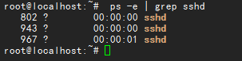
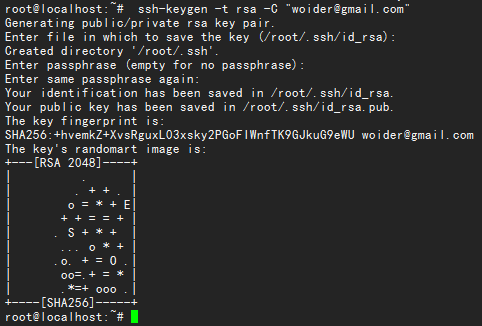
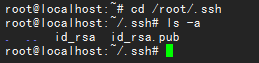
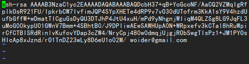
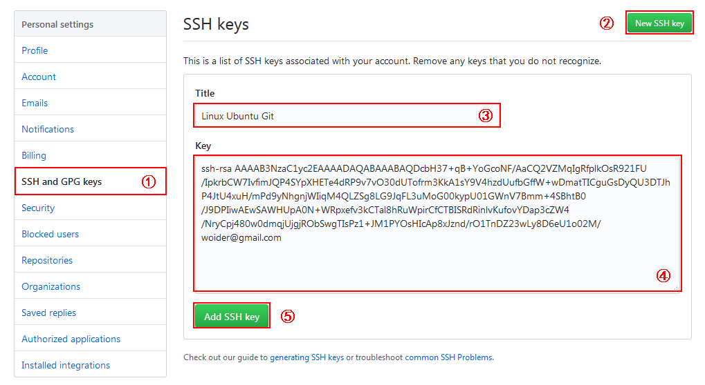
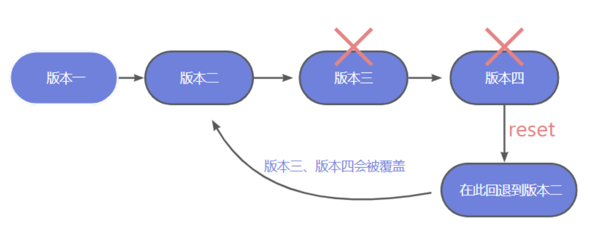
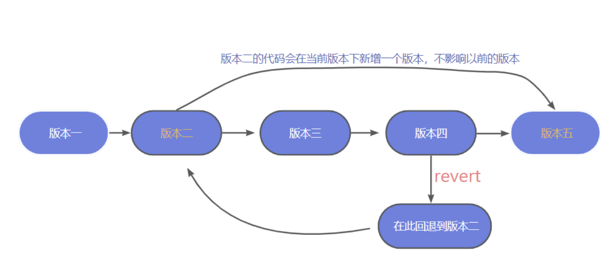
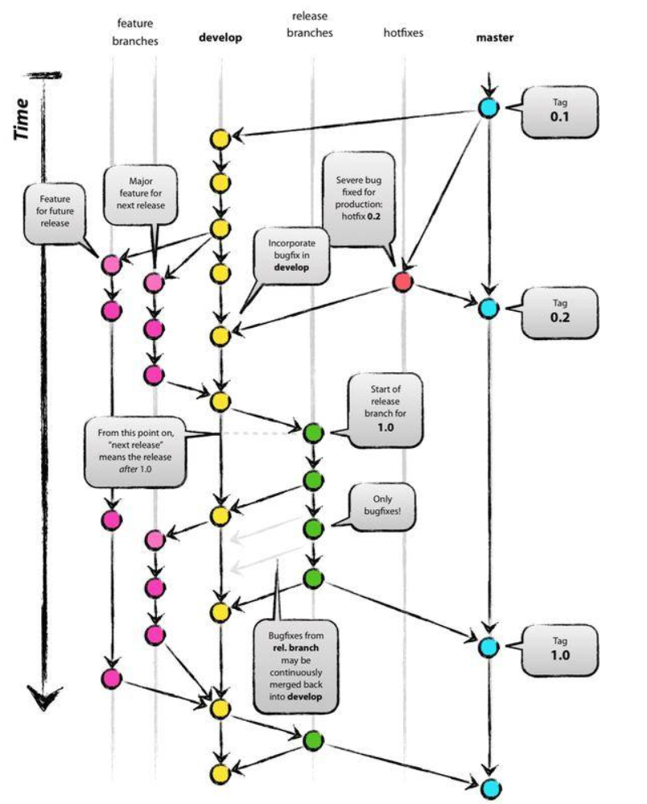

# Github使用笔记

优秀教程参考[菜鸟教程](https://www.runoob.com/git/git-tutorial.html)

# 配置git

## 安装Git

```shell
sudo apt-get install git
# 查看git版本
git --version
```

配置git用户信息

```shell
git config --global user.name "woider"
git config --global user.email "woider@gmail.com"
```

## 开启SSH服务

Ubuntu安装SSH：apt-get install ssh

查看SSH服务状态：ps -e | grep sshd



sshd 表示ssh-server已启动

## 生成SSH KEY

使用ls -al ~/.ssh命令查看ssh key 是否存在，若存在则忽略

**生成SSH KEY**：ssh-keygen -t rsa -C “woider@gmail.com”



生成ssh key过程中，会让你填写passphrase，连按三次回车跳过即可

进入/root/.ssh目录，查看id_rsa和id_rsa.pub文件：

```shell
root@localhost:~# cd /root/.ssh
root@localhost:~/.ssh# ls -a
```



**复制SSH KEY**：打开id_rsa.pub文件，将内容复制到剪贴板：vim id_rsa.pub    【cat ~/.ssh/id_rsa.pub】



**添加SSH KEY**：登录Github，打开personalsetting页面，选择SSH and GPG keys选项：



Title可以随意填写，key中填写刚从id_rsa.pub中拷贝的内容

添加SSH key之后，就可以通过SSH建立本地Git与Github连接了。

# git常用命令

git clone [url]         克隆仓库地址

git init                     初始化本地仓库

git status                查看仓库状态

git add .                  添加当前仓库所有文件

git add *                 将修改的文件添加到本地仓库

git add XX.*            添加当前仓库的某一个文件，add后面空格跟多个文件表示同时添加多个文件

git commit -m "messages"    提交文件

git log                     查询提交日志

git branch              查看分支

git branch (branchname)       创建分支

git checkout (branchname)         切换分支或标签

git checkout -b [branchname]      创建并切换到新分支

git rm [file] delete the file from project and stage the removal for commit

git push [alias] [branch] transimit local branch commits to the remote repository branch

git pull fetch and merge any commits from the tracking remote branch

git remote add <远端名称><仓库路径>：远端名称默认为origin，取决于远端服务器设置，仓库路径，从远端服务器获取此URL

# git 工作流

## 添加与提交

将文件添加到缓存区：git add <filename>或者git add *

提交改动：git commit -m "提交信息"

现在已经将提交到HEAD，但是还没有到远端仓库

## 推送改动

将改动提交到远端仓库：git push origin master      [可以将master改成想要推送的分支]

将本地仓库与远程仓库连接：git remote add origin <server>

## 分支

在创建仓库时，master是默认的，在其他分支上进行开始开发，完成后再将该分支合并到主分支上。

创建一个“feature”的分支，并切换：git checkout -b feature

切换回主分支：git checkout master

删除新建分支：git branch -d feature

除非将分支推送到远端仓库，不然该分支就是不为其他人所见：git push origin <branch>

## 更新与合并

要更新本地仓库至最新改动：git pull， 以在工作目录中获取（fetch）并合并（merge）远端的改动。

合并其他分支到当前分支：git merge <branch>

## 标签

在软件发布时创建标签：git tag 1.0.0 1b2e1d63ff     该命令是创建一个1.0.0的标签，1b2e1d63ff是想要标记的提交ID的前十位字符

获取提交的ID：git log


# 在github上创建项目

​		第一次在github上创建了项目之后，出现如下的提示：

**create a new repository on the command line**

```bash
echo "# QtProject" >> README.md
git init
git add README.md（git add . 表示提交当前目录所有文件）
git commit -m "first commit"（提交记录说明）
git branch -M main
git remote add origin git@github.com:littleHuixian/QtProject.git
git push [-u] origin main
# 由于远程库是空的，我们第一次推送master分支时，加上了-u参数,Git不但会把本地的
# master分支内容推送的远程新的master分支，还会把本地的master分支和远程的master
# 分支关联起来，在以后的推送或者拉取时就可以简化命令
```

**push an existing repository from the command line**

```github
git remote add origin git@github.com:littleHuixian/QtProject.git
git branch -M main  （创建main分支）
git push -u origin main
```


# 将本地代码提交到github远程仓库

命令：`git push [-f] [--set-upstream][远端名称[本地分支名][:远端分支名]]`

​	如果远程分支名和本地分支名相同，则可以只写本地分支名：git push origin master

​	-f 表示强制覆盖

​	--set-upstream 推送到远端的同时并且建立起和远端分支的关联关系：git push --set-upstream origin master

​	如果当前分支已经和远端分支关联，则可以省略分支名和远端名：git push 将master分支推送到已关联的远端分支。

**方法一**

- git clone        仓库地址
- git add *        将修改的文件添加到本地仓库
- git commit -m “提交的注释”
- git push origin main   将本地的仓库提交到github仓库（如果只有readme文件则需要加上-u）

**方法二**

- git init    初始化本地仓库并生成.git文件
- git add * 将文件夹下面所有文件添加到本地仓库
- git commit -m “提交的注释”
- git remote add origin [远程仓库地址] 将本地仓库与远程仓库关联
- git push origin main 将本地的仓库提交到github仓库（如果只有readme文件则需要加上-u）
- 如果本地没有README文件则需要添加--rebase参数，git pull --rebase origin main

## 合并错误

推送到远程仓库

```
git push -u origin master
```

出现如下错误

```bash
 ! [rejected]        master -> master (fetch first)
error: failed to push some refs to 'git@github.com:qiyuebuku/WxRobot.git'
hint: Updates were rejected because the remote contains work that you do
hint: not have locally. This is usually caused by another repository pushing
hint: to the same ref. You may want to first integrate the remote changes
hint: (e.g., 'git pull ...') before pushing again.
hint: See the 'Note about fast-forwards' in 'git push --help' for details.
```

首先它的出现是因为在你上传的时候，远程仓库中有着本地仓库没有的文件，及导致本地仓库和远程有不同的开始点，也就是两个仓库没有共同的 commit 出现的无法提交。

解决方法就是在push到远程服务器之前，先将本地仓库的变化连接到远程仓库主分支

```bash
git pull origin master
git push -u origin master      //把本地仓库的文件推送到远程仓库
git branch -d (branchname)     //删除分支
```

以后先创建远端仓库，然后clone到本地吧，不会出现什么问题；或者远端仓库默认不要添加初始化文件，设置为空即可。
本质上是将分支进行了合并。

# 为github开源项目贡献自己的代码

- git init         初始化.git文件
- git add *     上传修改的文件
- git commit -m “test”        添加上传文件的描述
- git branch test                  创建分支
- git checkout test               切换分支
- git remote add origin [url]          与远程仓库关联
- git push origin test            上传到test分支

# 使用git log

git log用于查看仓库的历史提交记录，这将显示每个提交的作者，日期，提交信息以及唯一的SHA哈希值。

git log -n 5 查看最近5个提交

# 使用git tag

学习参考[链接](https://git-scm.com/book/zh/v2/Git-%E5%9F%BA%E7%A1%80-%E6%89%93%E6%A0%87%E7%AD%BE)

​		创建一个tag

```shell
git tag <tag_name>
//Eg. git tag V1.0.1
```

​		此命令标记当前分支中的最新提交，tag_name即为你为这次commit打的标签。通常标签为v1.0.1，遵循的命名模式为 v<major>.<minor>.<patch>

**major(主版本号)**：重大变化；**minor(次要版本号)**：版本与先前版本兼容；**patch(补丁号)**：bug修复

​		创建tag后，将他推送到远程版本库

```bash 
$ git push --tags
```

​		在Git中打标签非常简单，首先，切换到需要打标签的分支上

```bash
$ git branch

* dev
  master

$ git checkout master # Switched to branch 'master' 切换成“master”
```

2、敲命令git tag

```bash
$ git tag v1.0.1
```

3、查看已经常见的Tag

```bash
$ git tag
v1.0.1
```

4、推送到远程服务器上

 ```bash
 $ git push origin --tags
 ```

补充：

一、如何对以前内容打标签。 需要找到历史提交的commit id，然后打上就可以了 

```bash
$ git log --pretty=oneline --abbrev-commit

be58e91 添加中文说明
007a52f 1.0.6 重新整理代码
0116e99 Update README.md
fe62401 Delete MessageType.png
```

然后执行

```bash
$ git tag V1.0.6 007a52f
```

再用命令git tag查看标签：

 ```bash
 $ git tag
 ```

也可以创建带有说明的标签，用-a指定标签名，-m指定说明文字：

```bash
$ git tag -a v1.0.6 -m "version 1.0.6 released" 007a52f
```

5、git发布release版本后打tag

git tag -a [tagname] -m "说明"       git tag -a 标签名称 -m "说明"

git push origin [tagname]               git push origin 标签名称 推送标签到远程仓库

```bash
# 附注标签
$ git tag -a v1.4 -m "my version 1.4"
# 轻量标签
$ git tag v1.4-lw
# 在指定的提交上打标签
$ git tag -a v1.2 9fceb02
# 推送标签到远程
$ git push origin v1.5
```

一般我们在项目代码发布新的版本后，为了后期版本的跟踪，需要在git中打一个tag。使用命令：

```bash
$ git tag -a v3.0 -m "这是4.0版本"
$ git push origin v3.0
```

删除tag

```bash
$ git tag -d v1.1  //删除本地tag
$ git push origin :v1.1//删除远程tag
//也可以这样
$ git push origin --delete tag V1.1 
```

# 版本回退

​	git回退到指定版本的两种方法reset/revert

​	实现多人合作程序开发的过程中，我们有时会出现错误提交的情况，此时我们希望能撤销提交操作，让程序回到提交前的样子，本文总结了两种解决方法：reset、revert。

| 命令   | 特点                                                         |
| ------ | ------------------------------------------------------------ |
| reset  | 该命令会强行覆盖当前版本和要回退的版本之间的其他版本（不太建议） |
| revert | 再当前版本的基础上新增一个版本，不影响以前的代码             |

## 1.reset 的使用方法（会覆盖，不太建议）



git log 查看要回退的版本号

使用git reset --head(目标版本号)

此时再推送到远程仓库用git push会报错，需要用到git push -f强推上去才行

## 2.revert的使用方法




git log 查看版本号

git revert -n（版本号）

这里可能会出现冲突，那么需要手动修改冲突的文件
3.然会就正常的提交流程就可以了，会生成一个新的版本在最新，不会影响到以前的版本

# 分支创建与管理


## 分支命名

### master 分支

master 为主分支，也是用于部署生产环境的分支，需要确保master分支稳定性。master 分支一般由 release 以及 hotfix 分支合并，任何时间都不能直接修改代码。

### develop 分支

develop 为开发环境分支，始终保持最新完成以及bug修复后的代码，用于前后端联调。一般开发的新功能时，feature分支都是基于develop分支创建的。

### feature 分支

开发新功能时，以develop为基础创建feature分支。

分支命名时以 `feature/` 开头，后面可以加上开发的功能模块， 命名示例：`feature/user_module`、`feature/cart_module`

### test分支

test为测试环境分支，外部用户无法访问，专门给测试人员使用，版本相对稳定。

### release分支

release 为预上线分支（预发布分支），UAT测试阶段使用。一般由 test 或 hotfix 分支合并，不建议直接在 release 分支上直接修改代码。

### hotfix 分支

线上出现紧急问题时，需要及时修复，以master分支为基线，创建hotfix分支。修复完成后，需要合并到 master 分支和 develop 分支。

分支命名以`hotfix/` 开头的为修复分支，它的命名规则与 feature 分支类似。

## 分支与环境对应关系

在系统开发过程中常用的环境：

- DEV 环境（Development environment）：用于开发者调试使用
- FAT环境（Feature Acceptance Test environment）：功能验收测试环境，用于测试环境下的软件测试者测试使用
- UAT环境 （User Acceptance Test environment）：用户验收测试环境，用于生产环境下的软件测试者测试使用
- PRO 环境（Production environment）：生产环境

对应关系：

| 分支 | 功能 | 环境 | 可访问 |
| --- | --- | --- | --- |
| master | 主分支，稳定版本 | PRO | 是 |
| develop | 开发分支，最新版本 | DEV | 是 |
| feature | 开发分支，实现新特性 | | 否 |
| test | 测试分支，功能测试 | FAT | 是 |
| release | 预上线分支，发布新版本 | UAT | 是 |
| hotfix | 紧急修复分支，修复线上bug | | 否 |

### 分支合并流程规范

业界常见的两大主分支（master、develop）、三个辅助分支（feature、release、hotfix）的生命周期：



以上生命周期仅作参考，不同开发团队可能有不同的规范，可自行灵活定义。

例如我们团队在开发时，至少需要保证以下流程：

- develop 分支和 hotfix 分支，必须从 master 分支检出
- 由 develop 分支合并到 test 分支
- 功能测试无误后，由 test 分支合并到 release 分支
- UAT测试通过后，由 release 分支合并到 master分支
- 对于工作量小的功能开发（工时小于1天），可以直接在devolop 分支进行开发，否则由 develop 分支检出 feature 分支进行开发，开发完后合并到develop 分支

## git commit Message规范

Git commit message规范指提交代码时编写的规范注释，编写良好的Commit messages可以达到3个重要的目的：

- 加快代码review的流程
- 帮助我们编写良好的版本发布日志
- 让之后的维护者了解代码里出现特定变化和feature被添加的原因

### Angular Git Commit Guidelines

业界应用的比较广泛的是Angular Git Commit Guidelines：

```xml
<type>(<scope>): <subject>
<BLANK LINE>
<body>
<BLANK LINE>
<footer>
```

- type：提交类型
- scope：可选项，本次 commit 波及的范围
- subject：简明扼要的阐述下本次 commit 的主旨，在`Angular Git Commit Guidelines`中强调了三点。使用祈使句，首字母不要大写，结尾无需添加标点
- body: 同样使用祈使句，在主体内容中我们需要把本次 commit 详细的描述一下，比如此次变更的动机
- footer: 描述下与之关联的 issue 或 break change

### 简易版

项目中实际可以采用简易版规范：

```
<type>(<scope>):<subject>
```

### type规范

`Angular Git Commit Guidelines`中推荐的type类型如下：

- feat: 新增功能
- fix: 修复bug
- docs: 仅文档更改
- style: 不影响代码含义的更改（空白、格式设置、缺失 分号等）
- refactor: 既不修复bug也不添加特性的代码更改
- perf: 改进性能的代码更改
- test: 添加缺少的测试或更正现有测试
- chore: 对构建过程或辅助工具和库（如文档）的更改

除此之外，还有一些常用的类型：

- delete：删除功能或文件
- modify：修改功能
- build：改变构建流程，新增依赖库、工具等（例如webpack、gulp、npm修改）
- test：测试用例的新增、修改
- ci：自动化流程配置修改
- revert：回滚到上一个版本

### 单次提交注意事项

- 提交问题必须为同一类别
- 提交问题不要超过3个
- 提交的commit发现不符合规范，`git commit --amend -m "新的提交信息"`或 `git reset --hard HEAD` 重新提交一次

# 改动查询

```bash
git diff [选项]           # 查看工作区中的修改
git diff [选项] --staged   # 查看已添加到暂存区的修改
git diff [选项] HEAD       # 查看当前所有未提交的修改

选项：
    --color-words： 颜色
    --stat：        不显示具体修改，只显示修改了的文件
```


# 其他

此外，还有一些其他建议：

- master 分支的每一次更新，都建议打 tag 添加标签，通常为对应版本号，便于管理
- feature分支、hotfix分支在合并后可以删除，避免分支过多管理混乱
- 每次 pull 代码前，提交本地代码到本地库中，否则可能回出现合并代码出错，导致代码丢失


