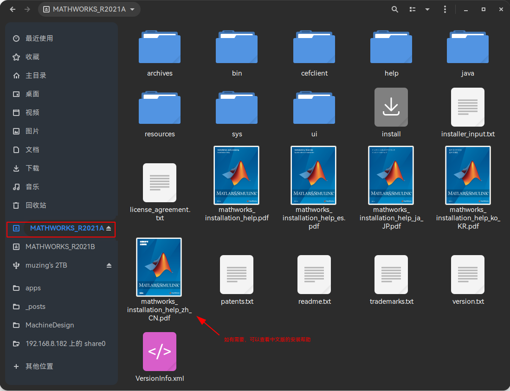
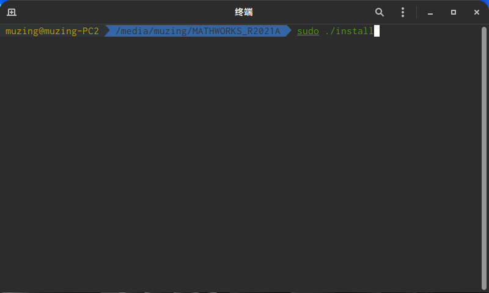
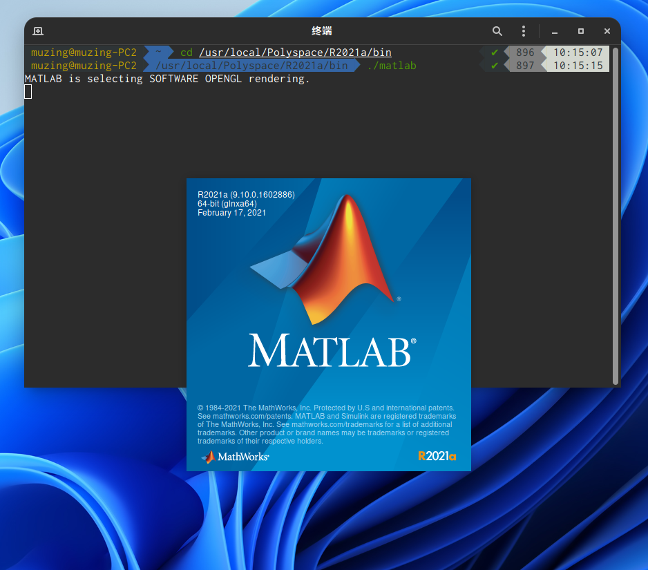
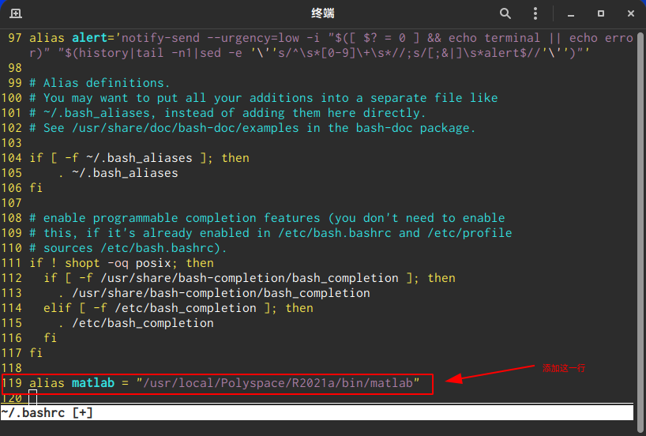
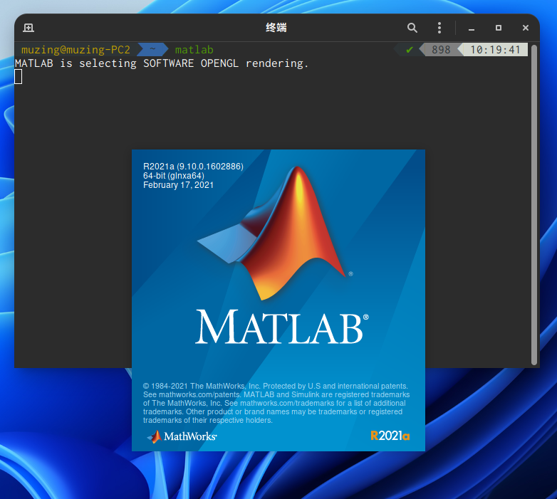

# 1. 前言

本文主要介绍在 Linux 下的安装配置，[文章参考链接]()。

操作系统：Ubuntu 20.04 LTS

matlab版本2020a linux


# 2. 安装matlab软件

## 2.1 挂载磁盘映像

直接在文件资源管理器中双击iso文件即可挂载


可以查看中文版的安装说明PDF文件



在已经打开挂载iso目录中右键鼠标“在终端中打开”。


## 2.2 安装matlab

在刚刚打开的终端中输入命令，根据提示输入用户密码。

```
sudo ./install
```



然后出现图形化中文安装界面，根据提示一步步安装即可。


建议默认路径作为安装路径


全部安装的话体积较大（25.26 GB），选择需要的产品安装即可。即使在第一次安装时有忘记安装的模块，重复上述步骤即可补充安装，无需担心。


安装完毕，在安装路径下的 `bin` 目录中执行 `matlab` 可执行文件即可启动 MATLAB 了。注意第一次启动较慢，再次启动速度会快得多。

```
cd /usr/local/Polyspace/R2021a/bin # 进入 MATLAB 可执行文件目录
./matlab # 运行 MATLAB
```



2.3 在shell中配置命令别名

​		此时已经安装好了 MATLAB，但每次启动都需要输入完整文件路径，非常繁琐。可以在 shell 中为 MATLAB 可执行文件设置命令别名，以实现在命令行任意位置直接使用 `matlab` 命令即可启动软件的效果。

​		Linux 中的 `alias` 命令可以为命令设置别名，但如果直接在命令行执行 `alias` ，则每次重启电脑（重新登录）之后都会失效。故需要将该配置写入到用户的 shell 配置文件中（默认即为 `~` 目录下的 `.bashrc` 文件）。

```
vim ~/.bashrc # 使用 Vim 编辑器编辑 .bashrc 文件

# 将下行内容添加到 .bashrc 的最后一行中
alias matlab="/usr/local/Polyspace/R2021a/bin/matlab"

# 保存并退出 Vim 编辑器

source ~/.bashrc # 使刚才的修改生效
```



完成上面的操作后，就可以在命令行任意位置直接使用 `matlab` 命令启动软件了。


