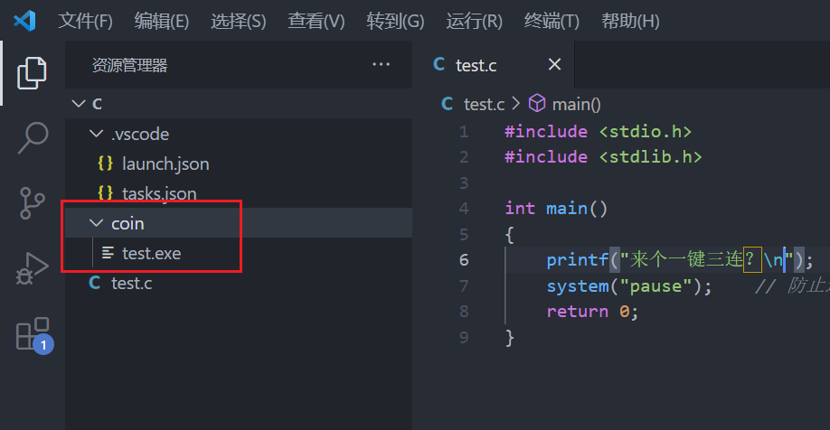

# 前言

​		Qt的OpenCV开发环境搭建还是有一些难度，为此将个人搭建过程做一个笔记。

​		本笔记主要记录个人OpenCV在Qt和visual studio 2022中的开发环境搭建，主要包括mac、windows下的OpenCV环境搭建。

# 一、Windos环境

## 1. 在VScode中配置C/C++环境

[官网参考](https://code.visualstudio.com/docs/cpp/config-msvc)

优质博主参考笔记：爱编程的大丙 [链接](https://subingwen.cn/vscode/cpp-windows/) b站 [链接](https://space.bilibili.com/147020887)

xiaobing1016 [link](https://space.bilibili.com/434013215)

### 1.1 下载VScode并安装

### 1.2 下载编译器MinGW并安装

​		安装好MinGW之后，进入mingw64下的bin文件夹，复制当前路径，Win + i唤起系统设置，输入高级系统设置并进入，点击环境变量，选择path，编辑，新建，粘贴路径，按下三个确定，配置MinGW64环境完成

​		cmd进入命令窗口，输入`g++`进行测试，或者输入`g++ --version`来测试


### 1.3 基于cmake

若电脑已安装了VS，可能会调用微软的MSVC编译器，使用`（cmake -G “MinGW Makefiles” ..）`代替（cmake..）即可。

### 1.4 安装VScode插件

​		打开VScode安装插件C/C++，分别为`c/c++`, `CMake`, `CMake Tools`，安装完成之后重启VScode。

​		切换C/C++插件至1.8.4版本。因最新版本不会自动生成launch.json文件，给后续优化带来不便，故退回旧版本。


### 1.5 json配置文件生成

在使用VS Code进行C/C++的开发过程中，有三个至关重要的配置文件，分别是 **tasks.json, launch.json** 和 **c_cpp_properties.json**

#### **tasks.json**

参考 **[Integrate with External Tools via Tasks 官方文档](https://code.visualstudio.com/docs/editor/tasks)** 文档了解

tasks.json 是在 vscode 中辅助程序**编译**的模块，可以代你执行类似于在命令行输入 ***“****gcc hello.c -o hello”*** 命令的操作，你只要在图形界面下操作即可生成可执行文件。

​	当你在项目文件夹下打开 vscode 后：

1) 选择“**终端**”；　　2. 选择“**配置任务**”；　　3. 选择你想使用的编译器；

即可生成默认的 tasks.json 文件。


可以看到在文件夹下生成了名为 .vscode 的文件，tasks.json 就放在其中。

```json
{
    "version": "2.0.0",
    "tasks": [
        {
            "type": "cppbuild",        //任务类型（如果是shell，下面的command就相当于执行shell命令）
            "label": "环境配置测试",     //任务的名称，可以修改，但一定要和launch中的"preLaunchTask"项保持一致
            "command": "/usr/bin/gcc", //编译器（可执行文件）的路径
            "args": [                  //（常用）编译时使用的参数，和命令行下相同
                "-g",
                "${fileDirname}/hello.c",
                "-o",
                "${fileDirname}/hello"
            ],
            //上述内容相当于在命令行下输入了: gcc hello.c -o hello
            "options": {
                "cwd": "/usr/bin"     //编译器的目录
            },
            "problemMatcher": [
                "$gcc"        　　　　 //使用gcc捕捉错误
            ],
            "group": "build",
            "detail": "compiler: /usr/bin/gcc"      //一些描述性信息
        }
    ]
}
```

#### **launch.json**

launch.json 是用于**运行 ( run ) 和调试 ( debug )** 的配置文件，可以指定语言环境，指定调试类型等等内容。

打开 VS Code 后，按照下图所示的提示，从左向右依次点击（也可以在上方菜单栏依次选择 ：

1) **“运行”；**2) **“打开配置”**；3) **选择编译器** 选择 **" C++ (GDB/LLDB) "** ，根据自己配置的路径选择对应的编译套件中的编译器即可。如果源文件是.cpp, 此处显示的是 g++.exe，即可生成 launch.json），创建 launch.json 文件


生成的 launch.json 也放在 .vscode 文件夹中。

其中各种变量的内容及涵义如下：

```json
{
    "version": "0.2.0",
    "configurations": [
        {
            "name": "运行和调试",         //运行和调试任务的名称，可自定义
            "type": "cppdbg",       　　 //配置类型，默认即可
            "request": "launch",    　　 //launch模式允许我们打断点进行调试，默认即可
            "program": "${fileDirname}/hello", //（常用）程序目录，这里相当于在命令行执行"hello"
            "args": [],             　　 //（常用）程序(main函数)的入口参数
            "stopAtEntry": false,       //在入口处暂停，选true相当于在入口处增加断点
            "cwd": "${workspaceFolder}",//当前的文件目录
            "environment": [],          //添加到程序的环境变量
            "externalConsole": false,   //外部控制台，true在调试时会开启系统控制台窗口，false会使用vscode自带的调试控制台
            "MIMode": "gdb",            //使用gdb进行调试
            "setupCommands": [      　　 //用来设置gdb的参数，默认即可
                {
                    "description": "为 gdb 启用整齐打印",
                    "text": "-enable-pretty-printing",
                    "ignoreFailures": true
                }
            ],
            "preLaunchTask": "环境配置测试",    //（常用）运行和调试前要执行的task(编译)任务，任务名要和task.json里的"label"对应
            "miDebuggerPath": "/usr/bin/gdb"  //debug调试工具的路径，这里使用gdb所在的路径
        }
    ]
}
```

也可以参考 **[Configuring C/C++ debugging官方文档](https://code.visualstudio.com/docs/cpp/launch-json-reference)** 和 **[Debugging in VS Code官方文档](https://code.visualstudio.com/docs/editor/debugging#_global-launch-configuration)** 进行设置

#### **c_cpp_properties.json**

c_cpp_properties.json 主要用来设置包含**头文件的路径**，设置 C/C++ 支持的**版本号**等等。

1) 点击 ***Ctrl + Shift +P*** 弹出命令搜索框；2) 选择 C/C++: 编辑配置 (UI) 即可生成 c_cpp_properties.json 文件，此文件同样包含在.vscode文件夹中。


```json
{
    "configurations": [
        {
            "name": "Linux",    　　　　//配置名称，默认为系统名，可以自行更改
            "includePath": [    　　　　//（常用）运行项目包含.h头文件的目录，
                "${workspaceFolder}/**"//此处会匹配工作文件下的所有文件
            ],                  　　　　//添加"compilerPath"后,系统include路径可不写明
            "defines": [],　　　　　　　 //（常用）定义一些需要的变量，等价于在编译时写"-D变量" 
            "compilerPath": "/usr/bin/gcc",     //编译器的路径
            "cStandard": "gnu17",               //C标准的版本
            "cppStandard": "gnu++14",           //C++标准的版本
            "intelliSenseMode": "gcc-x64"       //IntelliSense的一些配置，默认即可
        }
    ],
    "version": 4
}
```

也可参考 **[c_cpp_properties.json 官方文档](https://code.visualstudio.com/docs/cpp/c-cpp-properties-schema-reference)** 设置更多内容。

在上述三个配置文件中，我们会看到类似于 ${workspaceFolder} 等等类似的描述，这些描述是 VS Code **预定义变量名**，可以用来代指工作目录的路径，环境变量的名称，生成文件的名称等等。使用这些预定义的变量名可以使得我们的开发过程更加高效，同时可移植性也大大增强。更多内容可以参照官方文档 **[Variables Reference](https://code.visualstudio.com/docs/editor/variables-reference)**。

一般我们比较常见的变量名有：

```tex
${workspaceFolder} - VS Code当前打开工作区文件夹的路径
${file} - 当前打开文件的绝对路径
${fileBasename} - 当前打开文件的名称
${fileBasenameNoExtension} - 当前打开文件的名称，但是不加后缀名
${fileDirname} - 文件所在的文件夹路径
```

### 1.6 配置OpenCV

参考文档 [Windows平台下VSCode + OpenCV+ MinGW环境搭建-C++](https://www.bmabk.com/index.php/post/46059.html)

1.编译OpenCV，点击`Configure`，然后选择使用`MinGw MakeFiles`作为编译器，并选择`Specify native compliers`，点击`next`继续。

2.`Compliers`C选择`mingw/bin`文件夹下的`gcc.exe`，C++选择`mingw/bin`文件夹下的`g++.exe`，然后点击`finish`继续。

3.等完成后可能会有红色的框表示失败了，这时候看一下`CMakeDownloadLog.txt`文件，应该是有几个文件没有下载下来，可以手动下载，然后把它们放到指定文件夹内并重命名。大概就是这几个文件需要手动下载：`opencv_videoio_ffmpeg.dll`、`opencv_videoio_ffmpeg_64.dll`、`ade-0.1.1f.zip`、`ffmpeg_version.cmake`。

4.下载完成后再重新点击`Configure`，等待完成即可。如果完成后仍然还有红色框出现，不要着急，再重新点击`Configure`即可。

5.执行完后，把`python`相关的都取消勾选，
`WITH_IPP`、`WITH_MSMF`、`ENABLE_PRECOMPILED_HEADERS`取消勾选；
`BUILD_opencv_world`、`WITH_OPENGL`、`BUILD_EXAMPLES`选择勾选，
`CPU_DISPATCH`选空。

6.上述操作完成后点击`Generate`，直到操作完成。

7.重新打开cmd窗口，进入刚刚生成的`mingw`文件夹，执行命令：`minGW32-make -j 4`。
没有出错，继续执行命令：`minGW32-make install`。然后添加环境变量

8.`.vscode`文件夹下手动创建三个文件：`c_cpp_properties.json`、`launch.json`、`tasks.json`，然后按照如下编辑这些json文件。

c_cpp_properties.json

```json
{
    "configurations": [
        {
            "name": "win",
            "includePath": [
                "${workspaceFolder}/**",
                "D:\\IDE\\opencv452\\opencv\\build\\x64\\mingw\\install\\include",
               "D:\\IDE\\opencv452\\opencv\\build\\x64\\mingw\\install\\include\\opencv2"
            ],
            "defines": [],
            "compilerPath": "D:\\IDE\\MinGw\\bin\\g++.exe",
            "cStandard": "c11",
            "cppStandard": "c++17",
            "intelliSenseMode": "${default}"
        }
    ],
    "version": 4
}
```

tasks.json

```json
{
    "version": "2.0.0",
    "tasks": [
        {
            "type": "shell",
            "label": "opencv4.5.2",
            "command": "D:\\IDE\\MinGw\\bin\\g++.exe",
            "args": [
                "-g",
                "${file}",
                "-o",
                "${workspaceFolder}\\RBin\\${fileBasenameNoExtension}.exe",
                // RBin是自定义的文件夹名，会把生成的EXE放在该文件夹下，要手动创建RBin文件夹
                // 下面的opencv路径根据自己的路径修改
             "D:\\IDE\\opencv452\\opencv\\build\\x64\\mingw\\bin\\libopencv_world452.dll",
                "-I",
                "D:\\IDE\\opencv452\\opencv\\build\\x64\\mingw\\install\\include",
                "-I",
                "D:\\IDE\\opencv452\\opencv\\build\\x64\\mingw\\install\\include\\opencv2",
            ],
            "options": {
                "cwd": "D:\\IDE\\MinGw\\bin"
            },
            "problemMatcher": [
                "$gcc"
            ],
            "group": {
                "kind": "build",
                "isDefault": true
            }
        }
    ]
}
```

launch.json

```json
{
    // 使用 IntelliSense 了解相关属性。 
    // 悬停以查看现有属性的描述。
    // 欲了解更多信息，请访问: https://go.microsoft.com/fwlink/?linkid=830387
    "version": "0.2.0",
    "configurations": [
        {
            "name": "opencv debuge",
            "type": "cppdbg",
            "request": "launch",
            "program": "${workspaceFolder}\\RBin\\${fileBasenameNoExtension}.exe",
            "args": [],
            "stopAtEntry": false, // true表示运行到main()函数的第一行，可以调试；false表示直接运行，不会再main()函数的第一行停止，除非设置了断点
            "cwd": "${workspaceFolder}",
            "environment": [],
            "externalConsole": true,//是否调用外部cmd
            "MIMode": "gdb",
            "miDebuggerPath": "D:\\IDE\\MinGw\\bin\\gdb.exe",//自己进行设置
            "setupCommands": [
                {
                    "description": "为 gdb 启用整齐打印",
                    "text": "-enable-pretty-printing",
                    "ignoreFailures": false
                }
            ],
            "preLaunchTask": "opencv4.5.2",
            "console": "integratedTerminal",
            "justMyCode": true
        }
    ],
}
```

### 1.7 调整和优化

请根据自己的需要进行优化

代码运行后 `.vscode` 文件夹会自动生成在你的源文件目录下

`.vscode` 文件夹下的 `task.json` 和 `launch.json` 用来控制程序的运行和调试

- 将程序运行在外部控制台【推荐】

  **解决方法：**打开`.vscode` 文件夹下的 `launch.json` 文件，找到 `"externalConsole": false,` 将 `false` 改为 `true` 并保存

  

  

- vscode c++编译器中文输出乱码

  **解决方法：**将tasks.json文件的编码格式改为gbk即可, vscode窗口的右下角，点击显示的当前编码格式，输入gbk并保存，重新f5 进入debug中文打印就是正常了。

  

  ```c++
  "-fexec-charset=GBK",   // 处理mingw中文编码问题
  "-finput-charset=UTF-8",// 处理mingw中文编码问题
  ```

  

- 收纳生成的 `exe` 可执行文件【可选】

  **解决方法：**

  1.打开`.vscode` 文件夹下的 `task.json` 文件，找到 `"${fileDirname}\\${fileBasenameNoExtension}.exe"` ；

  2.修改成 `"${fileDirname}\\coin\\${fileBasenameNoExtension}.exe"` 并保存，同理，`launch.json` 下也有相同的字段，需要你修改；

  3.在源文件同目录下新建 `coin` 文件夹，程序运行后，可执行文件将会生成在里面（其中 `coin` 可修改成你喜欢的英文名字）

> 这样 `.c` 文件一多起来的时候，就不会出现 `.exe` 和 `.c` 相互穿插在目录中



## 2. 在Qt中配置OpenCV开发环境

1.调用cmake编译的OpenCV
  在新建的项目.pr中添加

```c++
INCLUDEPATH += E:\OPENCV\MinGWBuildOpenCV3.4.8x64\include \
                 E:\OPENCV\MinGWBuildOpenCV3.4.8x64\include\opencv \
                 E:\OPENCV\MinGWBuildOpenCV3.4.8x64\include\opencv2

LIBS += E:\OPENCV\MinGWBuildOpenCV3.4.8x64\x64\mingw\lib\libopencv_*.a
```

2.调用MSVC编译的OpenCV

```C++
//OpenCV核心动态链接库，和core.hpp头文件对应，d代表调试版本
#pragma comment(lib,"opencv_core249d.lib")
//OpenCV图形处理动态链接库，和highgui.hpp头文件对应，d代表调试版本
#pragma comment(lib,"opencv_highgui249d.lib")

#pragma comment(lib,"opencv_video249d.lib")
#pragma comment(lib,"opencv_imgproc249d.lib")
```

本笔记参考了网络上的教程文章：

 - 1.win10系统Qt5.12配置OpenCV4.0.1库教程暨Qt，OpenCV，Cmake详细下载安装教程[文章链接](https://blog.csdn.net/weixin_42322013/article/details/88808230)
 - 2.Qt-OpenCV开发环境搭建[文章链接](https://wangjichuan.blog.csdn.net/article/details/110677323?spm=1001.2014.3001.5506)
 - 3.opencv_contrib安装笔记[文章链接](https://blog.csdn.net/weijifen000/article/details/93377143)

### 2.1 Qt的下载与安装

Qt下载链接[download](https://download.qt.io/archive/qt/)
Qt的安装过程不做过多的赘述

### 2.2 CMAKE的下载与安装

下载[链接](https://cmake.org/download/)


### 2.3 添加环境变量

安装完成Qt和CMake之后，需要将路径添加到系统环境变量中，之后重启生效

```C++
C:\Qt\Qt5.14.2\5.14.2\mingw73_64\bin
C:\Qt\Qt5.14.2\Tools\mingw730_64\bin

C:\Program Files\CMake\bin
```

### 2.4 OpenCV下载

下载[链接](https://opencv.org/releases/)


OpenCV结构说明：

- **Sources**：当前版本的OpenCV源代码

- **Windows**：Windows环境下编译好的文件（build）+源码

- **IOSpack**：IOS环境下编译好的文件（build）+源码

- **Android**：Android环境下编译好的文件（build）+源码

### 2.5 编译器路径

```C++
C:\Qt\Qt5.14.2\Tools\mingw730_64\bin\gcc.exe
C:\Qt\Qt5.14.2\Tools\mingw730_64\bin\g++.exe
```

### 2.6 CMake配置并生成


Configuring done之后，会出现一大片红，不用管，勾选WITH_OPENGL、WITH_QT，然后再次点击Configure


此时仍有红色

| 模块              | 路径                                                     |
| ----------------- | -------------------------------------------------------- |
| Qt5_DIR           | D:/Qt/Qt5.13.2/5.13.2/mingw73_64/lib/cmake/Qt5           |
| Qt5Concurrent_DIR | D:/Qt/Qt5.13.2/5.13.2/mingw73_64/lib/cmake/Qt5Concurrent |
| Qt5Core_DIR       | D:/Qt/Qt5.13.2/5.13.2/mingw73_64/lib/cmake/Qt5Core       |
| Qt5Gui_DIR        | D:/Qt/Qt5.13.2/5.13.2/mingw73_64/lib/cmake/Qt5Gui        |
| Qt5OpenGL_DIR     | D:/Qt/Qt5.13.2/5.13.2/mingw73_64/lib/cmake/Qt5OpenGL     |
| Qt5Test_DIR       | D:/Qt/Qt5.13.2/5.13.2/mingw73_64/lib/cmake/Qt5Test       |
| Qt5widgets_DIR    | D:/Qt/Qt5.13.2/5.13.2/mingw73_64/lib/cmake/Qt5Widgets    |

再次点击Configure之后，红色消失，最后点击Generate


### 2.7 开始编译

在生成文件夹中按下Shift键，点击鼠标右键，选择在此处打开PowerShell执行命令行
输入如下指令开始编译（-j 8 多核编译）：**mingw32-make -j 8**

编译完成之后，输入如下指令安装：**mingw32-make install**


### 2.8 编译问题汇总

**问题1：windres.exe:preprocessing failed.**

- 解决办法：去掉CMake中OPENCV项中的OPENCV_ENABLE_ALLOCATOR_STATS的勾勾

**问题2：error: ‘std::_hypot’ has not been declared**

- 解决方法1：此问题是由于pyconfig.h和cmath 冲突所致；
  修改OpenCV源码D:\Qt\openCV3.4.12\openCV3.4.12\modules\python\src2\cv2.cpp ，在 #include <pyconfig.h>之前添加#include <math.h>
- 解决办法2：取消CMake中的配置项：“BUILD_opencv_python3” 和 “BUILD_opencv_python_bindings_generator”

**问题3：collect2.exe: error: ld returned 5 exit status**
mingw32-make[2]: *** [modules\python3\CMakeFiles\opencv_python3.dir\build.make:104: lib/python3/cv2.cp37-win32.pyd] Error 1
mingw32-make[2]: *** Deleting file ‘lib/python3/cv2.cp37-win32.pyd’
mingw32-make[1]: *** [CMakeFiles\Makefile2:4181: modules/python3/CMakeFiles/opencv_python3.dir/all] Error 2
mingw32-make: *** [Makefile:162: all] Error 2

- 解决办法1：将CMake中的Python2、Python3中的值全部设为空
- 解决办法2：取消CMake中的配置项：“BUILD_opencv_python3” 和 “BUILD_opencv_python_bindings_generator”

**问题4：sprintf_instead_use_StringCbPrintfA_or_StringCchPrintfA**

- 解决办法：修改OpenCV源码：D:\Qt\openCV3.4.12\openCV3.4.12\modules\videoio\src\cap_dshow.cpp ，在#include "DShow.h"这行的上面加一行#define NO_DSHOW_STRSAFE

**问题5：cmake中Configure时 ffmpeg.dll 下载一直失败**（这会导致编译后的OpenCV无法用VideoCapture打开视频）


```C++
FFMPEG: Download: opencv_videoio_ffmpeg.dll
Try 1 failed
=======================================================================
  Couldn't connect to server from the Internet.
  Perhaps direct connections are not allowed in the current network.
  To use proxy please check/specify these environment variables:
  - http_proxy/https_proxy
  - and/or HTTP_PROXY/HTTPS_PROXY
=======================================================================
CMake Warning at cmake/OpenCVDownload.cmake:202 (message):
  FFMPEG: Download failed: 7;"Couldn't connect to server"

  For details please refer to the download log file:

  C:/Users/Administrator/Desktop/opencv-4.5.0/build/CMakeDownloadLog.txt

Call Stack (most recent call first):
  3rdparty/ffmpeg/ffmpeg.cmake:20 (ocv_download)
  modules/videoio/cmake/detect_ffmpeg.cmake:14 (download_win_ffmpeg)
  modules/videoio/cmake/init.cmake:3 (include)
  modules/videoio/cmake/init.cmake:22 (add_backend)
  cmake/OpenCVModule.cmake:312 (include)
  cmake/OpenCVModule.cmake:375 (_add_modules_1)
  modules/CMakeLists.txt:7 (ocv_glob_modules)

FFMPEG: Download: opencv_videoio_ffmpeg_64.dll
Try 1 failed
=======================================================================
  Couldn't connect to server from the Internet.
  Perhaps direct connections are not allowed in the current network.
  To use proxy please check/specify these environment variables:
  - http_proxy/https_proxy
  - and/or HTTP_PROXY/HTTPS_PROXY
=======================================================================
CMake Warning at cmake/OpenCVDownload.cmake:202 (message):
  FFMPEG: Download failed: 7;"Couldn't connect to server"

  For details please refer to the download log file:

  C:/Users/Administrator/Desktop/opencv-4.5.0/build/CMakeDownloadLog.txt

Call Stack (most recent call first):
  3rdparty/ffmpeg/ffmpeg.cmake:20 (ocv_download)
  modules/videoio/cmake/detect_ffmpeg.cmake:14 (download_win_ffmpeg)
  modules/videoio/cmake/init.cmake:3 (include)
  modules/videoio/cmake/init.cmake:22 (add_backend)
  cmake/OpenCVModule.cmake:312 (include)
  cmake/OpenCVModule.cmake:375 (_add_modules_1)
  modules/CMakeLists.txt:7 (ocv_glob_modules)

FFMPEG: Download: ffmpeg_version.cmake
Try 1 failed
=======================================================================
  Couldn't connect to server from the Internet.
  Perhaps direct connections are not allowed in the current network.
  To use proxy please check/specify these environment variables:
  - http_proxy/https_proxy
  - and/or HTTP_PROXY/HTTPS_PROXY
=======================================================================

CMake Warning at cmake/OpenCVDownload.cmake:202 (message):
  FFMPEG: Download failed: 7;"Couldn't connect to server"

  For details please refer to the download log file:

  C:/Users/Administrator/Desktop/opencv-4.5.0/build/CMakeDownloadLog.txt

Call Stack (most recent call first):
  3rdparty/ffmpeg/ffmpeg.cmake:20 (ocv_download)
  modules/videoio/cmake/detect_ffmpeg.cmake:14 (download_win_ffmpeg)
  modules/videoio/cmake/init.cmake:3 (include)
  modules/videoio/cmake/init.cmake:22 (add_backend)
  cmake/OpenCVModule.cmake:312 (include)
  cmake/OpenCVModule.cmake:375 (_add_modules_1)
  modules/CMakeLists.txt:7 (ocv_glob_modules)
```


解决办法：
1、打开编译生成路径（D:\Qt\opencv-3.4.5\build），找到`CMakeDownloadLog.txt`，并打开如下所示：

```json
#use_cache "C:/Users/Administrator/Desktop/opencv-4.5.0/opencv-4.5.0/.cache"
#match_hash_in_cmake_cache "OCV_DOWNLOAD_ADE_HASH_3rdparty_ade_v0_1_1f_zip"
#do_copy "opencv_videoio_ffmpeg.dll" "37e2dadf776631acc8856e281f29cf42" "https://raw.githubusercontent.com/opencv/opencv_3rdparty/6152e132572dfdaa32887eabeb7199bef49b14dc/ffmpeg/opencv_videoio_ffmpeg.dll" "C:/Users/Administrator/Desktop/opencv-4.5.0/build/3rdparty/ffmpeg"
#missing "C:/Users/Administrator/Desktop/opencv-4.5.0/build/3rdparty/ffmpeg/opencv_videoio_ffmpeg.dll"
#check_md5 "C:/Users/Administrator/Desktop/opencv-4.5.0/opencv-4.5.0/.cache/ffmpeg/37e2dadf776631acc8856e281f29cf42-opencv_videoio_ffmpeg.dll"
#mismatch_md5 "C:/Users/Administrator/Desktop/opencv-4.5.0/opencv-4.5.0/.cache/ffmpeg/37e2dadf776631acc8856e281f29cf42-opencv_videoio_ffmpeg.dll" "d41d8cd98f00b204e9800998ecf8427e"
#delete "C:/Users/Administrator/Desktop/opencv-4.5.0/opencv-4.5.0/.cache/ffmpeg/37e2dadf776631acc8856e281f29cf42-opencv_videoio_ffmpeg.dll"
#cmake_download "C:/Users/Administrator/Desktop/opencv-4.5.0/opencv-4.5.0/.cache/ffmpeg/37e2dadf776631acc8856e281f29cf42-opencv_videoio_ffmpeg.dll" "https://raw.githubusercontent.com/opencv/opencv_3rdparty/6152e132572dfdaa32887eabeb7199bef49b14dc/ffmpeg/opencv_videoio_ffmpeg.dll"
#try 1
# timeout on name lookup is not supported
#   Trying 0.0.0.0...
# TCP_NODELAY set
# connect to 0.0.0.0 port 443 failed: Address not available
# Failed to connect to raw.githubusercontent.com port 443: Address not available
# Closing connection 0

#do_copy "opencv_videoio_ffmpeg_64.dll" "cf5dba83edf8619f57ccff4edb989c62" "https://raw.githubusercontent.com/opencv/opencv_3rdparty/6152e132572dfdaa32887eabeb7199bef49b14dc/ffmpeg/opencv_videoio_ffmpeg_64.dll" "C:/Users/Administrator/Desktop/opencv-4.5.0/build/3rdparty/ffmpeg"
#missing "C:/Users/Administrator/Desktop/opencv-4.5.0/build/3rdparty/ffmpeg/opencv_videoio_ffmpeg_64.dll"
#check_md5 "C:/Users/Administrator/Desktop/opencv-4.5.0/opencv-4.5.0/.cache/ffmpeg/cf5dba83edf8619f57ccff4edb989c62-opencv_videoio_ffmpeg_64.dll"
#mismatch_md5 "C:/Users/Administrator/Desktop/opencv-4.5.0/opencv-4.5.0/.cache/ffmpeg/cf5dba83edf8619f57ccff4edb989c62-opencv_videoio_ffmpeg_64.dll" "d41d8cd98f00b204e9800998ecf8427e"
#delete "C:/Users/Administrator/Desktop/opencv-4.5.0/opencv-4.5.0/.cache/ffmpeg/cf5dba83edf8619f57ccff4edb989c62-opencv_videoio_ffmpeg_64.dll"
#cmake_download "C:/Users/Administrator/Desktop/opencv-4.5.0/opencv-4.5.0/.cache/ffmpeg/cf5dba83edf8619f57ccff4edb989c62-opencv_videoio_ffmpeg_64.dll" "https://raw.githubusercontent.com/opencv/opencv_3rdparty/6152e132572dfdaa32887eabeb7199bef49b14dc/ffmpeg/opencv_videoio_ffmpeg_64.dll"
#try 1
# timeout on name lookup is not supported
#   Trying 0.0.0.0...
# TCP_NODELAY set
# connect to 0.0.0.0 port 443 failed: Address not available
# Failed to connect to raw.githubusercontent.com port 443: Address not available
# Closing connection 0

#do_copy "ffmpeg_version.cmake" "f8e65dbe4a3b4eedc0d2997e07c3f3fd" "https://raw.githubusercontent.com/opencv/opencv_3rdparty/6152e132572dfdaa32887eabeb7199bef49b14dc/ffmpeg/ffmpeg_version.cmake" "C:/Users/Administrator/Desktop/opencv-4.5.0/build/3rdparty/ffmpeg"
#missing "C:/Users/Administrator/Desktop/opencv-4.5.0/build/3rdparty/ffmpeg/ffmpeg_version.cmake"
#check_md5 "C:/Users/Administrator/Desktop/opencv-4.5.0/opencv-4.5.0/.cache/ffmpeg/f8e65dbe4a3b4eedc0d2997e07c3f3fd-ffmpeg_version.cmake"
#mismatch_md5 "C:/Users/Administrator/Desktop/opencv-4.5.0/opencv-4.5.0/.cache/ffmpeg/f8e65dbe4a3b4eedc0d2997e07c3f3fd-ffmpeg_version.cmake" "d41d8cd98f00b204e9800998ecf8427e"
#delete "C:/Users/Administrator/Desktop/opencv-4.5.0/opencv-4.5.0/.cache/ffmpeg/f8e65dbe4a3b4eedc0d2997e07c3f3fd-ffmpeg_version.cmake"
#cmake_download "C:/Users/Administrator/Desktop/opencv-4.5.0/opencv-4.5.0/.cache/ffmpeg/f8e65dbe4a3b4eedc0d2997e07c3f3fd-ffmpeg_version.cmake" "https://raw.githubusercontent.com/opencv/opencv_3rdparty/6152e132572dfdaa32887eabeb7199bef49b14dc/ffmpeg/ffmpeg_version.cmake"
#try 1
# timeout on name lookup is not supported
#   Trying 0.0.0.0...
# TCP_NODELAY set
# connect to 0.0.0.0 port 443 failed: Address not available
# Failed to connect to raw.githubusercontent.com port 443: Address not available
# Closing connection 0
```


```json
#do_copy "opencv_videoio_ffmpeg.dll" "37e2dadf776631acc8856e281f29cf42" "https://raw.githubusercontent.com/opencv/opencv_3rdparty/6152e132572dfdaa32887eabeb7199bef49b14dc/ffmpeg/opencv_videoio_ffmpeg.dll" "C:/Users/Administrator/Desktop/opencv-4.5.0/build/3rdparty/ffmpeg"
```

“opencv_videoio_ffmpeg.dll”： 需要下载的文件；

“37e2dadf776631acc8856e281f29cf42”： 需要下载的文件对于的哈希码；
“https://raw.githubusercontent.com/opencv/opencv_3rdparty/6152e132572dfdaa32887eabeb7199bef49b14dc/ffmpeg/opencv_videoio_ffmpeg.dll” ： 需要下载的文件的下载地址；
“C:/Users/Administrator/Desktop/opencv-4.5.0/build/3rdparty/ffmpeg” ： 需要下载的文件下载下来的存放路径
查看CMakeDownloadLog.txt，可知总共有三个文件需要下载，分别是：

“opencv_videoio_ffmpeg.dll”
“opencv_videoio_ffmpeg_64.dll”
“ffmpeg_version.cmake”
科学上网，访问每个文件对应的下载地址将之下载下来，其中前两个文件可以直接下载，第三个文件输入网址后不会直接下载，而是会直接将内容显示出来，之后右键网页另存为，然后修改名字为ffmpeg_version.cmake即可（不可自己创建，然后把内容复制进去，这样哈希码对应不上，不可行）。

文件下载完之后，需要把下载下来的文件放到它应该待的地方去，总共有两处：

源代码下的opencv-4.5.0\.cache\ffmpeg，命名格式：哈希码-文件名；


编译输出代码下的`opencv-3.4.5\build\3rdparty\ffmpeg`，命名格式：与`CMakeDownloadLog.txt`中的名字一致；


文件摆放好之后，再次使用`cmake`：Configure-Generate，即可


### 2.9 测试

#### 2.9.1 新建Qt工程并配置

```C++
INCLUDEPATH += D:\opencv-454-Win_pack\opencv\buildForQt\install\include
LIBS += D:\opencv-454-Win_pack\opencv\buildForQt\install\x64\lib\libopencv_*.a
```

或者

```C++
INCLUDEPATH += D:\opencv-454-Win_pack\opencv\buildForQt\install\include\
               D:\opencv-454-Win_pack\opencv\buildForQt\install\include\opencv2\
               D:\opencv-454-Win_pack\opencv\buildForQt\install\include\opencv

LIBS += -L D:\opencv-454-Win_pack\opencv\buildForQt\install\x64\mingw\lib\libopencv_*.a
```


#### 2.9.2 图片测试代码

```C++
#include "mainwindow.h"
#include <QApplication>

#include <opencv2/core/core.hpp>
#include <opencv2/highgui/highgui.hpp>
#include <opencv2/imgproc/imgproc.hpp>

using namespace cv;

int main(int argc, char *argv[])
{
    QApplication a(argc, argv);

    cv::Mat image = imread("D:\\Qt\\Project\\OpenCV_Test\\1.jpg");
    namedWindow("Display window",WINDOW_AUTOSIZE);
    imshow("Display window",image);
    waitKey(0);
    
    MainWindow w;
    w.show();
    return a.exec();
}
```

图片成功加载


#### 2.9.3 视频测试代码

```C++
#include "mainwindow.h"
#include <QApplication>
#include <QDebug>
#include <QFileDialog>

#include <opencv2/highgui.hpp>
#include <opencv2/imgproc/imgproc.hpp>

using namespace cv;

int main(int argc, char *argv[])
{
    QApplication a(argc, argv);

    namedWindow("Display", WINDOW_AUTOSIZE);
    VideoCapture cap;
    cap.open("D:/Qt/Project/OpenCV_Test/Resources/test.mp4");
    if(cap.isOpened())
        qDebug()<<"Video Load Success!";
    else
        qDebug()<<"Video Load Failure!";
    Mat frame;
    for(;;){
        cap >> frame;
        if(frame.empty())
            break;
        imshow("Display", frame);
        if(waitKey(33) >= 0)
            break;
    }
    return a.exec();
}
```

视频成功加载


### 2.10 编译opencv-contrib

​		由于opencv功能越来越臃肿，opencv3改变了项目架构，使用内核+插件的架构形式。在Github中，除了存放正式版OpenCV的主仓库和新增加的opencv_extra仓库外，还添加了一个opencv_contrib的全新仓库，功能有：脸部识别、文本识别、边缘检测、追踪算法等，里面存放的是功能未稳定的代码，如果需要使用这些功能，就需要重新进行编译，OpenCV的opencv_contrib的版本要一致，否则编译时会出现问题。

#### 2.10.1 下载

| 模块               | 名称                      |
| ------------------ | ------------------------- |
| aruco              | AR 增强现实模块           |
| bgsegm             | 背景分割                  |
| bioinspired        | 生物视觉                  |
| ccalib             | 自定义标定                |
| cnn_3dobj          | CNN物体识别和姿态识别估计 |
| cvv                | 弹窗GUI                   |
| datasets           | 数据集Reader              |
| dnn_objdetect      | DNN物体识别               |
| dnns_easily_fooled | 糊弄DNN                   |
| dpm                | DPM物体识别               |
| face               | 人脸识别                  |
| fuzzy              | 模糊变化                  |
| freetype           | FreeType                  |
| hdf                | HDF                       |
| ine_descriptor     | 线条描述子                |
| matlab             | Matlab                    |
| optflow            | 光流 Optflow              |
| ovis               | 3D 可视化                 |
| plot               | 绘图                      |
| reg                | 图像注册                  |
| rgbd               | RGBD 模块                 |
| saliency           | 显著性 saliency           |
| sfm                | 三维重建                  |
| stereo             | 三维描述子                |
| structured_light   | 结构光                    |
| surface_matching   | 平面配准                  |
| text               | OCR 光学文字识别          |
| tracking           | 目标跟踪                  |
| xfeatures2d        | 额外 2D 特征              |
| ximgproc           | 扩展图像处理              |
| xobjdetect         | 物体检测                  |
| xphoto             | 照片处理                  |

下载对应OpenCV的版本
下载opencv-contrib [GitHub地址](https://github.com/opencv)


#### 2.10.2 编译

​		开始编译OpenCV-contrib，选择OPENCV_EXTRA_MODULES_PATH的路径，勾选中OPENCV_ENABLE_NONFREE，然后Configure直到没有红色，有些文件下载失败，找到CMakeDownloadLog.txt，将文件手动下载下来，并以指定格式命名，放在指定的路径。


#### 2.10.3 测试代码

​		跟随上述链接博文配置完成后，在Qt中即可链接Contrib第三方库，如barcode:

```C++
#include <opencv2/barcode.hpp>
#include <opencv2/core/core.hpp>
#include <opencv2/core/mat.hpp>
#include <opencv2/highgui/highgui.hpp>
#include <opencv2/imgproc/imgproc.hpp>

using namespace cv;

int g_nThresholdValue = 100;
int g_nThresholdType = 3;

Mat image = imread("C:/Users/Administrator/Pictures/Camera Roll/78375788_p0.jpg", IMREAD_ANYCOLOR);
Mat g_srcImage, g_grayImage, g_dstImage;

if (nullptr == image.data){
    QMessageBox::critical(this, "Error", "img no data");
} else{
    Mat z1, z2;
    cvtColor(image, z1, COLOR_BGR2GRAY);
    adaptiveThreshold(z1, g_grayImage, 255, cv::ADAPTIVE_THRESH_MEAN_C, cv::THRESH_BINARY, 7, 25);
    threshold(g_grayImage, g_dstImage, g_nThresholdValue, 255, g_nThresholdType);
    imshow("Image Source", image);
    imshow("Image Output", g_dstImage);   
}
```


## 3. Qt+Visual Studio构建套件

[参考链接](https://ncut2020.blog.csdn.net/article/details/129652437?spm=1001.2101.3001.6650.1&utm_medium=distribute.pc_relevant.none-task-blog-2%7Edefault%7ECTRLIST%7ERate-1-129652437-blog-107721947.235%5Ev36%5Epc_relevant_default_base3&depth_1-utm_source=distribute.pc_relevant.none-task-blog-2%7Edefault%7ECTRLIST%7ERate-1-129652437-blog-107721947.235%5Ev36%5Epc_relevant_default_base3&utm_relevant_index=2)

### 3.1 问题描述

​		在使用Qt做开发时，会遇到如下的问题，无法勾选MSVC2015，MSVC2017，发现“MSVC2015 64bit”出现黄色感叹号，表示当前编译器和调试器不匹配。


将鼠标放置感叹号处，可看到如下提示(提示编译器不匹配)：


点击`编译器`可以看到自动生成的以下红色框中的编译器


点击`Debuggers`可以看到自动生成的以下红色框中的调试器


### 3.2 解决方法

造一个匹配的编译器：

1.点击编译器进入界面

2.选择其中一个编译器，注意区分32bit还是64bit

3.点击克隆按钮后，可看到Manual下拉列表中出现刚选择的编译器的克隆，C列表与C++列表同样操作

4.选择克隆的编译器，点击自定义，修改为msvc2015，并且可以修改名称

5.C++列表进行同样的操作，点击Apply后OK


### 3.3 问题解决

​		点击构建套件，选择相应Kit后进行编译器及调试器的配置，配置成功，感叹号取消【(\64\cdb.exe)调试器注意位数，x86为32位，x64为64位】


## 4. Visual studio搭建Qt开发环境

在Qt安装目录中检查Qt支持的开发套件


在电脑环境变量中添加msvc的bin目录，并重启系统。使环境变量生效。

在visual studio中检查是否安装了相应的套件


qt-vsaddin插件[下载](https://download.qt.io/archive/vsaddin/)，下载对应的插件；安装qt-vsaddin插件：双击qt-vsaddin-msvc应用程序（安装之前应该先关闭visual studio）->选择install。

打开visual studio->选择扩展->Qt vs tools

->Qt versions->点击“+”添加编辑器msvc2017的qmake.exe路径：添加方法，选择path浏览->选择qmake.exe->打开->确定。

创建新项目测试安装是否成功。

## 5. 在visual studio 2022中配置OpenCV

参考视频[链接](https://www.bilibili.com/video/BV1E7411c7FR?spm_id_from=333.337.search-card.all.click&vd_source=17fc0e081aaf9e74566de5e1aebbb0b3)

Opencv（C++）系列学习---opencv_contrib安装[link](https://blog.csdn.net/qiaodahua/article/details/127987767?spm=1001.2101.3001.6650.9&utm_medium=distribute.pc_relevant.none-task-blog-2%7Edefault%7EBlogCommendFromBaidu%7ERate-9-127987767-blog-93377143.235%5Ev38%5Epc_relevant_sort&depth_1-utm_source=distribute.pc_relevant.none-task-blog-2%7Edefault%7EBlogCommendFromBaidu%7ERate-9-127987767-blog-93377143.235%5Ev38%5Epc_relevant_sort&utm_relevant_index=17)

opencv_contrib安装笔记[link](https://blog.csdn.net/weijifen000/article/details/93377143)

## 6. SFML 在 VS 和 Qt 下的配置

- 官网下载链接 [link](https://www.sfml-dev.org/download/sfml/2.5.0/)

- 解压至某一路径，如：D:\SFML-2.5.0

- 配置环境变量：我的电脑 - 高级系统设置 - 环境变量 - 系统变量 PATH，添加：D:\SFML-2.5.0\bin

- 配置VS环境变量

  - VC++ - 包含目录：D:\SFML-2.5.0\include

  - VC++ - 库目录：D:\SFML-2.5.0\lib

  - 链接器 - 附加依赖项

    ```tex
    sfml-graphics-s.lib;
    flac.lib;
    sfml-graphics-s-d.lib;
    sfml-system-s.lib;
    freetype.lib;
    sfml-system-s-d.lib;
    ogg.lib;
    sfml-main.lib;
    openal32.lib;
    sfml-main-d.lib;
    sfml-window.lib;
    sfml-audio.lib;
    sfml-window-d.lib;
    sfml-audio-d.lib;
    sfml-network.lib;
    sfml-network-d.lib;
    sfml-window-s.lib;
    sfml-audio-s.lib;
    sfml-window-s-d.lib;
    sfml-audio-s-d.lib;
    sfml-network-s.lib;
    sfml-network-s-d.lib;
    vorbis.lib;
    sfml-graphics.lib;
    vorbisenc.lib;
    sfml-graphics-d.lib;
    sfml-system.lib;
    vorbisfile.lib;
    sfml-system-d.lib;
    ```

  - 或者直接导入.props文件

    ```tex
    <?xml version="1.0" encoding="utf-8"?>
    <Project ToolsVersion="4.0" xmlns="http://schemas.microsoft.com/developer/msbuild/2003">
         <ImportGroup Label="PropertySheets" />
           <PropertyGroup Label="UserMacros" />
           <PropertyGroup>
               <IncludePath>D:\SFML-2.5.0\include;$(IncludePath)</IncludePath>
               <LibraryPath>D:\SFML-2.5.0\lib;$(LibraryPath)</LibraryPath>
           </PropertyGroup>
       <ItemDefinitionGroup>
           <Link>
               <AdditionalDependencies>sfml-graphics-s.lib;flac.lib;sfml-graphics-s-d.lib;sfml-system-s.lib;freetype.lib;sfml-system-s-d.lib;ogg.lib;sfml-main.lib;openal32.lib;sfml-main-d.lib;sfml-window.lib;sfml-audio.lib;sfml-window-d.lib;sfml-audio-d.lib;sfml-network.lib;sfml-network-d.lib;sfml-window-s.lib;sfml-audio-s.lib;sfml-window-s-d.lib;sfml-audio-s-d.lib;sfml-network-s.lib;sfml-network-s-d.lib;vorbis.lib;sfml-graphics.lib;vorbisenc.lib;sfml-graphics-d.lib;sfml-system.lib;vorbisfile.lib;sfml-system-d.lib;%(AdditionalDependencies)</AdditionalDependencies>
           </Link>
       </ItemDefinitionGroup>
     <ItemGroup />
    </Project>
    ```

    

- 配置Qt.pro文件

```c++
# Config - Windows

INCLUDEPATH += D:\SFML-2.5.0\include\

CONFIG(debug,debug | release ){    

LIBS += D:\SFML-2.5.0\lib\sfml-graphics-d.lib\
        D:\SFML-2.5.0\lib\sfml-window-d.lib\
        D:\SFML-2.5.0\lib\sfml-audio-d.lib\
        D:\SFML-2.5.0\lib\sfml-network-d.lib\
        D:\SFML-2.5.0\lib\sfml-system-d.lib\
}else{
    
}
```

测试

```C++
#include <SFML/Graphics.hpp>

int main(){
    sf::RenderWindow window(sf::VideoMode(200, 200), "SFML works!");
    sf::CircleShape shape(100.f);
    shape.setFillColor(sf::Color::Green);
    while (window.isOpen()){
        sf::Event event;
        while (window.pollEvent(event)){
    
            if (event.type == sf::Event::Closed)
                window.close();
        }
        window.clear();
        window.draw(shape);
        window.display();
    }
    return 0;
}
```

## 7. CUDA与cuDNN安装

[参考链接](https://zhuanlan.zhihu.com/p/354838274)

cuDNN

打开cmd。输入命令nvidia-smi，观察输出结果，找到CUDA version


# 二、Ubuntu环境

## 1. 在Ubuntu中安装Qt

参考链接[link](https://blog.csdn.net/Boxjod/article/details/122876799)

参考链接[OpenCV 4.2.0 + opencv_contrib安装 (ubuntu16.04)](https://blog.csdn.net/youlinhuanyan/article/details/104109599)

QT官网：[link](httpsIndex of /archive/qt)

打开终端，输入命令，赋予安装包权限

```bash
sudo chmod -R 777 qt-opensource-linux-x64-5.14.0.run
# 777表示给予最大权限 或者
sudo chmod +x qt-opensource-linux-x64-5.14.0.run
```

开始安装 Qt

输入命令 “./ qt-opensource-linux-x64-5.14.0.run”或者“sudo ./ qt-opensource-linux-x64-5.14.0.run”，两者的区别在于，一个是将 Qt 默认安装在 home 目录下，后者是将 Qt 安装在根目录／opt 下

根据弹出的窗口，按照提示，一直点击 next，再点击 skip，之后一直点击 next，直到这一步，注意，如图，将所有选项打“√”，点击 next，即可，然后等待安装。

配置环境方式1：

由于ubuntu20.04自带Qt，但是开发用到的Qt版本是5.12，所以要修改环境配置

```bash
sudo vim /etc/profile
```

按“i”插入内容，可使用which qtcreator查看安装位置

```bash
# 32bit
export QTDIR=/opt/Qt5.4.1/5.4
export PATH=$QTDIR/gcc/bin:$PATH
export LD_LIBRARY_PATH=$QTDIR/gcc/lib:$LD_LIBRARY_PATH
# 64bit
export QTDIR=/opt/Qt5.4.1/5.4
export PATH=$QTDIR/gcc_64/bin:$PATH
export LD_LIBRARY_PATH=$QTDIR/gcc_64/lib:$LD_LIBRARY_PATH
```

按esc键，:wq保存退出，并source /etc/profile使得环境变量生效，输入qmake --version验证查看


配置环境方式2：安装qtchooers

```shell
sudo vi /usr/lib/x86_64-linux-gnu/qt-default/qtchooser/default.conf
```

将安装qt的路径添加到第一行

/opt/Qt5.12.12/5.12.12/gcc_64/bin


sudo apt-get install qtbase5-dev qtchooser qt5-qmake qtbase5-dev-tools

sudo apt-get install qtcreator

sudo apt-get install qt5*

安装通用字体库

```shell
sudo apt-get install libfontconfig1
```

安装OpenGL库

```shell
sudo apt-get install mesa-common-dev
```

安装package，安装GL库

```shell
sudo apt-get install libglu1-mesa-dev
```

## 2. 配置OpenCV环境

### 2.1 安装方式1

参考链接1[link](https://blog.csdn.net/youlinhuanyan/article/details/104109599)

参考链接2[link](https://blog.csdn.net/Boxjod/article/details/122876799)

#### 2 依赖检测并安装

```shell
sudo apt install build-essential
sudo apt install cmake git libgtk2.0-dev pkg-config libavcodec-dev libavformat-dev libswscale-dev
sudo apt install python-dev python-numpy libtbb2 libtbb-dev libjpeg-dev libpng-dev libtiff-dev libjasper-dev libdc1394-22-dev
```

安装pkg-config，用来配置环境变量检查版本是否安装成功。

```shell
sudo apt-get install build-essential 
sudo apt-get install git libgtk-3-dev pkg-config libavcodec-dev libavformat-dev libswscale-dev
sudo apt-get install python3-dev python3-numpy libtbb2 libtbb-dev libjpeg-dev libpng-dev libtiff-dev libjasper-dev libdc1394-22-dev
```

再更新sudo apt-get update

如果出现**E: 无法定位软件包 libjasper-dev**问题，执行一下指令

```she
sudo add-apt-repository "deb http://security.ubuntu.com/ubuntu xenial-security main"
sudo apt update
sudo apt install libjasper1 libjasper-dev
```

其他解决方案

```shell
sudo apt-key adv --keyserver keyserver.ubuntu.com --recv-keys 40976EAF437D05B5
sudo apt-key adv --keyserver keyserver.ubuntu.com --recv-keys 3B4FE6ACC0B21F32
```

接下来安装pkg-config，用来配置环境变量检查版本是否安装成功。

```shell
sudo apt-get install pkg-config
pkg-config --version
```

#### 3 下载OpenCV和OpenCV-contrib

```shell
# 克隆源代码
git clone https://github.com/opencv/opencv.git
git clone https://github.com/opencv/opencv_contrib.git
# 选择4.5.4版本
cd opencv
git checkout 4.5.4
cd opencv_contrib
git checkout 4.5.4
```

解压文件

```shell
# 解压方式1
tar -zxvf opencv-4.5.4.tar.gz
tar -zxvf opencv_contrib-4.5.4.tar.gz
# 解压方式2
unzip opencv-4.5.4.tar.gz
opencv_contrib-4.5.4.tar.gz
```

新建一个build文件夹

在cmake-gui中配置，需要选中WITH_GTK、WITH_GTK_X、WITH_OPENGL、WITH_QT

OPENCV_GENERATE_PKGCONFIG=ON，生成opencv.pc文件的配置

| CMAKE_BUILD_TYPE          | Release                                 |
| ------------------------- | --------------------------------------- |
| CMAKE_INSTALL_PREFIX      | /usr/local                              |
| OPENCV_EXTRA_MODULES_PATH | opencv-4.5.5/opencv_contrib-4.x/modules |
| BUILD_DOCS                | 勾选                                    |
| BUILD_EXAMPLES            | 勾选                                    |
| INSTALL_PYTHON_EXAMPLES   | 勾选                                    |
| INSTALL_C_EXAMPLES        | 勾选                                    |
| OPENCV_GENERATE_PKGCONFIG | 勾选                                    |
| WITH_OPENGL               | 勾选                                    |
| WITH_QT                   | 勾选                                    |

`pkg-config` 命令介绍：用于获得某一个库/模块的所有编译相关的信息
所有用opencv的其他程序，在编译时，只需要写“pkg-config opencv –libs –cflags”，而不需要自己去找opencv的头文件在哪里，要链接的库在哪里！省时省力！

进入`build`目录，查看`CmakeDownloadLog.txt`，查找`boostdesc_bgm.i`关键词，下载所需要的文件到`opencv_contrib/modules/xfeatures2d/src/`下，包含的文件有：

```text
boostdesc_bgm.i
boostdesc_bgm_bi.i
boostdesc_bgm_hd.i
boostdesc_lbgm.i
boostdesc_binboost_064.i
boostdesc_binboost_128.i
boostdesc_binboost_256.i
vgg_generated_120.i
vgg_generated_64.i
vgg_generated_80.i
vgg_generated_48.i
```

#### 4 编译

```shell
make -j$(nproc)
sudo make install
```

安装好后，include目录在`/usr/local/include/opencv4`下，库目录在`/usr/local/lib`下

#### 5 配置环境变量

sudo gedit /etc/ld.so.conf.d/opencv.conf 或者

sudo vim /etc/ld.so.conf.d/opencv.conf 中加入/usr/local/lib并保存

#### 6 配置库

```shell
sudo ldconfig
```

sudo ldconfig 命令介绍: ldconfig是一个动态链接库管理命令，其目的为了让动态链接库为系统所共享。
主要是在默认搜寻目录/lib和/usr/lib以及动态库配置文件/etc/ld.so.conf内所列的目录下，否则需要 export LD_LIBRARY_PATH=$LD_LIBRARY_PATH:/usr/local/<you_dir>/lib
搜索出可共享的动态链接库（格式如lib*.so*）,进而创建出动态装入程序(ld.so)所需的连接和缓存文件，
缓存文件默认为/etc/ld.so.cache，此文件保存已排好序的动态链接库名字列表。
linux下的共享库机制采用了类似高速缓存机制，将库信息保存在/etc/ld.so.cache，程序连接的时候首先从这个文件里查找，然后再到ld.so.conf的路径中查找。
为了让动态链接库为系统所共享，需运行动态链接库的管理命令ldconfig，此执行程序存放在/sbin目录下。

#### 7 配置bash

sudo gedit /etc/bash.bashrc

sudo vim /etc/bash.bashrc中

加入PKG_CONFIG_PATH=$PKG_CONFIG_PATH:/usr/local/lib/pkgconfig

export PKG_CONFIG_PATH  

更新一下系统的环境变量

 source /etc/bash.bashrc 

#### 8 测试安装情况，查看安装版本

```shell
pkg-config opencv4 --modversion 
# or
pkg-config --cflags --libs opencv4

Package opencv was not found in the pkg-config search path.
Perhaps you should add the directory containing `opencv4.pc'
to the PKG_CONFIG_PATH environment variable
No package 'opencv4' found
```

原因：在configrue时，为指定 OPENCV_GENERATE_PKGCONFIG为NO(OFF为关闭)，而安装后并未自动生成响应的opencv4.pc文件，网上的许多的教程都未给出该选项。如果你勾选，那么就没有这个问题。

#### 9 创建opencv4.pc

```shell
sudo gedit /usr/local/lib/pkgconfig/opencv4.pc
```

添加内容

```txt
# Package Information for pkg-config
prefix=/usr/local
exec_prefix=${prefix}
libdir=${exec_prefix}/lib
includedir_old=${prefix}/include/opencv4/opencv
includedir_new=${prefix}/include/opencv4

Name: OpenCV
Description: Open Source Computer Vision Library
Version: 4.5.4
Libs: -L${exec_prefix}/lib -lopencv_gapi -lopencv_stitching -lopencv_aruco -lopencv_bgsegm -lopencv_bioinspired -lopencv_ccalib -lopencv_dnn_objdetect -lopencv_dpm -lopencv_face -lopencv_freetype -lopencv_fuzzy -lopencv_hfs -lopencv_img_hash -lopencv_line_descriptor -lopencv_quality -lopencv_reg -lopencv_rgbd -lopencv_saliency -lopencv_stereo -lopencv_structured_light -lopencv_phase_unwrapping -lopencv_superres -lopencv_optflow -lopencv_surface_matching -lopencv_tracking -lopencv_datasets -lopencv_text -lopencv_dnn -lopencv_plot -lopencv_videostab -lopencv_video -lopencv_xfeatures2d -lopencv_shape -lopencv_ml -lopencv_ximgproc -lopencv_xobjdetect -lopencv_objdetect -lopencv_calib3d -lopencv_features2d -lopencv_highgui -lopencv_videoio -lopencv_imgcodecs -lopencv_flann -lopencv_xphoto -lopencv_photo -lopencv_imgproc -lopencv_core
Libs.private: -ldl -lm -lpthread -lrt
Cflags: -I${includedir_old} -I${includedir_new}
```

再一次pkg-config测试

```shell
pkg-config --cflags --libs opencv4
-I/usr/local/include/opencv4/opencv -I/usr/local/include/opencv4 -L/usr/local/lib -lopencv_gapi -lopencv_stitching -lopencv_aruco -lopencv_bgsegm -lopencv_bioinspired -lopencv_ccalib -lopencv_dnn_objdetect -lopencv_dpm -lopencv_face -lopencv_freetype -lopencv_fuzzy -lopencv_hfs -lopencv_img_hash -lopencv_line_descriptor -lopencv_quality -lopencv_reg -lopencv_rgbd -lopencv_saliency -lopencv_stereo -lopencv_structured_light -lopencv_phase_unwrapping -lopencv_superres -lopencv_optflow -lopencv_surface_matching -lopencv_tracking -lopencv_datasets -lopencv_text -lopencv_dnn -lopencv_plot -lopencv_videostab -lopencv_video -lopencv_xfeatures2d -lopencv_shape -lopencv_ml -lopencv_ximgproc -lopencv_xobjdetect -lopencv_objdetect -lopencv_calib3d -lopencv_features2d -lopencv_highgui -lopencv_videoio -lopencv_imgcodecs -lopencv_flann -lopencv_xphoto -lopencv_photo -lopencv_imgproc -lopencv_core
```

#### 10 卸载

sudo make uninstall

### 2.2 安装方式2

编写install-opencv-and-contrib.sh文件

```shell
# VERSION TO BE INSTALLED
OPENCV_VERSION='3.4.5'

OPENCV_CONTRIB=1

OPENCV_DIR_NAME=opencv-${OPENCV_VERSION}
CONTRIB_DIR_NAME=opencv_contrib-${OPENCV_VERSION}

CURRENT_DIR=`pwd`
CONTRIB_MODULES_DIR="${CURRENT_DIR}/${CONTRIB_DIR_NAME}/modules"

FLAGS=
FLAGS="${FLAGS} -DBUILD_JAVA=OFF"
FLAGS="${FLAGS} -DBUILD_opencv_java=OFF"
FLAGS="${FLAGS} -DCMAKE_CXX_COMPILER=g++"
FLAGS="${FLAGS} -DCMAKE_C_COMPILER=gcc"
FLAGS="${FLAGS} -DBUILD_TESTS=OFF"
#下面两句话就是编译contrib的设置
FLAGS="${FLAGS} -DOPENCV_ENABLE_NONFREE=ON"
FLAGS="${FLAGS} -DOPENCV_EXTRA_MODULES_PATH=${CONTRIB_MODULES_DIR}"

# 1. KEEP UBUNTU OR DEBIAN UP TO DATE

sudo apt-get -y update
# sudo apt-get -y upgrade       # Uncomment this line to install the newest versions of all packages currently installed
# sudo apt-get -y dist-upgrade  # Uncomment this line to, in addition to 'upgrade', handles changing dependencies with new versions of packages
# sudo apt-get -y autoremove    # Uncomment this line to remove packages that are now no longer needed

# 2. INSTALL THE DEPENDENCIES

# Build tools:
sudo apt-get install -y build-essential cmake

# GTK
sudo apt-get install -y libgtk2.0-dev

# GUI (if you want to use GTK instead of Qt, replace 'qt5-default' with 'libgtkglext1-dev' and remove '-DWITH_QT=ON' option in CMake):
sudo apt-get install -y qt5-default libvtk6-dev

# Media I/O:
sudo apt-get install -y zlib1g-dev libjpeg-dev libwebp-dev libpng-dev libtiff5-dev libjasper-dev libopenexr-dev libgdal-dev

# Video I/O:
sudo apt-get install -y libdc1394-22-dev libavcodec-dev libavformat-dev libswscale-dev libtheora-dev libvorbis-dev libxvidcore-dev libx264-dev yasm libopencore-amrnb-dev libopencore-amrwb-dev libv4l-dev libxine2-dev

# Parallelism and linear algebra libraries:
sudo apt-get install -y libtbb-dev libeigen3-dev

# Python:
sudo apt-get install -y python-dev python-tk python-numpy python3-dev python3-tk python3-numpy

# Java:
sudo apt-get install -y ant default-jdk

# Documentation:
sudo apt-get install -y doxygen

# 3. INSTALL THE LIBRARY

# install unzip wget
##sudo apt-get install -y unzip wget

##wget https://github.com/opencv/opencv/archive/${OPENCV_VERSION}.zip -O ${OPENCV_DIR_NAME}.zip
##unzip -o ${OPENCV_DIR_NAME}.zip
##rm    ${OPENCV_DIR_NAME}.zip

##if [ ${OPENCV_CONTRIB} -eq 1 ]; then
##	wget https://github.com/opencv/opencv_contrib/archive/${OPENCV_VERSION}.zip -O ##${CONTRIB_DIR_NAME}.zip
##	unzip -o ${CONTRIB_DIR_NAME}.zip
##	rm    ${CONTRIB_DIR_NAME}.zip
##	FLAGS="${FLAGS} -DOPENCV_EXTRA_MODULES_PATH=${CONTRIB_MODULES_DIR}"
##fi

# mv opencv-${OPENCV_VERSION} OpenCV
# cd OpenCV

cd ${OPENCV_DIR_NAME}

mkdir -p build
cd    build

echo "cmake ${FLAGS} .."

cmake -D BUILD_TIFF=ON -D ENABLE_PRECOMPILED_HEADERS=OFF ..

cmake ${FLAGS} ..

make -j4
sudo make install
sudo ldconfig
```

#### 测试安装是否成功

环境变量配置好后，进到我们解压opencv包的目录，里面有一个samples文件夹，这个里面全是各种语言的测试

```shell
cd ../samples/cpp/example_cmake
cmake .
make
./opencv_example
```

进到cpp目录下测试c++使用opencv,随便找一个.cpp文件进行编译

```shell
g++ edge.cpp `pkg-config --cflags --libs opencv4`
```


# 三、Mac环境

## 在vscode中配置C/C++开发环境

[官网参考链接](https://code.visualstudio.com/docs/cpp/config-clang-mac#_prerequisites)

与windows环境搭建基本一致。只是在mac选择clang编译器

在macOS上安装C++编译器

如果要为macOS进行C++开发，建议安装Clang编译器，只需在“终端”窗口中运行以下命令即可安装命令行开发人员工具：`xcode-select --install`

然后，验证已安装clang，在“终端”窗口运行`clang --version`命令，即可看到包含所用clang版本的信息。

## 1. 在Qt中配置OpenCV开发环境（mac）

### 方式1：homebrew安装

[homebrew官网](https://brew.sh/index_zh-cn.html)

```shell
# 安装Homebrew
/bin/bash -c "$(curl -fsSL https://raw.githubusercontent.com/Homebrew/install/HEAD/install.sh)"
# 安装wget
brew install wget
# 安装cmake
brew install cmake
# 安装OpenCV
brew install opencv
```

​		在这一步骤可能会遇到的问题：在安装opencv时会出现eigen error，报错 `fatal: not in a git directory Error: Command failed with exit 128: git`

解决方法：

​		brew -v 查看会有两个提示，提示用户设置 `homebrew-cask` 和 `homebrew-core` 的文件路径为设置为safe.directory， 即使用如下命名

```shell
git config --global --add safe.directory /opt/homebrew/Library/Taps/homebrew/homebrew-core
git config --global --add safe.directory /opt/homebrew/Library/Taps/homebrew/homebrew-cask
```

之后再执行brew install opencv即可。

### 方式2：cmake编译

​		当前cmake方法可参照win的编译方式。

[参考链接](https://www.jianshu.com/p/845390506279)

## 配置并测试

安装环境测试，在新建的.pro文件中新增关联库

```C++
INCLUDEPATH += /usr/local/Cellar/opencv/4.5.5_2/include \
               /usr/local/Cellar/opencv/4.5.5_2/include/opencv4

LIBS += -L/usr/local/Cellar/opencv/4.5.5_2/lib\
    -lopencv_core \
    -lopencv_highgui \
    -lopencv_imgproc \
    -lopencv_imgcodecs
```

测试代码

```C++
#include <opencv2/opencv.hpp>

using namespace cv;

int main(int argc, char** argv) {
    Mat image;
    //此改为自己的路径，查看一个文件的路径方法，将文件拖入到终端里即可查看路径
    image = imread("/Users/mac_name/Desktop/1.jpg", 1);
    namedWindow("Display Image", WINDOW_AUTOSIZE);
    imshow("Display Image", image);
    
    Mat gray;
    cvtColor(image, gray, COLOR_RGBA2GRAY);
    namedWindow("gray");
    imshow("gray", gray);
    
    waitKey(0);
    return 0;
}
```

## 2. xcode配置OpenCV


# Qt测试(mac与linux)

```shell
INCLUDEPATH += /usr/local/include \
               /usr/local/include/opencv \
               /usr/local/include/opencv2 \
LIBS += /usr/local/lib/libopencv_*.so
```
